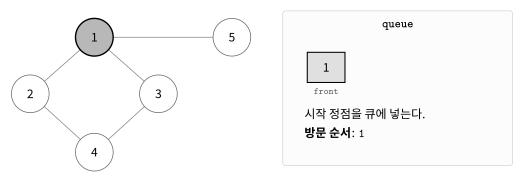
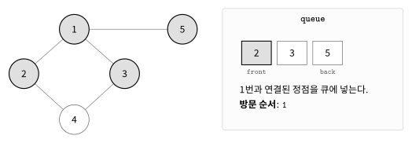
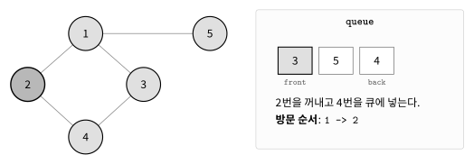
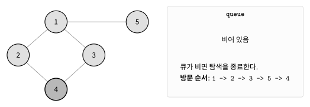

BFS는 그래프에서 시작 정점과 가까운 정점부터 차례대로 탐색하는 알고리즘이다.

먼저 발견한 정점을 큐에 넣고 앞에서부터 하나씩 꺼내며 탐색한다.

## 동작 원리

다음과 같은 그래프를 BFS로 탐색한다고 하자.

탐색은 `1`번 정점에서 시작한다.

여러 정점을 방문할 수 있다면 번호가 작은 정점부터 방문한다고 가정한다.



처음에는 시작 정점인 `1`번 정점을 큐에 넣고 방문 처리한다.

큐의 맨 앞에서 `1`번 정점을 꺼낸다.

`1`번 정점과 연결된 정점은 `2`, `3`, `5`이다. 아직 방문하지 않은 정점을 번호가 작은 순서대로 큐에 넣는다.



다음으로 큐의 맨 앞에 있는 `2`번 정점을 꺼낸다.

`2`번 정점과 연결된 정점은 `1`, `4`이다. `1`번 정점은 이미 방문했으므로 `4`번 정점만 큐에 넣는다.



이후 `3`, `5`, `4`번 정점을 차례대로 꺼낸다.

새롭게 큐에 넣을 정점이 없으므로 큐는 비게 된다.



큐가 비면 탐색을 종료한다.

방문 순서는 다음과 같다.

```text
1  2  3  5  4
```

## 그래프 저장

그래프는 인접 리스트를 이용해 저장할 수 있다.

```cpp
vector<vector<int>> conn(200'001);
```

양방향 간선으로 연결된 두 정점 `u`, `v`는 다음과 같이 저장한다.

```cpp
conn[u].push_back(v);
conn[v].push_back(u);
```

## 방문 확인

이미 큐에 넣은 정점을 다시 큐에 넣으면 같은 정점을 여러 번 처리할 수 있다.

따라서 정점을 큐에 넣을 때 바로 방문 처리한다.

```cpp
visited[next]=++cnt;
q.push(next);
```

## 구현

BFS는 `queue`를 이용해 다음과 같이 구현할 수 있다. $O(V+E)$

```cpp
int cnt, visited[MAX];
vector<vector<int>> conn(MAX);

void bfs(int start) {
    queue<int> q; q.push(start);
    visited[start]=++cnt;
    while(!q.empty()) {
        int cur = q.front(); q.pop();
        for(int next:conn[cur]) {
            if(!vis[next]) {
                vis[next]=++cnt;
                q.push(next);
            }
        }
    }
}
```

큐에서 정점을 하나 꺼낸 뒤 현재 정점과 연결된 정점을 하나씩 확인한다.

아직 방문하지 않은 정점을 찾으면 방문 처리한 뒤 큐에 넣는다.

## 최단 거리

모든 간선의 가중치가 같다면 BFS를 이용해 시작 정점으로부터의 최단 거리를 구할 수 있다.

시작 정점의 거리를 `0`으로 둔다.

```cpp
dist[start]=0;
```

아직 방문하지 않은 정점을 발견하면 현재 정점까지의 거리에 `1`을 더한다.

```cpp
dist[next]=dist[cur]+1;
```

BFS는 가까운 정점부터 탐색하므로 처음 구한 거리가 최단 거리이다.

## 시간복잡도

각 정점은 한 번만 큐에 들어간다.

각 간선도 인접 리스트에서 한 번씩 확인하므로 BFS의 시간복잡도는 $O(V+E)$이다.

여기서 $V$는 정점의 개수이고 $E$는 간선의 개수이다.

## 연습 문제

[https://soj.services/problems/28](https://soj.services/problems/28)

<details>
<summary>코드 보기</summary>

```cpp
#include<bits/stdc++.h>
using namespace std;

bool vis[100'001];
vector<vector<int>> conn(100'001);

int main() {
    cin.tie(0)->sync_with_stdio(0);
    int n, m, s; cin >> n >> m >> s;
    while(m--) {
        int u, v; cin >> u >> v;
        conn[u].push_back(v);
        conn[v].push_back(u);
    }
    for(int i=1;i<=n;i++) sort(conn[i].begin(), conn[i].end());

    queue<int> q; q.push(s);
    vis[s]=true;
    while(!q.empty()) {
        int cur = q.front(); q.pop();
        cout << cur << ' ';
        for(int next:conn[cur]) {
            if(!vis[next]) {
                vis[next]=true;
                q.push(next);
            }
        }
    }
}
```

</details>
