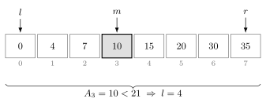
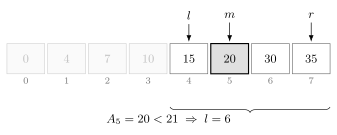
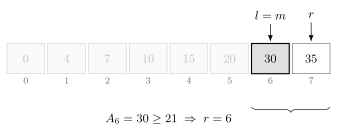
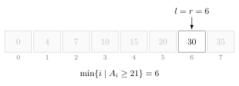

이분 탐색은 정렬된 배열에서 탐색 범위를 절반씩 줄여가며 원하는 값을 찾는 알고리즘이다.

원소가 $n$개라면 원하는 값이 존재하는지 $O(\log n)$에 확인할 수 있다.

## 동작 원리

다음과 같이 정렬된 배열에서 값 `21` 이상인 원소가 처음 나타나는 위치를 찾는다고 하자.

```text
0  4  7  10  15  20  30  35
```

처음에는 배열 전체를 탐색 범위로 둔다.

```cpp
int left=0, right=7;
```

현재 탐색 범위의 가운데 인덱스를 확인한다.



`a[mid]`는 `10`이고 찾으려는 값인 `21`보다 작다.

배열은 정렬되어 있으므로 `mid` 이하의 원소도 모두 `21`보다 작다. 따라서 탐색 범위를 오른쪽 절반으로 줄인다.

```cpp
left=mid+1;
```

다시 가운데 인덱스를 확인한다.



이번에도 `a[mid]`는 `20`이고 `21`보다 작다.

따라서 탐색 범위를 다시 오른쪽으로 줄인다.

```cpp
left=mid+1;
```

다시 가운데 인덱스를 확인한다.



이번에는 `a[mid]`가 `30`이고 `21` 이상이다.

`mid`가 답일 수도 있으므로 탐색 범위에 남겨둔다.

```cpp
right=mid;
```



이제 `left`와 `right`가 같으므로 탐색 범위를 더 이상 줄일 수 없다.

인덱스 `6`은 값이 `21` 이상인 원소가 처음 나타나는 위치이다.

마지막으로 `a[6]`을 확인한다. 값이 `30`이므로 배열에 `21`은 존재하지 않는다.

## 구현

이분 탐색은 다음과 같이 구현할 수 있다. $O(\log n)$

```cpp
bool binarySearch(vector<int>& a, int x) {
    int left=0, right=a.size()-1;
    while(left<right) {
        int mid=(left+right)>>1;
        if(a[mid]<x) left=mid+1;
        else right=mid;
    }
    return a[left]==x;
}
```

`a[mid]`가 `x`보다 작다면 `mid` 이하의 원소는 답이 될 수 없다.

그렇지 않다면 `mid`가 답일 수도 있으므로 탐색 범위에 남겨둔다.

단, 위 구현은 배열에 원소가 하나 이상 있을 때 사용할 수 있다.

## 내장 함수

C++에서는 `binary_search()`를 이용해 값의 존재 여부를 확인할 수 있다. $O(\log n)$

```cpp
sort(a.begin(), a.end());

if(binary_search(a.begin(), a.end(), x)) {
    cout << "exist";
}
```

배열도 같은 방식으로 사용할 수 있다.

```cpp
sort(a, a+n);

if(binary_search(a, a+n, x)) {
    cout << "exist";
}
```

## lower_bound

`lower_bound()`는 주어진 값 이상인 원소가 처음 나타나는 위치를 가리키는 이터레이터를 반환한다. $O(\log n)$

```cpp
vector<int> a = {0, 4, 7, 10, 15, 20, 30, 35};

auto it=lower_bound(a.begin(), a.end(), 21);
```

인덱스가 필요하다면 시작 이터레이터를 빼면 된다.

```cpp
int idx=lower_bound(a.begin(), a.end(), 21)-a.begin();

cout << idx;
```

위 코드를 실행하면 `6`이 출력된다.

주어진 값 이상인 원소가 없다면 `end()`를 반환한다.

## upper_bound

`upper_bound()`는 주어진 값보다 큰 원소가 처음 나타나는 위치를 가리키는 이터레이터를 반환한다. $O(\log n)$

```cpp
vector<int> a = {10, 20, 20, 20, 30};

int left=lower_bound(a.begin(), a.end(), 20)-a.begin();
int right=upper_bound(a.begin(), a.end(), 20)-a.begin();
```

따라서 값이 `20`인 원소의 개수는 다음과 같이 구할 수 있다.

```cpp
cout << right-left;
```

위 코드를 실행하면 `3`이 출력된다.

## 연습 문제

[https://soj.services/problems/23](https://soj.services/problems/23)

<details>
<summary>코드 보기</summary>

```cpp
#include<bits/stdc++.h>
using namespace std;

int a[100'000];

int main() {
    cin.tie(0)->sync_with_stdio(0);
    int n, q; cin >> n >> q;
    for(int i=0;i<n;i++) cin >> a[i];
    while(q--) {
        int x; cin >> x;
        auto it = lower_bound(a, a+n, x);
        if(it==a+n || *it!=x) cout << "-1\n";
        else cout << it-a << '\n';
    }
}
```

</details>