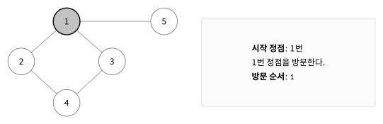
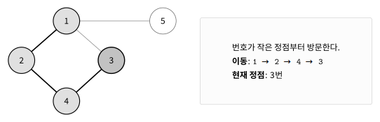
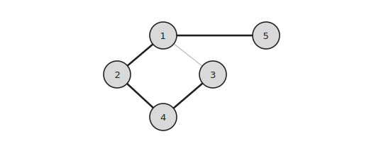

DFS는 그래프에서 한 경로를 가능한 깊게 탐색하는 알고리즘이다.

더 이상 이동할 수 없으면 이전 정점으로 돌아가 다른 경로를 탐색한다.

## 동작 원리

다음 그래프를 `1`번 정점에서 DFS로 탐색한다고 하자.



여러 정점을 방문할 수 있다면 번호가 작은 정점부터 방문한다고 가정한다.

`1`번 정점에서 `2`번 정점으로 이동하고, 다시 `4`번 정점과 `3`번 정점으로 깊게 이동한다.



`3`번 정점에서 더 이상 방문할 정점이 없으면 이전 정점으로 돌아간다.

이후 `1`번 정점에서 아직 방문하지 않은 `5`번 정점으로 이동한다.



방문 순서는 다음과 같다.

```text
1  2  4  3  5
```

## 그래프 저장

그래프는 인접 리스트로 저장한다.

```cpp
vector<vector<int>> conn(MAX);
```

양방향 간선 `u`, `v`는 다음과 같이 추가한다.

```cpp
conn[u].push_back(v);
conn[v].push_back(u);
```

## 방문 처리

이미 방문한 정점은 다시 탐색하지 않는다.

```cpp
bool visited[MAX];
```

방문한 정점에는 `true`를 저장한다.

```cpp
visited[cur]=true;
```

방문 순서가 필요하다면 `int` 배열을 사용할 수도 있다.

```cpp
visited[cur]=++cnt;
```

## 구현

재귀 함수로 구현할 수 있다. $O(V+E)$

```cpp
bool visited[MAX];
vector<vector<int>> conn(MAX);

void dfs(int cur) {
    visited[cur]=true;
    for(int next:conn[cur]) {
        if(!visited[next]) {
            dfs(next);
        }
    }
}
```

현재 정점과 연결된 정점을 하나씩 확인한다.

아직 방문하지 않은 정점이 있으면 그 정점에서 다시 `dfs()`를 수행한다.

## 방문 순서

인접 리스트에 저장된 순서에 따라 방문 순서가 달라질 수 있다.

번호가 작은 정점부터 방문하려면 각 인접 리스트를 정렬해야 한다.

```cpp
for(int i=1;i<=n;i++) {
    sort(conn[i].begin(), conn[i].end());
}
```

## 시간복잡도

각 정점은 한 번만 방문한다.

각 간선도 인접 리스트에서 한 번씩 확인한다.

따라서 시간복잡도는 $O(V+E)$이다.

## 연습 문제

[https://soj.services/problems/27](https://soj.services/problems/27)

<details>
<summary>코드 보기</summary>

```cpp
#include<bits/stdc++.h>
using namespace std;

bool vis[100'001];
vector<vector<int>> conn(100'001);

void dfs(int cur) {
    vis[cur]=true;
    cout << cur << ' ';
    for(int next:conn[cur]) {
        if(!vis[next]) {
            dfs(next);
        }
    }
}

int main() {
    cin.tie(0)->sync_with_stdio(0);
    int n, m, s; cin >> n >> m >> s;
    while(m--) {
        int u, v; cin >> u >> v;
        conn[u].push_back(v);
        conn[v].push_back(u);
    }
    for(int i=1;i<=n;i++) sort(conn[i].begin(), conn[i].end());
    dfs(s);
}
```

</details>