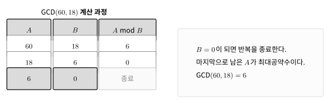

유클리드 호제법은 나머지 연산을 반복해 두 수의 최대공약수를 구하는 알고리즘이다.

두 수 $a$, $b$의 최대공약수는 두 수를 모두 나누어떨어지게 하는 가장 큰 정수이다.

## 동작 원리

$60$과 $18$의 최대공약수를 구한다고 하자.

$60$을 $18$로 나눈 나머지는 $6$이다.

```text
60 = 18 × 3 + 6
```

두 수의 최대공약수는 다음처럼 바꿔도 변하지 않는다.

$$
\gcd(60,18)=\gcd(18,6)
$$

다시 $18$을 $6$으로 나누면 나머지는 $0$이다.

```text
18 = 6 × 3 + 0
```

나머지가 $0$이 되면 마지막으로 남은 수가 최대공약수이다.



따라서 $60$과 $18$의 최대공약수는 $6$이다.

## 구현

반복문으로 구현할 수 있다. $O(\log \min(a,b))$

```cpp
long long gcd(long long a, long long b) {
    while(b) {
        long long tmp=a%b;
        a=b;
        b=tmp;
    }
    return a;
}
```

재귀 함수로도 구현할 수 있다.

```cpp
long long gcd(long long a, long long b) {
    if(!b) return a;
    return gcd(b, a%b);
}
```

## 최소공배수

두 수의 최소공배수는 최대공약수로 구할 수 있다.

$$
\operatorname{lcm}(a,b)=\frac{ab}{\gcd(a,b)}
$$

## 내장 함수

C++에서는 `gcd()`와 `lcm()`을 사용할 수 있다.

```cpp
#include<numeric>
```

```cpp
cout << gcd(a, b);
cout << lcm(a, b);
```

PS에서는 보통 다음 헤더 파일을 사용한다.

```cpp
#include<bits/stdc++.h>
```

## 연습 문제

[https://soj.services/problems/34](https://soj.services/problems/34)

<details>
<summary>코드 보기</summary>

```cpp
#include<bits/stdc++.h>
using namespace std;

int main() {
    cin.tie(0)->sync_with_stdio(0);
    long long a, b; cin >> a >> b;
    cout << gcd(a, b) << '\n' << a*b/gcd(a, b);
}
```

</details>