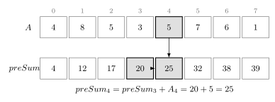
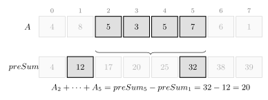

누적 합은 배열의 첫 번째 원소부터 각 위치까지의 합을 미리 계산하는 방법이다.

누적 합 배열을 만들어두면 임의 구간의 합을 $O(1)$에 구할 수 있다.

## 누적 합 배열

다음과 같은 배열 `a`가 있다고 하자.

```text
4  8  5  3  5  7  6  1
```

누적 합 배열 `preSum`은 다음과 같이 정의한다.

$$
preSum_i=a_0+a_1+\cdots+a_i
$$



각 위치의 누적 합은 이전 위치의 누적 합에 현재 값을 더해 구할 수 있다.

```cpp
preSum[i]=preSum[i-1]+a[i];
```

## 누적 합 배열 만들기

누적 합 배열의 앞에 `0`을 하나 추가하면 예외 처리 없이 구현할 수 있다. $O(n)$

```cpp
vector<int> preSum(n+1);

for(int i=1;i<=n;i++) {
    cin >> preSum[i];
    preSum[i]+=preSum[i-1];
}
```

`preSum[i]`에는 첫 번째 원소부터 `i`번째 원소까지의 합이 저장된다.

## 구간 합

인덱스가 `l` 이상 `r` 이하인 원소의 합을 구한다고 하자.

```text
a[l] + a[l+1] + ... + a[r]
```

`preSum[r]`에는 첫 번째 원소부터 `r`번째 원소까지의 합이 저장되어 있다.

여기서 `preSum[l-1]`을 빼면 `l`번째 원소부터 `r`번째 원소까지의 합만 남는다.

$$
a_l+a_{l+1}+\cdots+a_r=preSum_r-preSum_{l-1}
$$



따라서 구간 합은 다음과 같이 구할 수 있다. $O(1)$

```cpp
cout << preSum[r]-preSum[l-1];
```

## 연습 문제

[https://soj.services/problems/24](https://soj.services/problems/24)

<details>
<summary>코드 보기</summary>

```cpp
#include<bits/stdc++.h>
using namespace std;

long long preSum[100'001];

int main() {
    cin.tie(0)->sync_with_stdio(0);
    int n, q; cin >> n >> q;
    for(int i=1;i<=n;i++) {
        cin >> preSum[i];
        preSum[i]+=preSum[i-1];
    }
    while(q--) {
        int l, r; cin >> l >> r;
        cout << preSum[r]-preSum[l-1] << '\n';
    }
}
```

</details>
