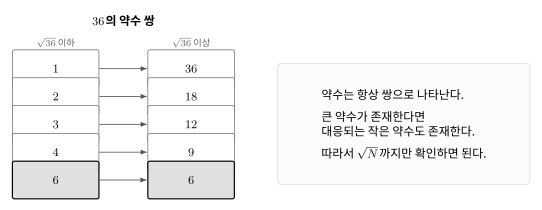
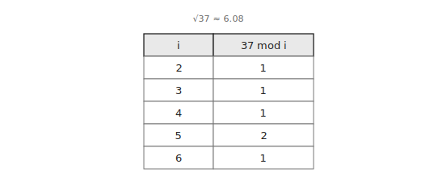

소수는 `1`보다 크고 `1`과 자기 자신만을 약수로 갖는 정수이다.

소수 판정은 주어진 정수가 소수인지 확인하는 알고리즘이다.

## 약수 확인

정수 `n`이 소수가 아니라면 `1`과 `n`을 제외한 약수를 갖는다.

가장 단순한 방법은 `2`부터 `n-1`까지의 정수로 나누어보는 것이다.

```cpp
for(long long i=2;i<n;i++) {
    if(n%i==0) return false;
}
```

이 방법은 $O(n)$이 걸린다.

## 제곱근까지만 확인하기

약수는 항상 쌍으로 나타난다.

예를 들어 `36`의 약수 쌍은 다음과 같다.



`n`의 약수 `a`가 $\sqrt{n}$보다 크다면 대응되는 약수 `n/a`는 $\sqrt{n}$보다 작다.

따라서 `2`부터 $\sqrt{n}$까지만 확인해도 소수 여부를 판별할 수 있다.

예를 들어 `37`이 소수인지 확인하려면 `2`부터 `6`까지만 확인하면 된다.



## 구현

소수 판정은 다음과 같이 구현할 수 있다. $O(\sqrt{n})$

```cpp
bool isPrime(long long n) {
    if(n<=1) return false;
    for(long long i=2;i*i<=n;i++) {
        if(n%i==0) return false;
    }
    return true;
}
```

`n`이 `1` 이하라면 소수가 아니다.

`2` 이상 $\sqrt{n}$ 이하인 정수 중 하나라도 `n`의 약수라면 `n`은 소수가 아니다.

## 연습 문제

[https://soj.services/problems/32](https://soj.services/problems/32)

<details>
<summary>코드 보기</summary>

```cpp
#include<bits/stdc++.h>
using namespace std;

bool isPrime(long long n) {
    if(n<=1) return false;
    for(long long i=2;i*i<=n;i++) {
        if(n%i==0) return false;
    }
    return true;
}

int main() {
    cin.tie(0)->sync_with_stdio(0);
    long long n; cin >> n;
    cout << (isPrime(n) ? "Yes" : "No");
}
```

</details>
