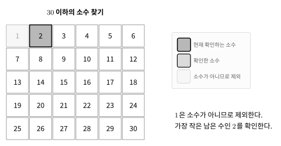
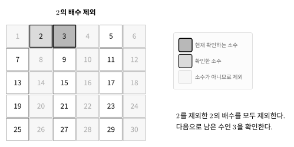
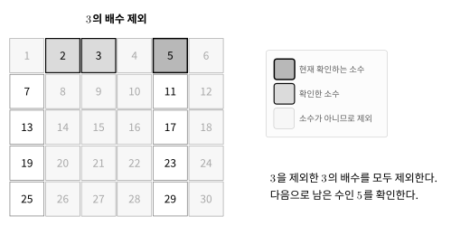
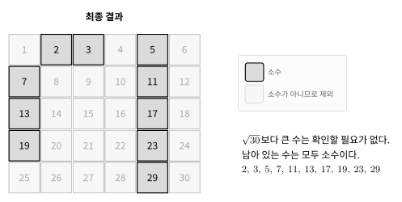

에라토스테네스의 체는 $1$부터 $n$까지의 소수를 한 번에 구하는 알고리즘이다.

작은 소수부터 확인하며 그 배수를 제외한다.

## 동작 원리

$30$ 이하의 소수를 찾는다고 하자.

먼저 $1$은 소수가 아니므로 제외한다.

아직 제외되지 않은 가장 작은 수인 $2$는 소수이다.



$2$를 제외한 $2$의 배수를 모두 제외한다.

다음으로 아직 제외되지 않은 가장 작은 수인 $3$을 확인한다.



$3$도 소수이므로 $3$을 제외한 $3$의 배수를 모두 제외한다.

다음으로 $5$를 확인한다.



$5$의 배수도 제외하면 $\sqrt{30}$ 이하의 소수는 모두 확인한 것이다.



남아 있는 수는 모두 소수이다.

```text
2  3  5  7  11  13  17  19  23  29
```

## 구현

`notPrime[i]`가 `false`이면 $i$는 아직 제외되지 않은 수이다. $O(n \log \log n)$

```cpp
vector<bool> notPrime(n+1);
notPrime[0]=notPrime[1]=true;

for(int i=2;i*i<=n;i++) {
    if(notPrime[i]) continue;
    for(int j=i*i;j<=n;j+=i) {
        notPrime[j]=true;
    }
}
```

소수 $i$를 찾으면 $i$의 배수를 제외한다.

## $i^2$부터 확인하는 이유

$i$의 배수를 제외할 때 $2i$가 아니라 $i^2$부터 시작해도 된다.

```cpp
for(int j=i*i;j<=n;j+=i) {
    notPrime[j]=true;
}
```

$i \times k$에서 $k<i$인 값은 이미 더 작은 소수의 배수를 처리할 때 제외되었다.

예를 들어 $5$의 배수를 처리한다고 하자.

```text
10 = 2 × 5
15 = 3 × 5
20 = 4 × 5
```

$10$, $15$, $20$은 이미 $2$ 또는 $3$의 배수를 처리할 때 제외되었다.

따라서 $25 = 5 \times 5$부터 확인하면 된다.

## 연습 문제

[https://soj.services/problems/33](https://soj.services/problems/33)

<details>
<summary>코드 보기</summary>

```cpp
#include<bits/stdc++.h>
using namespace std;

bool notPrime[10'000'001] = {true, true};

int main() {
    cin.tie(0)->sync_with_stdio(0);
    int n, q; cin >> n >> q;
    for(int i=2;i*i<=n;i++) {
        if(notPrime[i]) continue;
        for(int j=i*i;j<=n;j+=i) notPrime[j]=true;
    }
    while(q--) {
        int x; cin >> x;
        cout << (notPrime[x] ? "No\n" : "Yes\n");
    }
}
```

</details>