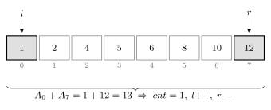
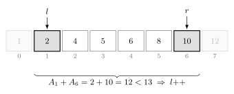
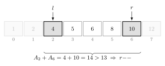
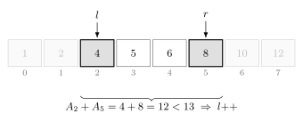
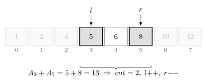

투 포인터는 두 개의 포인터를 이동시키며 조건을 만족하는 값을 찾는 알고리즘이다.

각 포인터가 한 방향으로만 움직이면 전체 탐색을 $O(n)$에 처리할 수 있다.

## 두 수의 합

정렬된 배열에서 합이 $13$인 두 원소의 쌍을 찾는다고 하자.

```text
1  2  4  5  6  8  10  12
```

처음에는 `left`를 왼쪽 끝에 두고 `right`를 오른쪽 끝에 둔다.



현재 합이 $13$이면 조건을 만족하는 쌍을 찾은 것이다.

```cpp
cnt++;
left++;
right--;
```



현재 합이 $13$보다 작으면 더 큰 값을 사용해야 하므로 `left`를 오른쪽으로 이동한다.

```cpp
left++;
```



현재 합이 $13$보다 크면 더 작은 값을 사용해야 하므로 `right`를 왼쪽으로 이동한다.

```cpp
right--;
```



같은 규칙으로 포인터를 이동한다.



두 포인터가 만나거나 지나치면 탐색을 종료한다.

## 구현

정렬된 배열에서 합이 `x`인 두 원소의 쌍을 센다. $O(n)$

```cpp
int cnt=0, left=0, right=n-1;

while(left<right) {
    int sum=a[left]+a[right];

    if(sum<x) {
        left++;
    } else if(sum>x) {
        right--;
    } else {
        cnt++;
        left++;
        right--;
    }
}
```

현재 합이 `x`보다 작으면 `left`를 이동한다.

현재 합이 `x`보다 크면 `right`를 이동한다.

같으면 쌍을 하나 찾은 뒤 두 포인터를 모두 이동한다.

두 포인터는 각각 최대 $n$번 이동하므로 시간복잡도는 $O(n)$이다.

## 연습 문제

[https://soj.services/problems/25](https://soj.services/problems/25)

<details>
<summary>코드 보기</summary>

```cpp
#include<bits/stdc++.h>
using namespace std;

int a[100'000];

int main() {
    cin.tie(0)->sync_with_stdio(0);
    int n, x; cin >> n >> x;
    for(int i=0;i<n;i++) cin >> a[i];

    int cnt=0, l=0, r=n-1;
    while(l<r) {
        if(a[l]+a[r]==x) l++, r--, cnt++;
        else if(a[l]+a[r]<x) l++;
        else r--;
    }
    cout << cnt;
}
```

</details>