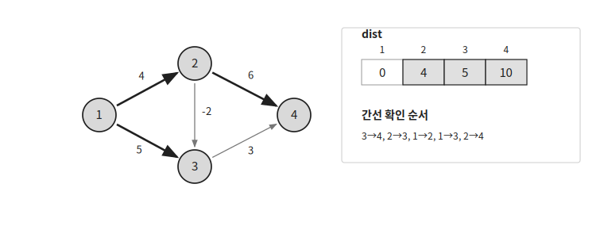
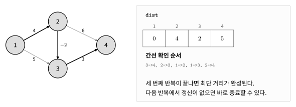

벨만-포드는 시작 정점으로부터의 최단 거리를 구하는 알고리즘이다.

음수 간선이 있어도 사용할 수 있고 시작 정점에서 도달 가능한 음수 사이클도 판별할 수 있다.

## 동작 원리

시작 정점 `s`에서 각 정점까지의 최단 거리를 구한다고 하자.

처음에는 시작 정점의 거리를 $0$으로 두고 나머지는 무한대로 둔다.

```cpp
fill(dist, dist+n+1, LINF);
dist[s]=0;
```

`dist[i]`는 현재까지 찾은 `s`에서 `i`까지의 가장 짧은 거리이다.

현재 정점 `cur`에서 `nxt`로 가는 간선의 가중치가 `w`라고 하자.

`cur`까지 도달할 수 있고 더 짧은 경로를 만들 수 있다면 `dist[nxt]`를 갱신한다.

```cpp
if(dist[cur]!=LINF && dist[nxt]>dist[cur]+w) {
    dist[nxt]=dist[cur]+w;
}
```

이처럼 더 짧은 경로를 찾았을 때 거리를 갱신하는 과정을 간선 완화라고 한다.



음수 사이클이 없다면 최단 경로는 같은 정점을 두 번 이상 지날 필요가 없다.

따라서 최단 경로는 최대 $V-1$개의 간선으로 이루어진다.

모든 간선을 최대 $V-1$번 확인하면 최단 거리를 구할 수 있다.



한 번의 반복에서 갱신이 발생하지 않았다면 이후에도 값은 바뀌지 않는다.

```cpp
if(!update) break;
```

## 음수 사이클

음수 사이클은 간선 가중치의 합이 음수인 사이클이다.

음수 사이클을 반복해서 돌면 경로의 길이를 계속 줄일 수 있다.

음수 사이클이 없다면 $V-1$번의 반복 뒤에는 더 이상 거리가 줄어들지 않는다.

따라서 $V$번째 반복에서도 갱신이 발생하면 시작 정점에서 도달 가능한 음수 사이클이 존재한다.

```cpp
if(i==n-1) {
    cout << "NEGATIVE CYCLE";
}
```

도달할 수 없는 정점은 건너뛴다.

```cpp
if(dist[cur]==LINF) continue;
```

따라서 시작 정점에서 도달할 수 없는 음수 사이클은 판별하지 않는다.

## 그래프 저장

가중치가 있는 방향 그래프는 인접 리스트로 저장한다.

```cpp
vector<vector<pair<ll, ll>>> conn(MAX);
```

방향 간선 `u → v`의 가중치가 `w`라면 다음과 같이 저장한다.

```cpp
conn[u].push_back({v, w});
```

## 구현

벨만-포드는 다음과 같이 구현할 수 있다. $O(VE)$

```cpp
ll dist[MAX];
vector<vector<pair<ll, ll>>> conn(MAX);

bool bellmanFord(int start, int n) {
    fill(dist, dist+n+1, LINF);
    dist[start]=0;
    for(int i=0;i<n;i++) {
        bool update=false;
        for(int cur=1;cur<=n;cur++) {
            if(dist[cur]==LINF) continue;
            for(auto [nxt, w]:conn[cur]) {
                if(dist[nxt]>dist[cur]+w) {
                    dist[nxt]=dist[cur]+w;
                    update=true;
                }
            }
        }
        if(!update) return true;
    }
    return false;
}
```

음수 사이클이 없다면 `true`를 반환한다.

시작 정점에서 도달 가능한 음수 사이클이 있다면 `false`를 반환한다.

## 시간복잡도

한 번의 반복에서 모든 간선을 확인하므로 $O(E)$가 걸린다.

이 과정을 최대 $V$번 반복하므로 시간복잡도는 $O(VE)$이다.

## 연습 문제

[https://soj.services/problems/39](https://soj.services/problems/39)

<details>
<summary>코드 보기</summary>

```cpp
#include<bits/stdc++.h>
using namespace std;

typedef long long ll;
const ll LINF=0x3f3f3f3f3f3f3f3f;

ll dist[1001];
vector<vector<pair<ll, ll>>> conn(1001);

int main() {
    cin.tie(0)->sync_with_stdio(0);
    int n, m, s; cin >> n >> m >> s;
    while(m--) {
        ll u, v, w; cin >> u >> v >> w;
        conn[u].push_back({v, w});
    }

    fill(dist, dist+n+1, LINF);
    dist[s]=0;
    for(int i=0;i<n;i++) {
        bool update=false;
        for(int j=1;j<=n;j++) {
            if(dist[j]==LINF) continue;
            for(auto [nxt, w]:conn[j]) {
                if(dist[nxt]>dist[j]+w) {
                    dist[nxt]=dist[j]+w;
                    update=true;
                }
            }
        }
        if(!update) break;
        if(i==n-1) return !(cout << "NEGATIVE CYCLE");
    }
    for(int i=1;i<=n;i++) {
        if(dist[i]==LINF) cout << "INF\n";
        else cout << dist[i] << '\n';
    }
}
```

</details>