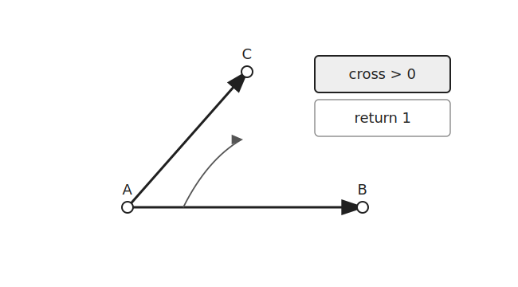
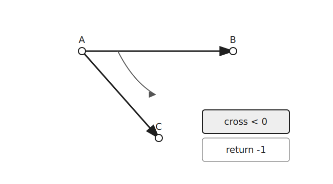
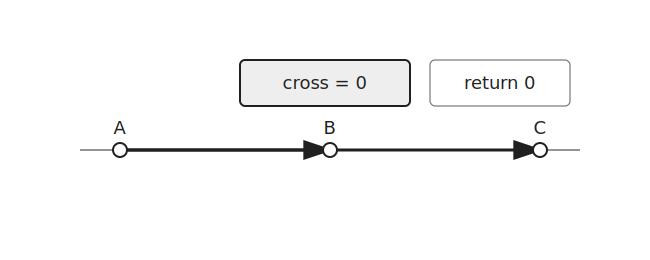
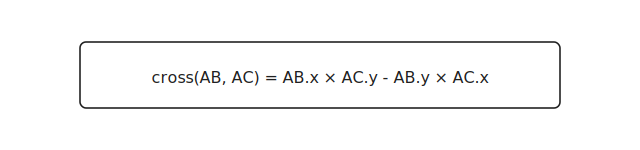

`CCW`는 세 점의 방향을 판별하는 알고리즘이다.

세 점 `A`, `B`, `C`가 있을 때 `A → B → C`가 반시계 방향인지, 시계 방향인지, 일직선인지 확인한다.

## 방향

세 점이 반시계 방향을 이루면 `CCW` 값은 양수이다.



세 점이 시계 방향을 이루면 `CCW` 값은 음수이다.



세 점이 한 직선 위에 있으면 `CCW` 값은 $0$이다.



따라서 `CCW` 값은 다음과 같이 해석할 수 있다.

```text
CCW > 0 : 반시계 방향
CCW < 0 : 시계 방향
CCW = 0 : 일직선
```

## 외적

`CCW`는 두 벡터의 외적으로 구한다.

점 `A`를 기준으로 $\overrightarrow{AB}$와 $\overrightarrow{AC}$를 만든다.



```cpp
point v1 = {b.x-a.x, b.y-a.y};
point v2 = {c.x-a.x, c.y-a.y};
```

두 벡터의 외적은 다음과 같이 계산한다.

$$
\operatorname{cross}(\overrightarrow{AB}, \overrightarrow{AC}) = (B_x-A_x)(C_y-A_y) - (B_y-A_y)(C_x-A_x)
$$

```cpp
ll cross=v1.x*v2.y-v2.x*v1.y;
```

이 값의 부호가 세 점의 방향을 결정한다.

## 구현

`CCW`는 다음과 같이 구현할 수 있다. $O(1)$

```cpp
struct point {
    ll x, y;
};

ll ccw(point a, point b, point c) {
    point v1 = {b.x-a.x, b.y-a.y};
    point v2 = {c.x-a.x, c.y-a.y};
    ll ret=v1.x*v2.y-v2.x*v1.y;
    return ret>0 ? 1 : ret<0 ? -1 : 0;
}
```

좌표의 절댓값이 크면 곱셈 과정에서 값이 커질 수 있으므로 `long long`을 사용한다.

## 연습 문제

[https://soj.services/problems/57](https://soj.services/problems/57)

<details>
<summary>코드 보기</summary>

```cpp
#include<bits/stdc++.h>
using namespace std;

typedef long long ll;

struct point {
    ll x, y;
};

ll ccw(point a, point b, point c) {
    point v1 = {b.x-a.x, b.y-a.y};
    point v2 = {c.x-a.x, c.y-a.y};
    ll ret=v1.x*v2.y-v2.x*v1.y;
    return ret>0 ? 1 : ret<0 ? -1 : 0;
}

int main() {
    cin.tie(0)->sync_with_stdio(0);
    int q; cin >> q;
    while(q--) {
        point a, b, c; cin >> a.x >> a.y >> b.x >> b.y >> c.x >> c.y;
        cout << ccw(a, b, c) << '\n';
    }
}
```

</details>