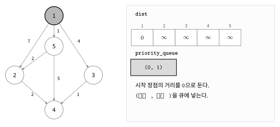
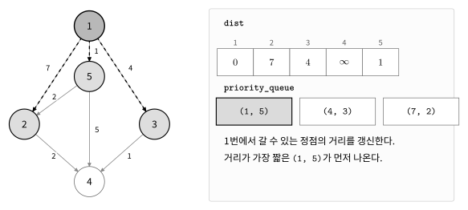
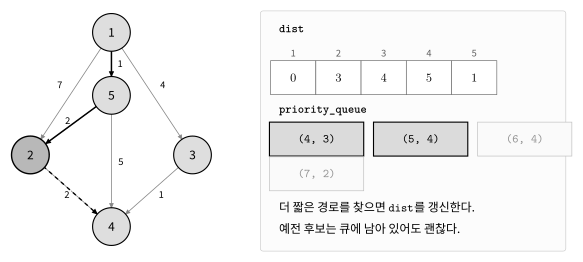
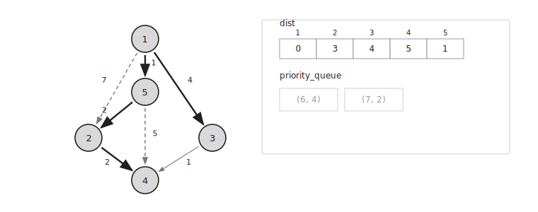

다익스트라는 가중치가 음수가 없는 그래프에서 시작 정점으로부터의 최단 거리를 구하는 알고리즘이다.

현재까지 발견한 경로 중 거리가 가장 짧은 경로부터 확인한다.

## 동작 원리

다음과 같은 방향 그래프에서 `1`번 정점으로부터의 최단 거리를 구한다고 하자.

처음에는 모든 정점의 거리를 무한대로 두고 우선순위 큐에 `(시작 정점, 0)`을 넣는다.

```cpp
pq.push({1, 0});
```

우선순위 큐에는 `(정점, 거리)`를 저장한다.



큐에서 거리가 가장 짧은 후보를 꺼낸다.

처음에는 `(1, 0)`을 꺼내고 `1`번 정점의 최단 거리를 `0`으로 확정한다.

```cpp
dist[1]=0;
```

이후 `1`번 정점에서 갈 수 있는 정점을 확인한다.

```text
1 → 5 : 1
1 → 3 : 4
1 → 2 : 7
```

새롭게 발견한 경로가 이미 확정된 거리보다 짧다면 우선순위 큐에 후보로 넣는다.



다음으로 거리가 가장 짧은 `(5, 1)`을 꺼낸다.

`5`번 정점의 최단 거리를 `1`로 확정하고 연결된 정점을 확인한다.

`5`번 정점을 거쳐 `2`번 정점으로 이동하면 거리는 `3`이다.

```text
1 → 5 → 2 : 3
```

큐에는 기존 후보 `(2, 7)`이 남아 있지만 더 짧은 후보 `(2, 3)`도 함께 넣는다.

이후 `(2, 3)`을 꺼내면 `2`번 정점의 최단 거리를 `3`으로 확정한다.

`2`번 정점을 거쳐 `4`번 정점까지 거리 `5`로 이동할 수 있으므로 `(4, 5)`를 큐에 넣는다.



## 오래된 후보 무시하기

우선순위 큐에는 더 짧은 경로를 찾기 전에 넣은 후보가 남아 있을 수 있다.

예를 들어 큐에 `(2, 7)`을 넣은 뒤 더 짧은 후보 `(2, 3)`을 찾았다고 하자.

`(2, 3)`을 먼저 꺼내면 `2`번 정점의 최단 거리는 `3`으로 확정된다.

나중에 `(2, 7)`을 꺼냈을 때는 이미 더 짧은 거리가 확정되어 있으므로 건너뛴다.

```cpp
if(dist[cur]<=cost) continue;
```



오래된 후보를 큐에서 직접 지울 필요는 없다.

큐에서 꺼냈을 때 이미 더 짧거나 같은 거리가 확정되어 있다면 무시하면 된다.

## 간선 완화

현재 정점 `cur`에서 다음 정점 `next`로 가는 간선의 가중치가 `weight`라고 하자.

현재 경로가 이미 확정된 거리보다 짧다면 새로운 후보를 우선순위 큐에 넣는다.

```cpp
long long nextCost=dist[cur]+weight;

if(nextCost<dist[next]) {
    pq.push({next, nextCost});
}
```

이 구현에서는 후보를 발견했을 때 `dist[next]`를 바로 갱신하지 않는다.

`next`가 우선순위 큐에서 처음 나왔을 때 최단 거리를 확정한다.

```cpp
if(dist[cur]<=cost) continue;
dist[cur]=cost;
```

이처럼 더 짧은 경로를 확인하는 과정을 간선 완화라고 한다.

## 그래프 저장

가중치가 있는 그래프는 인접 리스트를 이용해 저장할 수 있다.

```cpp
vector<vector<pair<int, int>>> conn(20'001);
```

방향 간선 `u → v`의 가중치가 `w`라면 다음과 같이 저장한다.

```cpp
conn[u].push_back({v, w});
```

양방향 간선이라면 반대 방향도 함께 저장한다.

```cpp
conn[u].push_back({v, w});
conn[v].push_back({u, w});
```

## 구현

다익스트라는 우선순위 큐를 이용해 다음과 같이 구현할 수 있다.

```cpp
typedef long long ll;

const ll LINF=0x3f3f3f3f3f3f3f3f;

struct element {
    ll u, w;
    bool operator<(const element& e) const {
        return w > e.w;
    }
};

ll dist[100'001];
vector<vector<element>> conn(100'001);

void dijkstra(int start, int n) {
    fill(dist, dist+n+1, LINF);

    priority_queue<element> pq;
    pq.push({start, 0});

    while(!pq.empty()) {
        auto [cur, cost]=pq.top();
        pq.pop();

        if(dist[cur]<=cost) continue;
        dist[cur]=cost;

        for(auto [next, weight]:conn[cur]) {
            ll nextCost=dist[cur]+weight;

            if(nextCost<dist[next]) {
                pq.push({next, nextCost});
            }
        }
    }
}
```

`priority_queue`는 기본적으로 가장 큰 값을 먼저 꺼낸다.

따라서 비교 연산자의 부호를 반대로 설정하여 거리가 가장 작은 후보를 먼저 꺼내도록 만든다.

```cpp
bool operator<(const element& e) const {
    return w > e.w;
}
```

`dist`에는 큐에서 꺼내 확정한 최단 거리만 저장한다.

확정되지 않은 후보는 우선순위 큐에서 관리한다.

## 시간복잡도

각 간선을 확인하며 더 짧은 경로를 찾을 때 우선순위 큐에 값을 넣는다.

우선순위 큐의 삽입과 삭제에는 각각 $O(\log V)$가 걸린다.

따라서 시간복잡도는 $O((V+E)\log V)$이다.

보통 $O(E\log V)$로 간단히 표현하기도 한다.

여기서 $V$는 정점의 개수이고 $E$는 간선의 개수이다.

## 음수 간선

다익스트라는 가중치가 음수인 간선이 있으면 사용할 수 없다.

이미 확인한 경로보다 더 짧은 경로가 나중에 나타날 수 있기 때문이다.

음수 간선이 있는 그래프에서는 벨만-포드와 같은 다른 알고리즘을 사용해야 한다.

## 연습 문제

[https://soj.services/problems/38](https://soj.services/problems/38)

<details>
<summary>코드 보기</summary>

```cpp
#include<bits/stdc++.h>
using namespace std;

typedef long long ll;
const ll LINF=0x3f3f3f3f3f3f3f3f;

struct element {
    ll u, w;
    bool operator<(const element& e) const {
        return w > e.w;
    }
};

ll dist[100'001];
vector<vector<element>> conn(100'001);

int main() {
    cin.tie(0)->sync_with_stdio(0);
    int n, m, s; cin >> n >> m >> s;
    while(m--) {
        int u, v, w; cin >> u >> v >> w;
        conn[u].push_back({v, w});
        conn[v].push_back({u, w});
    }

    fill(dist, dist+n+1, LINF);
    priority_queue<element> pq; pq.push({s, 0});
    while(!pq.empty()) {
        auto [cur, cost] = pq.top(); pq.pop();
        if(dist[cur]<=cost) continue;
        dist[cur]=cost;
        for(auto [nxt, w]:conn[cur]) {
            if(dist[nxt]>cost+w) {
                pq.push({nxt, cost+w});
            }
        }
    }
    for(int i=1;i<=n;i++) cout << (dist[i]==LINF ? -1 : dist[i]) << "\n";
}
```

</details>
