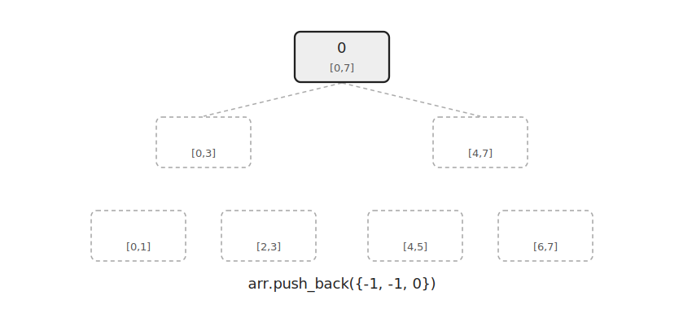
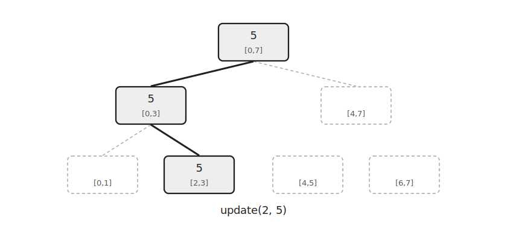
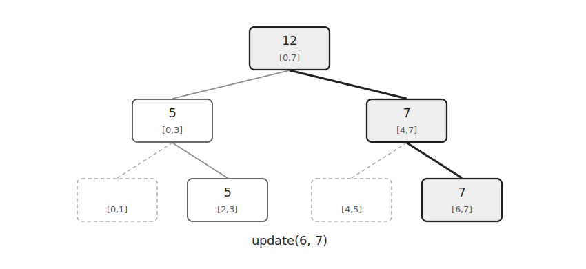
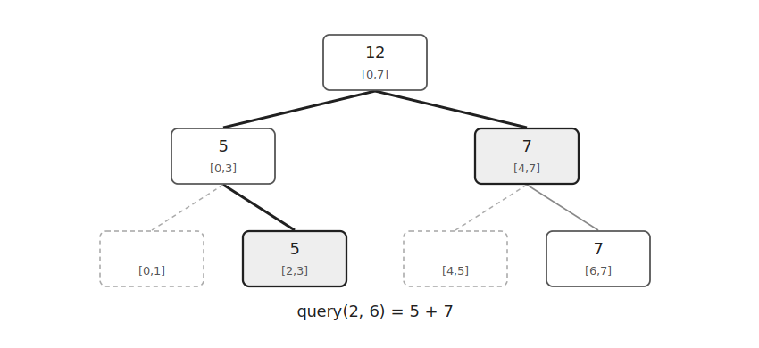

Dynamic Segment Tree는 필요한 노드만 생성하는 세그먼트 트리이다.

일반 세그먼트 트리는 전체 구간에 대한 노드를 미리 만든다.

하지만 좌표 범위가 매우 크고 실제로 사용하는 위치가 적다면 모든 노드를 만들 필요가 없다.

Dynamic Segment Tree는 업데이트나 쿼리 과정에서 방문한 구간의 노드만 만든다.

## 구조

처음에는 루트 노드 하나만 존재한다.



각 노드는 왼쪽 자식 번호, 오른쪽 자식 번호, 구간 값을 저장한다.

```cpp
struct Node {
    int l=-1, r=-1;
    ll val=0;
};
```

자식이 아직 만들어지지 않았다면 `-1`로 둔다.

노드는 `vector<Node>`에 저장한다.

```cpp
vector<Node> arr(1);
```

`arr[0]`이 루트 노드이다.

## 노드 생성

인덱스 `2`의 값을 `5`로 바꾼다고 하자.

루트에서 시작해 필요한 방향으로 내려간다.

자식 노드가 없다면 그때 새로 만든다.



```cpp
if(arr[nodeNum].l==-1) {
    arr[nodeNum].l=arr.size();
    arr.push_back({-1, -1, 0});
}
```

리프 노드에 도착하면 값을 바꾼다.

```cpp
arr[nodeNum].val=val;
```

이후 다시 올라오면서 부모 값을 갱신한다.

```cpp
ll left=arr[nodeNum].l!=-1 ? arr[arr[nodeNum].l].val : 0;
ll right=arr[nodeNum].r!=-1 ? arr[arr[nodeNum].r].val : 0;
arr[nodeNum].val=left+right;
```

다른 위치를 업데이트하면 그 위치로 가는 경로만 추가로 만들어진다.



## 구간 쿼리

구간 합을 구할 때는 일반 세그먼트 트리처럼 탐색한다.

다만 없는 노드를 방문하면 해당 구간의 값은 `0`으로 처리한다.



```cpp
if(nodeNum==-1 || R<nodeL || nodeR<L) return 0;
```

현재 노드의 구간이 질의 구간에 완전히 포함되면 저장된 값을 반환한다.

```cpp
if(L<=nodeL && nodeR<=R) return arr[nodeNum].val;
```

일부만 겹치면 왼쪽 자식과 오른쪽 자식을 재귀적으로 탐색한다.

```cpp
return query(L, R, arr[nodeNum].l, nodeL, mid)+query(L, R, arr[nodeNum].r, mid+1, nodeR);
```

## 구현

구간 합을 저장하는 Dynamic Segment Tree는 다음과 같이 구현할 수 있다.

```cpp
struct Node {
    int l=-1, r=-1;
    ll val=0;
};

vector<Node> arr(1);

void update(int k, ll val, int nodeNum=0, int nodeL=1, int nodeR=n) {
    if(nodeL==nodeR) {
        arr[nodeNum].val=val;
        return;
    }
    int mid=nodeL+nodeR>>1;
    if(k<=mid) {
        if(arr[nodeNum].l==-1) {
            arr[nodeNum].l=arr.size();
            arr.push_back({});
        }
        update(k, val, arr[nodeNum].l, nodeL, mid);
    } else {
        if(arr[nodeNum].r==-1) {
            arr[nodeNum].r=arr.size();
            arr.push_back({});
        }
        update(k, val, arr[nodeNum].r, mid+1, nodeR);
    }
    ll left=arr[nodeNum].l!=-1 ? arr[arr[nodeNum].l].val : 0;
    ll right=arr[nodeNum].r!=-1 ? arr[arr[nodeNum].r].val : 0;
    arr[nodeNum].val=left+right;
}

ll query(int L, int R, int nodeNum=0, int nodeL=1, int nodeR=n) {
    if(nodeNum==-1 || R<nodeL || nodeR<L) return 0;
    if(L<=nodeL && nodeR<=R) return arr[nodeNum].val;
    int mid=nodeL+nodeR>>1;
    return query(L, R, arr[nodeNum].l, nodeL, mid)+query(L, R, arr[nodeNum].r, mid+1, nodeR);
}
```

## 시간복잡도

전체 범위의 크기를 `N`이라고 하자.

업데이트와 쿼리는 트리의 높이만큼 내려가므로 각각 $O(\log N)$이다.

생성되는 노드 수는 방문한 경로의 수에 비례한다.

업데이트가 `Q`번이라면 생성되는 노드 수는 최대 $O(Q\log N)$이다.

## 연습 문제

[https://soj.services/problems/54](https://soj.services/problems/54)

<details>
<summary>코드 보기</summary>

```cpp
#include<bits/stdc++.h>
using namespace std;
typedef long long ll;

struct Node {
    int l=-1, r=-1;
    ll val=0;
};

int n, q;
vector<Node> arr(1);

void update(int k, ll val, int idx=0, int s=1, int e=n) {
    if(s==e) {
        arr[idx].val=val;
        return;
    }
    int mid=s+e>>1;
    if(k<=mid) {
        if(arr[idx].l==-1) {
            arr[idx].l=arr.size();
            arr.push_back({});
        }
        update(k, val, arr[idx].l, s, mid);
    } else {
        if(arr[idx].r==-1) {
            arr[idx].r=arr.size();
            arr.push_back({});
        }
        update(k, val, arr[idx].r, mid+1, e);
    }
    ll t1 = arr[idx].l!=-1 ? arr[arr[idx].l].val : 0;
    ll t2 = arr[idx].r!=-1 ? arr[arr[idx].r].val : 0;
    arr[idx].val=t1+t2;
}

ll query(int l, int r, int idx=0, int s=1, int e=n) {
    if(idx==-1 || r<s || e<l) return 0;
    if(l<=s && e<=r) return arr[idx].val;
    int mid = s+e>>1;
    return query(l, r, arr[idx].l, s, mid)+query(l, r, arr[idx].r, mid+1, e);
}

int main() {
    cin.tie(0)->sync_with_stdio(0);
    cin >> n >> q;
    for(int i=1;i<=n;i++) {
        int a; cin >> a;
        update(i, a);
    }
    while(q--) {
        int op; cin >> op;
        if(op==1) {
            int i, x; cin >> i >> x;
            update(i, x);
        } else {
            int l, r; cin >> l >> r;
            cout << query(l, r) << '\n';
        }
    }
}
```

</details>
