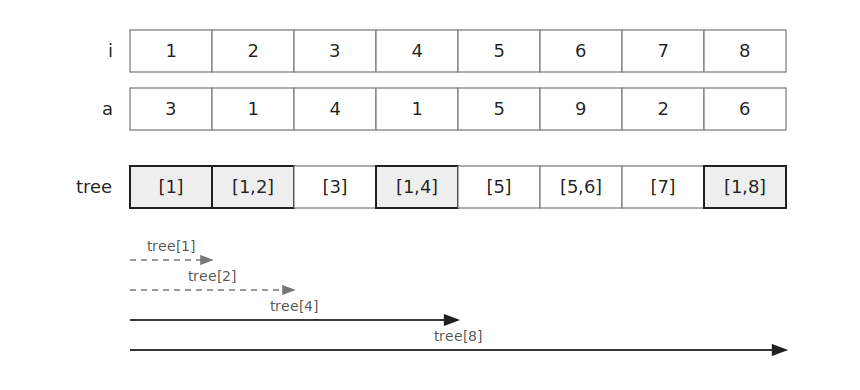
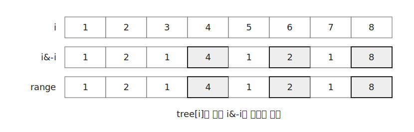
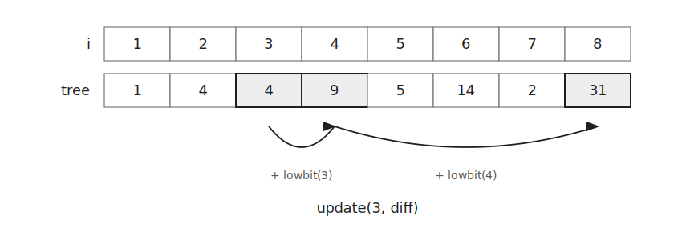
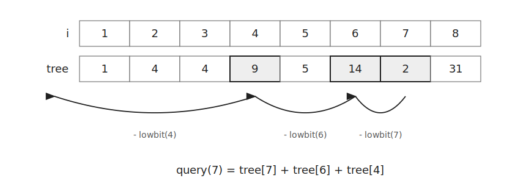

`Fenwick Tree`는 배열의 `prefix sum`을 빠르게 관리하는 자료구조이다.

값 변경과 구간 합 쿼리를 모두 $O(\log N)$에 처리할 수 있다.

이 글에서는 $1$-based 인덱스를 기준으로 설명한다.

## 구조

`Fenwick Tree`의 `tree[i]`는 원래 배열의 특정 구간 합을 저장한다.



`tree[i]`가 담당하는 구간의 길이는 `i&-i`이다.



예를 들어 `tree[4]`는 길이 $4$인 구간 $[1,4]$의 합을 저장한다.

`tree[6]`은 길이 $2$인 구간 $[5,6]$의 합을 저장한다.

```cpp
i&-i
```

위 식은 `i`의 마지막으로 켜진 비트만 남긴 값이다.

## 값 변경

`i`번 원소에 `val`을 더한다고 하자.

해당 원소를 포함하는 `tree` 값을 모두 갱신해야 한다.

예를 들어 $3$번 원소를 변경하면 `tree[3]`, `tree[4]`, `tree[8]`이 영향을 받는다.



다음 위치로 이동할 때는 `i&-i`를 더한다.

```cpp
void update(int i, ll val) {
    while(i<MAX) {
        tree[i]+=val;
        i+=i&-i;
    }
}
```

## Prefix Sum

`query(i)`는 $1$번부터 $i$번까지의 합을 반환한다.

예를 들어 `query(7)`은 `tree[7]`, `tree[6]`, `tree[4]`를 더한다.



이전 구간으로 이동할 때는 `i&-i`를 뺀다.

```cpp
ll query(int i) {
    ll ret=0;
    while(i) {
        ret+=tree[i];
        i-=i&-i;
    }
    return ret;
}
```

## 구간 합

구간 $[L,R]$의 합은 두 `prefix sum`의 차이로 구한다.

```cpp
query(R)-query(L-1)
```

예를 들어 구간 $[3,7]$의 합은 다음과 같다.

```cpp
query(7)-query(2)
```

## 초기화

값을 하나씩 `update()`로 넣으면 $O(N \log N)$이 걸린다.

아래처럼 만들면 $O(N)$에 초기화할 수 있다.

```cpp
for(int i=1;i<=n;i++) {
    ll val; cin >> val;
    tree[i]+=val;
    int nxt=i+(i&-i);
    if(nxt<=n) tree[nxt]+=tree[i];
}
```

`tree[i]` 값을 자신을 포함하는 다음 구간으로 넘겨주는 방식이다.

## 구현

`Fenwick Tree`는 다음과 같이 구현할 수 있다.

```cpp
ll tree[MAX];

void update(int i, ll val) {
    while(i<MAX) {
        tree[i]+=val;
        i+=i&-i;
    }
}

ll query(int i) {
    ll ret=0;
    while(i) {
        ret+=tree[i];
        i-=i&-i;
    }
    return ret;
}
```

값 변경과 `prefix sum` 쿼리는 각각 $O(\log N)$이다.

구간 합 쿼리도 `query()`를 두 번 호출하므로 $O(\log N)$이다.

공간복잡도는 $O(N)$이다.

## 연습 문제

[https://soj.services/problems/55](https://soj.services/problems/55)

<details>
<summary>코드 보기</summary>

```cpp
#include<bits/stdc++.h>
using namespace std;

typedef long long ll;
const int MAX=3'000'001;

ll a[MAX];

void update(int i, ll val) {
    while(i<MAX) {
        a[i]+=val;
        i+=i&-i;
    }
}

ll query(int i) {
    ll ret=0;
    while(i) {
        ret+=a[i];
        i-=i&-i;
    }
    return ret;
}

int main() {
    cin.tie(0)->sync_with_stdio(0);
    int n, q; cin >> n >> q;
    for(int i=1;i<=n;i++) {
        ll val; cin >> val;
        a[i]+=val;
        int nxt=i+(i&-i);
        if(nxt<=n) a[nxt]+=a[i];
    }

    while(q--) {
        int op; cin >> op;
        if(op==1) {
            int i, x; cin >> i >> x;
            update(i, x);
        } else {
            int l, r; cin >> l >> r;
            cout << query(r)-query(l-1) << '\n';
        }
    }
}
```

</details>