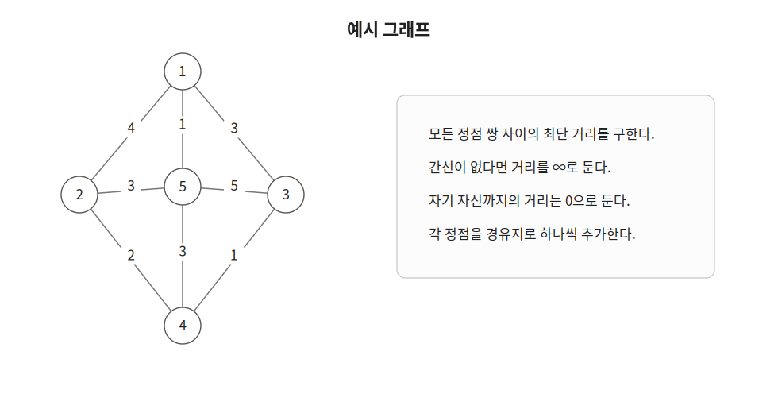
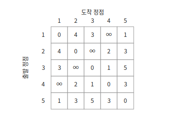
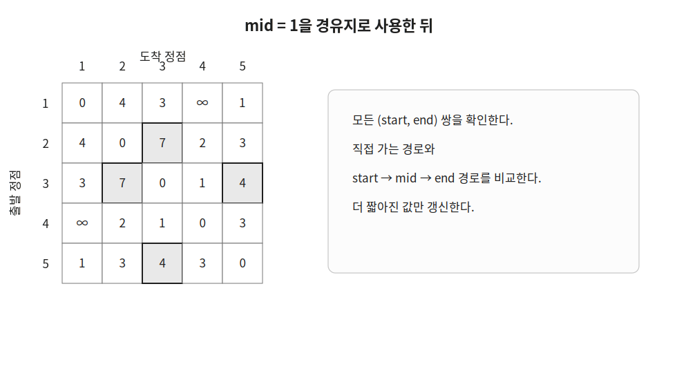
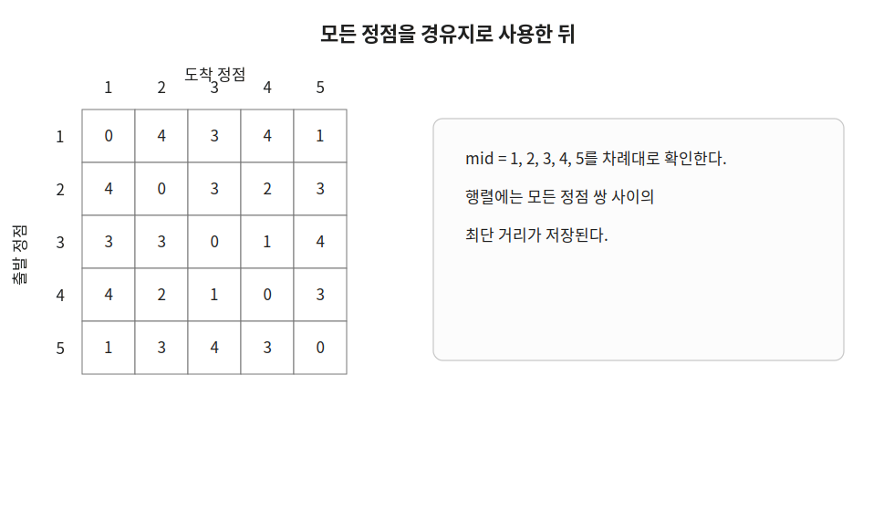

플로이드-워셜은 모든 정점 쌍 사이의 최단 거리를 구하는 알고리즘이다.

하나의 시작 정점에서 다른 정점까지의 거리를 구하는 다익스트라나 벨만-포드와 달리 모든 출발점과 도착점의 조합을 한 번에 처리한다.

## 동작 원리

다음과 같은 그래프에서 모든 정점 쌍 사이의 최단 거리를 구한다고 하자.



먼저 간선을 이용해 거리 행렬을 만든다.

`minCost[start][end]`는 `start`번 정점에서 `end`번 정점까지 현재까지 찾은 가장 짧은 거리를 의미한다.

직접 연결된 간선이 있다면 간선의 가중치를 저장한다.

```cpp
minCost[u][v]=min(minCost[u][v], w);
```

같은 두 정점 사이에 여러 간선이 있을 수 있으므로 가장 작은 가중치만 남긴다.

자기 자신까지의 거리는 `0`으로 두고 연결되지 않은 정점 사이의 거리는 무한대로 둔다.

```cpp
fill(&minCost[0][0], &minCost[100][101], INF);

for(int i=1;i<=n;i++) {
    minCost[i][i]=0;
}
```



이후 각 정점을 경유지 `mid`로 하나씩 사용한다.

`start`에서 `end`로 직접 이동하는 경로와 `mid`를 거쳐 이동하는 경로를 비교한다.

```cpp
minCost[start][end]=min(minCost[start][end], minCost[start][mid]+minCost[mid][end]);
```

예를 들어 `mid=1`이라면 모든 `(start, end)` 쌍에 대해 `start → 1 → end` 경로를 확인한다.



`2 → 1 → 3`, `3 → 1 → 2`, `3 → 1 → 5`, `5 → 1 → 3` 경로가 기존 경로보다 짧으므로 행렬의 값이 갱신된다.

이 과정을 모든 정점에 대해 반복한다.



최종 행렬에는 모든 정점 쌍 사이의 최단 거리가 저장된다.

## 구현

플로이드-워셜은 다음과 같이 구현할 수 있다. $O(V^3)$

```cpp
int minCost[MAX][MAX];

void floydWarshall(int n) {
    for(int mid=1;mid<=n;mid++) {
        for(int start=1;start<=n;start++) {
            for(int end=1;end<=n;end++) {
                minCost[start][end]=min(minCost[start][end], minCost[start][mid]+minCost[mid][end]);
            }
        }
    }
}
```

반복문의 순서는 반드시 `mid → start → end`여야 한다.

`mid`번 정점까지 경유지로 사용할 수 있을 때의 최단 거리를 이용해 다음 상태를 계산하기 때문이다.

간선을 입력받기 전에는 거리 행렬을 다음과 같이 초기화한다.

```cpp
fill(&minCost[0][0], &minCost[100][101], INF);

for(int i=1;i<=n;i++) {
    minCost[i][i]=0;
}
```

방향 간선 `u → v`의 가중치가 `w`라면 다음과 같이 저장한다.

```cpp
minCost[u][v]=min(minCost[u][v], w);
```

양방향 간선이라면 반대 방향도 함께 저장한다.

```cpp
minCost[u][v]=min(minCost[u][v], w);
minCost[v][u]=min(minCost[v][u], w);
```

가중치가 음수인 간선이 있어도 사용할 수 있다.

음수 사이클의 존재 여부를 확인해야 한다면 알고리즘을 실행한 뒤 `minCost[i][i]`가 음수인지 확인한다.

```cpp
for(int i=1;i<=n;i++) {
    if(minCost[i][i]<0) {
        cout << "NEGATIVE CYCLE";
    }
}
```

## 시간복잡도

세 개의 반복문이 각각 `V`번 실행되므로 시간복잡도는 $O(V^3)$이다.

거리 행렬을 저장하므로 공간복잡도는 $O(V^2)$이다.

정점의 수가 크다면 사용하기 어렵지만 모든 정점 쌍 사이의 최단 거리가 필요할 때 구현이 간단하다.

## 연습 문제

[https://soj.services/problems/40](https://soj.services/problems/40)

<details>
<summary>코드 보기</summary>

```cpp
#include<bits/stdc++.h>
using namespace std;

typedef long long ll;
const ll LINF=0x3f3f3f3f3f3f3f3f;

ll dist[401][401];

int main() {
    cin.tie(0)->sync_with_stdio(0);
    int n, m; cin >> n >> m;

    fill(dist[0], dist[401], LINF);
    for(int i=1;i<=n;i++) dist[i][i]=0;
    while(m--) {
        ll u, v, w; cin >> u >> v >> w;
        dist[u][v]=min(dist[u][v], w);
    }

    for(int m=1;m<=n;m++) {
        for(int s=1;s<=n;s++) {
            for(int e=1;e<=n;e++) {
                dist[s][e] = min(dist[s][e], dist[s][m]+dist[m][e]);
            }
        }
    }
    for(int i=1;i<=n;i++) {
        for(int j=1;j<=n;j++) {
            if(dist[i][j]==LINF) cout << "INF ";
            else cout << dist[i][j] << ' ';
        }
        cout << '\n';
    }
}
```

</details>
