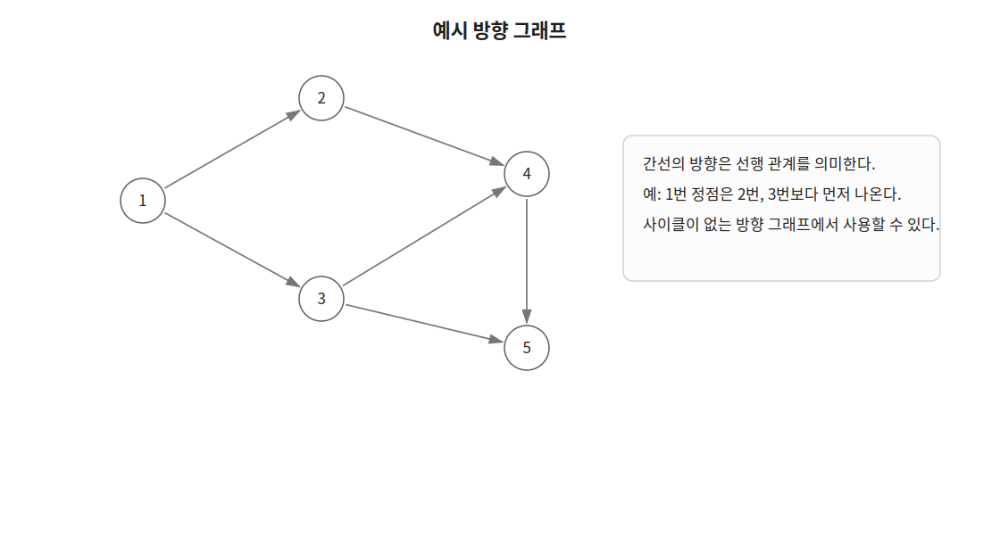
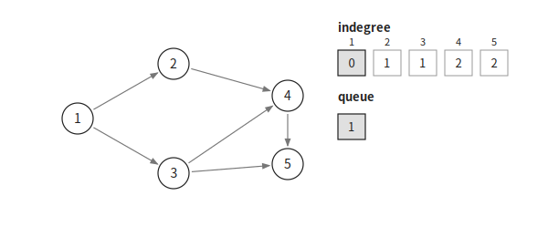
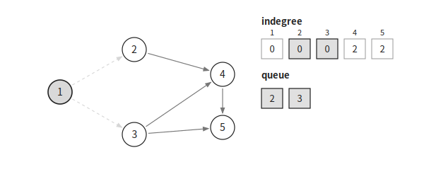
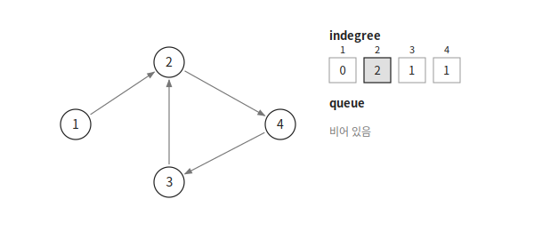

칸 알고리즘은 DAG에서 위상 정렬을 구하는 알고리즘이다.

위상 정렬은 모든 방향 간선 `u → v`에 대해 `u`가 `v`보다 앞에 나오도록 정점을 나열하는 것이다.

선행 관계가 있는 작업의 순서를 정할 때 사용할 수 있다.

## 동작 원리

다음과 같은 방향 그래프가 있다고 하자.



먼저 각 정점의 진입 차수를 계산한다.

진입 차수는 해당 정점으로 들어오는 간선의 개수이다.

```cpp
inDegree[v]++;
```

진입 차수가 `0`인 정점은 먼저 처리해야 하는 정점이 없다는 뜻이다.

따라서 진입 차수가 `0`인 정점을 모두 큐에 넣는다.



```cpp
queue<int> q;
for(int i=1;i<=n;i++) {
    if(!inDegree[i]) {
        q.push(i);
    }
}
```

큐에서 정점을 하나 꺼내 위상 정렬 결과에 추가한다.

이후 해당 정점에서 나가는 간선을 제거한다고 생각한다.

```cpp
int cur=q.front(); q.pop();
result.push_back(cur);
```

`cur → next` 간선을 제거하면 `next`의 진입 차수가 `1` 감소한다.

진입 차수가 새롭게 `0`이 된 정점은 큐에 넣는다.

```cpp
for(int next:conn[cur]) {
    if(--inDegree[next]==0) {
        q.push(next);
    }
}
```



이 과정을 큐가 빌 때까지 반복한다.

예시 그래프에서는 다음 순서로 정점을 꺼낼 수 있다.

```text
1  2  3  4  5
```

위상 정렬 결과는 하나로 정해지지 않을 수 있다.

동시에 진입 차수가 `0`인 정점이 여러 개라면 어떤 정점을 먼저 꺼내는지에 따라 결과가 달라진다.

## 사이클 판별

사이클이 있는 그래프에서는 사이클에 포함된 정점의 진입 차수가 `0`이 되지 않는다.

따라서 큐가 비었는데도 아직 처리하지 못한 정점이 남아 있다면 사이클이 존재한다.



```cpp
if(result.size()!=n) {
    cout << "CYCLE";
}
```

사이클이 존재하면 모든 정점을 포함하는 위상 정렬을 만들 수 없다.

## 구현

칸 알고리즘은 다음과 같이 구현할 수 있다. $O(V+E)$

```cpp
vector<int> topologicalSort(int n) {
    queue<int> q;
    vector<int> res;
    for(int i=1;i<=n;i++) {
        if(!inDegree[i]) {
            q.push(i);
        }
    }
    while(!q.empty()) {
        int cur=q.front(); q.pop();
        res.push_back(cur);
        for(int next:conn[cur]) {
            if(--inDegree[next]==0) {
                q.push(next);
            }
        }
    }
    return res;
}
```

방향 간선 `u → v`는 다음과 같이 저장한다.

```cpp
conn[u].push_back(v);
inDegree[v]++;
```

함수를 실행한 뒤 반환된 정점의 개수가 `n`보다 작다면 그래프에 사이클이 존재한다.

```cpp
vector<int> result=topologicalSort(n);

if(result.size()!=n) {
    cout << "CYCLE";
}
```

## 시간복잡도

각 정점은 큐에 한 번씩 들어가며 각 간선도 한 번씩 확인한다.

따라서 시간복잡도는 $O(V+E)$이다.

여기서 $V$는 정점의 개수이고 $E$는 간선의 개수이다.

## 연습 문제

[https://soj.services/problems/41](https://soj.services/problems/41)

<details>
<summary>코드 보기</summary>

```cpp
#include<bits/stdc++.h>
using namespace std;

int inD[100'001];
vector<vector<int>> conn(100'001);

int main() {
    cin.tie(0)->sync_with_stdio(0);
    int n, m; cin >> n >> m;
    while(m--) {
        int u, v; cin >> u >> v;
        conn[u].push_back(v);
        inD[v]++;
    }

    queue<int> q;
    for(int i=1;i<=n;i++) {
        if(!inD[i]) q.push(i);
    }
    vector<int> res;
    while(!q.empty()) {
        int cur=q.front(); q.pop();
        res.push_back(cur);
        for(int next:conn[cur]) {
            if(--inD[next]==0) q.push(next);
        }
    }
    if(res.size()!=n) cout << "CYCLE";
    else for(auto e:res) cout << e << ' ';
}
```

</details>
