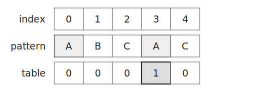
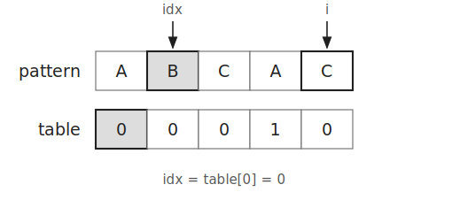
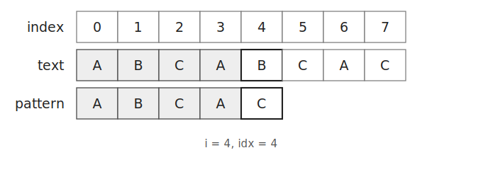
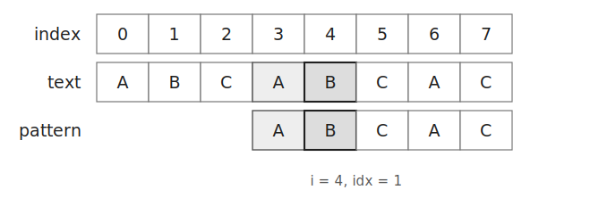
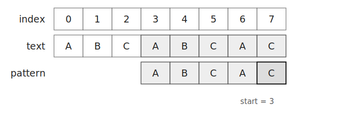
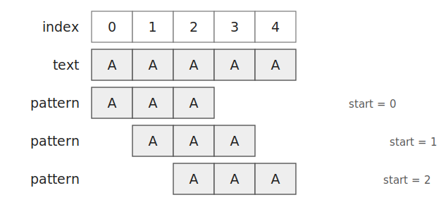

KMP는 문자열에서 패턴이 나타나는 위치를 찾는 알고리즘이다.

문자가 일치하지 않았을 때 이전에 확인한 내용을 이용해 패턴을 옮긴다.

따라서 이미 확인한 문자를 처음부터 다시 비교하지 않아도 된다.

## 부분 일치 테이블

패턴 `ABCAC`을 생각해 보자.

부분 일치 테이블 `table[i]`는 `pattern[0...i]`의 접두사와 접미사가 일치하는 최대 길이이다.



예를 들어 `ABCA`의 접두사 `A`와 접미사 `A`가 일치한다.

따라서 `table[3]`은 `1`이다.

```text
pattern[0...3] = ABCA
table[3] = 1
```

테이블을 만들 때는 현재까지 일치한 길이를 `idx`에 저장한다.

```cpp
for(int i=1, idx=0;i<pattern.size();i++) {
    ...
}
```

`pattern[i]`와 `pattern[idx]`가 다르면 이전에 구한 값을 이용해 `idx`를 줄인다.

```cpp
while(idx && pattern[i]!=pattern[idx]) {
    idx=table[idx-1];
}
```



문자가 같다면 일치한 길이를 `1` 증가시켜 저장한다.

```cpp
if(pattern[i]==pattern[idx]) {
    table[i]=++idx;
}
```

## 문자열 탐색

문자열 `ABCABCAC`에서 패턴 `ABCAC`을 찾는다고 하자.

처음에는 앞에서부터 문자를 비교한다.

```text
text    = ABCABCAC
pattern = ABCAC
```

앞의 네 문자는 일치하지만 마지막 문자는 다르다.



일반적인 방법이라면 다음 위치부터 패턴 전체를 다시 확인해야 한다.

KMP는 `table[idx-1]`을 이용해 다시 비교할 위치를 구한다.

```cpp
idx=table[idx-1];
```

`table[3]`은 `1`이므로 `idx`를 `1`로 줄인다.

문자열의 현재 위치 `i`는 바꾸지 않는다.



이전에 확인한 접두사 `A`와 접미사 `A`가 같다는 사실을 이용했기 때문이다.

이후 비교를 계속하면 인덱스 `3`에서 패턴을 찾을 수 있다.



패턴을 찾은 뒤에도 `idx`를 `table[idx-1]`로 옮긴다.

```cpp
idx=table[idx-1];
```

따라서 서로 겹치는 패턴도 모두 찾을 수 있다.



## 구현

부분 일치 테이블은 다음과 같이 만들 수 있다. $O(M)$

```cpp
vector<int> makeTable(const string& pattern) {
    vector<int> table(pattern.size());
    for(int i=1, idx=0;i<pattern.size();i++) {
        while(idx && pattern[i]!=pattern[idx]) idx=table[idx-1];
        if(pattern[i]==pattern[idx]) table[i]=++idx;
    }
    return table;
}
```

KMP는 다음과 같이 구현할 수 있다. $O(N+M)$

```cpp
vector<int> kmp(const string& text, const string& pattern) {
    vector<int> result, table=makeTable(pattern);
    for(int i=0, idx=0;i<text.size();i++) {
        while(idx && text[i]!=pattern[idx]) idx=table[idx-1];
        if(text[i]==pattern[idx]) {
            if(++idx==pattern.size()) {
                result.push_back(i-idx+2);
                idx=table[idx-1];
            }
        }
    }
    return result;
}
```

## 시간복잡도

부분 일치 테이블을 만드는 데 $O(M)$이 걸린다.

문자열을 탐색하는 데 $O(N)$이 걸린다.

따라서 전체 시간복잡도는 $O(N+M)$이다.

여기서 `N`은 문자열의 길이이고 `M`은 패턴의 길이이다.

## 연습 문제

[https://soj.services/problems/50](https://soj.services/problems/50)

<details>
<summary>코드 보기</summary>

```cpp
#include<bits/stdc++.h>
using namespace std;

int table[1'000'001];

void makeTable(string s) {
    for(int i=1, idx=0;i<s.length();i++) {
        while(idx && s[idx]!=s[i]) idx=table[idx-1];
        if(s[idx]==s[i]) table[i]=++idx;
    }
}

int main() {
    cin.tie(0)->sync_with_stdio(0);
    string t, p; cin >> t >> p;
    makeTable(p);

    vector<int> res;
    for(int i=0, idx=0;i<t.length();i++) {
        while(idx && p[idx]!=t[i]) idx=table[idx-1];
        if(p[idx]==t[i]) {
            if(++idx==p.length()) {
                res.push_back(i-idx+2);
                idx=table[idx-1];
            }
        }
    }
    cout << res.size() << '\n';
    for(auto e:res) cout << e << ' ';
}
```

</details>
