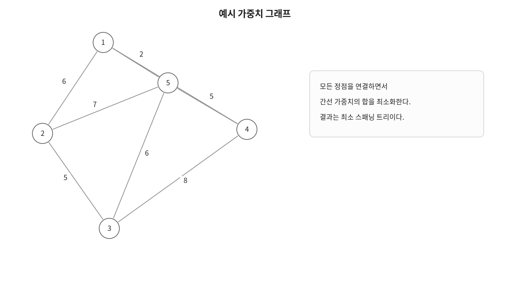
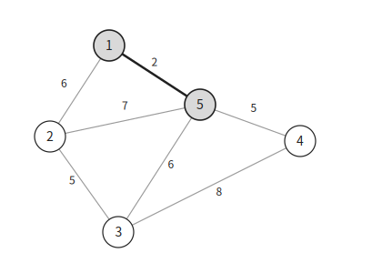
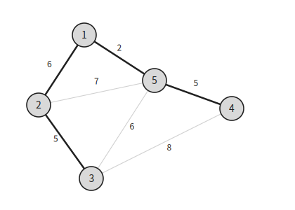
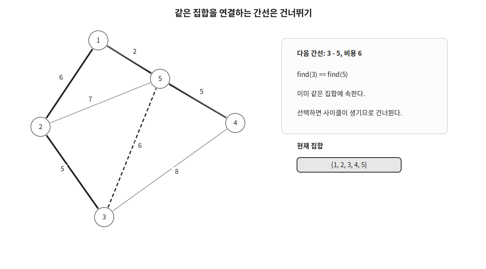

크루스칼은 그래프의 모든 정점을 최소 비용으로 연결하는 알고리즘이다.

가중치가 작은 간선부터 확인하며 사이클이 생기지 않는 간선만 선택한다.

## 최소 스패닝 트리

스패닝 트리는 그래프의 모든 정점을 연결하는 트리이다.

정점이 $V$개인 스패닝 트리는 $V-1$개의 간선을 갖는다.

최소 스패닝 트리는 스패닝 트리 중 간선 가중치의 합이 가장 작은 트리이다.



## 동작 원리

먼저 모든 간선을 가중치 기준으로 오름차순 정렬한다.



가중치가 작은 간선부터 차례대로 확인한다.

두 정점이 서로 다른 집합에 속한다면 간선을 선택하고 두 집합을 합친다.

```cpp
if(merge(u, v)) {
    res+=w;
}
```

두 정점이 이미 같은 집합에 속한다면 해당 간선을 선택했을 때 사이클이 생긴다.

따라서 그 간선은 선택하지 않는다.



예시에서는 다음 네 간선을 선택한다.

```text
1 - 5 : 2
2 - 3 : 5
4 - 5 : 5
1 - 2 : 6
```

이후 `3 - 5` 간선을 확인하면 두 정점은 이미 같은 집합에 속한다.



정점이 $5$개이므로 간선 $4$개를 선택하면 최소 스패닝 트리가 완성된다.

선택한 간선의 가중치 합은 $18$이다.

## 구현

크루스칼은 다음과 같이 구현할 수 있다. $O(E \log E)$

```cpp
struct element {
    ll u, v, w;
    bool operator<(const element &e) const {
        return w<e.w;
    }
};

int par[MAX];

int find(int x) {
    if(x==par[x]) return x;
    return par[x] = find(par[x]);
}

bool merge(int x, int y) {
    x=find(x);
    y=find(y);
    if(x==y) return false;
    if(x>y) par[x]=y;
    else par[y]=x;
    return true;
}

long long kruskal(int n, vector<element>& edges) {
    for(int i=1;i<=n;i++) par[i]=i;
    sort(edges.begin(), edges.end());

    long long res=0;
    for(auto [u, v, w]:edges) {
        if(merge(u, v)) {
            res+=w;
        }
    }
    return res;
}
```

간선 $E$개를 정렬하는 데 $O(E \log E)$가 걸린다.

각 간선마다 `DSU` 연산을 수행한다.

따라서 전체 시간복잡도는 $O(E \log E)$이다.

## 연습 문제

[https://soj.services/problems/42](https://soj.services/problems/42)

<details>
<summary>코드 보기</summary>

```cpp
#include<bits/stdc++.h>
using namespace std;

typedef long long ll;

struct element {
    ll u, v, w;
    bool operator<(const element &e) const {
        return w<e.w;
    }
};

int par[100'001];

int find(int x) {
    if(x==par[x]) return x;
    return par[x] = find(par[x]);
}

bool merge(int x, int y) {
    x=find(x);
    y=find(y);
    if(x==y) return false;
    if(x>y) swap(x, y);
    par[x]=y;
    return true;
}

int main() {
    cin.tie(0)->sync_with_stdio(0);
    int n, m; cin >> n >> m;

    for(int i=1;i<=n;i++) par[i]=i;
    vector<element> v(m);
    for(int i=0;i<m;i++) cin >> v[i].u >> v[i].v >> v[i].w;
    sort(v.begin(), v.end());

    ll res=0;
    for(auto [u, v, w]:v) {
        if(merge(u, v)) {
            res+=w;
        }
    }
    cout << res;
}
```

</details>