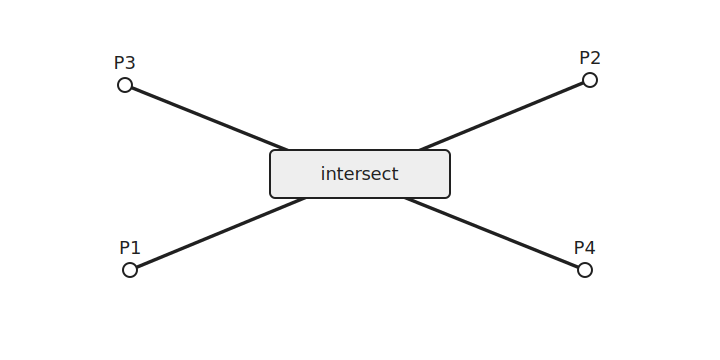
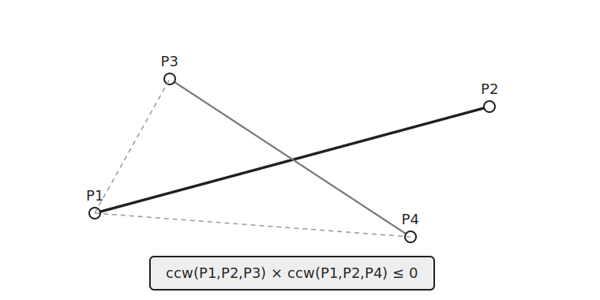
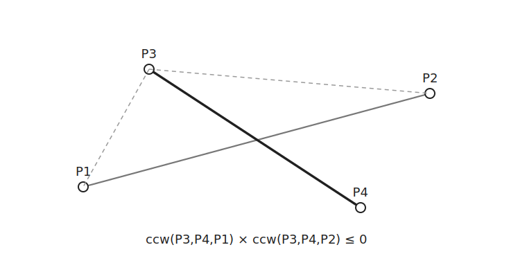
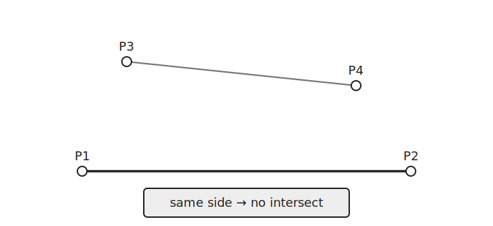
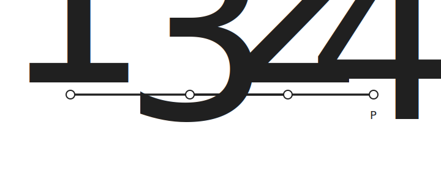
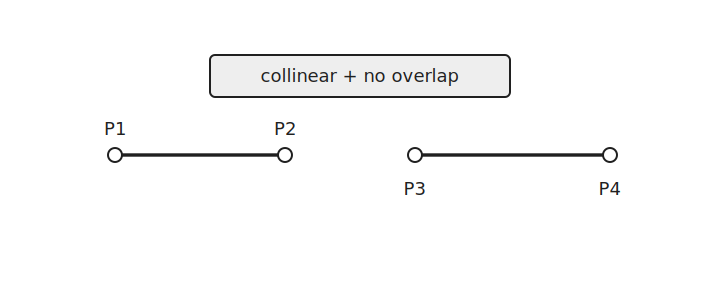

`Line Intersection`은 두 선분이 교차하는지 판별하는 알고리즘이다.

두 선분 $\overline{P_1P_2}$, $\overline{P_3P_4}$가 있을 때 `CCW`를 이용해 두 선분의 위치 관계를 확인한다.



끝점에서 만나는 경우도 교차로 본다.

## 한 선분을 기준으로 보기

먼저 선분 $\overline{P_1P_2}$를 기준으로 $P_3$, $P_4$가 서로 다른 방향에 있는지 확인한다.



```cpp
ccw(P1, P2, P3) * ccw(P1, P2, P4) <= 0
```

두 값의 부호가 다르면 $P_3$, $P_4$는 선분 $\overline{P_1P_2}$의 서로 다른 쪽에 있다.

둘 중 하나가 $0$이면 한 점이 직선 $P_1P_2$ 위에 있다는 뜻이다.

## 반대 방향도 확인

두 선분 $\overline{P_1P_2}$, $\overline{P_3P_4}$가 같은 직선 위에 있으면 별도로 처리해야 한다.



```cpp
ccw(P3, P4, P1) * ccw(P3, P4, P2) <= 0
```

두 조건을 모두 만족하면 두 선분은 보통 교차한다.

한쪽 기준에서 두 점이 같은 방향에 있으면 두 선분은 교차하지 않는다.



## 일직선인 경우

두 선분이 같은 직선 위에 있으면 별도로 처리해야 한다.



이때는 네 `CCW` 값이 모두 $0$이 된다.

각 선분의 양 끝점을 정렬한 뒤 두 구간이 겹치는지 확인한다.

```cpp
if(b<a) swap(a, b);
if(d<c) swap(c, d);
```

이제 `a <= b`, `c <= d`가 된다.

두 선분이 겹치지 않으려면 한 선분이 다른 선분보다 완전히 앞에 있어야 한다.

```cpp
b<c || d<a
```

따라서 두 선분이 겹치는 조건은 다음과 같다.

```cpp
!(b<c || d<a)
```

겹치지 않으면 교차하지 않는다.



## 구현

점을 저장하는 구조체를 만든다.

일직선 위에서 두 선분이 겹치는지 확인할 때 점의 순서를 비교해야 하므로 `<` 연산자를 정의한다.

```cpp
struct point {
    ll x, y;
    bool operator<(const point p) const {
        if(x!=p.x) return x<p.x;
        return y<p.y;
    }
};
```

선분은 두 점으로 표현한다.

```cpp
struct line {
    point p1, p2;
};
```

`CCW`를 구현한다.

```cpp
ll ccw(point a, point b, point c) {
    point v1 = {b.x-a.x, b.y-a.y};
    point v2 = {c.x-a.x, c.y-a.y};
    ll ret=v1.x*v2.y-v2.x*v1.y;
    return ret>0 ? 1 : ret<0 ? -1 : 0;
}
```

두 선분의 교차 여부는 다음과 같이 판별한다. $O(1)$

```cpp
bool isIntersect(line l1, line l2) {
    point a=l1.p1, b=l1.p2, c=l2.p1, d=l2.p2;
    ll ac=ccw(a, b, c);
    ll ad=ccw(a, b, d);
    ll ca=ccw(c, d, a);
    ll cb=ccw(c, d, b);

    if(ac*ad==0 && ca*cb==0) {
        if(b<a) swap(a, b);
        if(d<c) swap(c, d);
        return !(b<c || d<a);
    }
    return ac*ad<=0 && ca*cb<=0;
}
```

`ac*ad==0 && ca*cb==0`이면 두 선분이 같은 직선 위에 있는 경우까지 포함한다.

이 경우에는 점의 순서를 정렬한 뒤 겹치는지만 확인한다.

그 외에는 두 기준에서 모두 서로 다른 방향에 있는지 확인한다.

## 연습 문제

[https://soj.services/problems/58](https://soj.services/problems/58)

<details>
<summary>코드 보기</summary>

```cpp
#include<bits/stdc++.h>
using namespace std;

typedef long long ll;

struct point {
    ll x, y;
    bool operator<(const point p) const {
        if(x!=p.x) return x<p.x;
        return y<p.y;
    }
};

struct line {
    point p1, p2;
};

ll ccw(point a, point b, point c) {
    point v1 = {b.x-a.x, b.y-a.y};
    point v2 = {c.x-a.x, c.y-a.y};
    ll ret=v1.x*v2.y-v2.x*v1.y;
    return ret>0 ? 1 : ret<0 ? -1 : 0;
}

bool isIntersect(line l1, line l2) {
    point a=l1.p1, b=l1.p2, c=l2.p1, d=l2.p2;
    ll ac = ccw(a, b, c);
    ll ad = ccw(a, b, d);
    ll ca = ccw(c, d, a);
    ll cb = ccw(c, d, b);
    if(ac*ad==0 && ca*cb==0) {
        if(b<a) swap(a, b);
        if(d<c) swap(c, d);
        return !(b<c || d<a);
    }
    return ac*ad<=0 && ca*cb<=0;
}

int main() {
    cin.tie(0)->sync_with_stdio(0);
    int q; cin >> q;
    while(q--) {
        line a, b; cin >> a.p1.x >> a.p1.y >> a.p2.x >> a.p2.y >> b.p1.x >> b.p1.y >> b.p2.x >> b.p2.y;
        cout << (isIntersect(a, b) ? "Yes\n" : "No\n");
    }
}
```

</details>