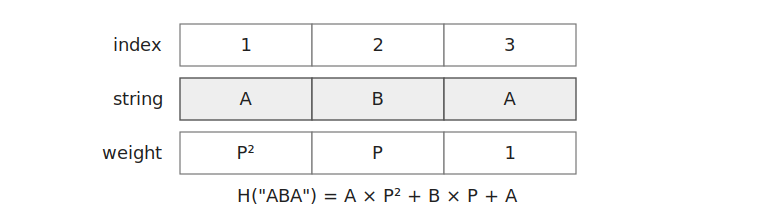
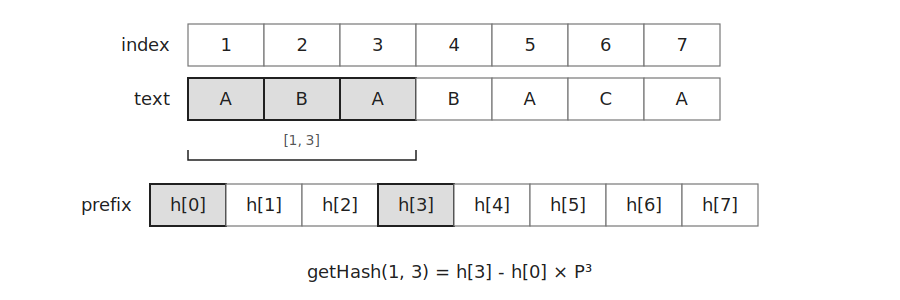
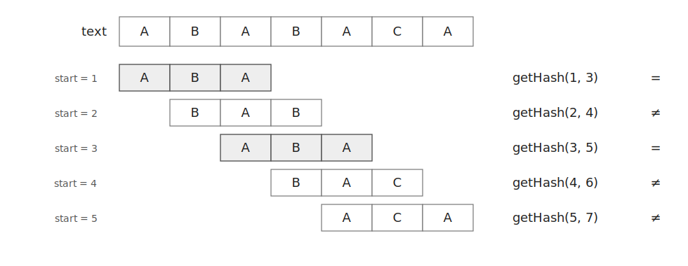
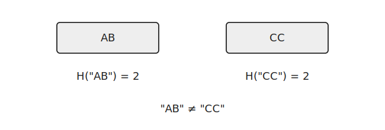

라빈-카프는 문자열을 해시값으로 바꾸어 패턴을 찾는 알고리즘이다.

길이가 같은 문자열은 해시값 하나로 비교할 수 있다.

접두사 해시를 이용하면 각 부분 문자열의 해시값도 $O(1)$에 구할 수 있다.

## 문자열 해시

문자열 `ABA`의 해시값은 다음과 같이 계산한다.



```text
H("ABA") = A × P² + B × P + A  (mod M)
```

문자를 하나 추가할 때는 기존 해시값에 `P`를 곱한 뒤 새로운 문자를 더한다.

```cpp
h=(h*P+ch)%M;
```

`P`는 밑이고 `M`은 모듈러이다.

같은 문자열은 같은 해시값을 갖는다.

해시값이 다르면 두 문자열도 반드시 다르다.

## 접두사 해시

문자열의 모든 접두사 해시값을 미리 계산한다.

```cpp
for(int i=1;i<=s.length();i++) {
    h[i]=(h[i-1]*P+s[i-1])%M;
}
```

`h[i]`는 문자열의 `1`번부터 `i`번 문자까지의 해시값이다.

`b[i]`에는 `P^i`를 저장한다.

```cpp
b[0]=1;
for(int i=1;i<=s.length();i++) {
    b[i]=b[i-1]*P%M;
}
```

접두사 해시를 이용하면 `left`번부터 `right`번 문자까지의 해시값을 다음과 같이 구할 수 있다.



`getHash(left, right)`는 `left`번부터 `right`번 문자까지의 해시값을 반환한다.

```cpp
ll getHash(int left, int right) {
    return (h[right]-h[left-1]*b[right-left+1]%M+M)%M;
}
```

## 패턴 탐색

문자열 `ABABACA`에서 패턴 `ABA`를 찾는다고 하자.

먼저 패턴의 해시값을 구한다.

```cpp
ll patternHash=getHash(pattern);
```

이후 패턴과 길이가 같은 모든 부분 문자열의 해시값을 확인한다.



```cpp
for(int i=1;i+pattern.length()-1<=text.length();i++) {
    if(getHash(i, i+pattern.length()-1)==patternHash) {
        result.push_back(i);
    }
}
```

예시에서는 `1`번과 `3`번 위치에서 패턴을 찾을 수 있다.


## 해시 충돌

서로 다른 문자열이 같은 해시값을 가질 수 있다.



이러한 현상을 해시 충돌이라고 한다.

## 구현

라빈-카프는 다음과 같이 구현할 수 있다.

```cpp
const ll M=3'037'000'493, P=1'343'457'632;
ll h[MAX], b[MAX];

void init(const string& s) {
    b[0]=1;
    for(int i=1;i<=s.length();i++) {
        h[i]=(h[i-1]*P+s[i-1])%M;
        b[i]=b[i-1]*P%M;
    }
}

ll getHash(int left, int right) {
    return (h[right]-h[left-1]*b[right-left+1]%M+M)%M;
}

ll getHash(const string& s) {
    ll h=0;
    for(char ch:s) h=(h*P+ch)%M;
    return h;
}

vector<int> rabinKarp(const string& text, const string& pattern) {
    init(text);
    vector<int> result;
    ll patternHash=getHash(pattern);
    for(int i=1;i+pattern.length()-1<=text.length();i++) {
        if(getHash(i, i+pattern.length()-1)==patternHash) {
            result.push_back(i);
        }
    }
    return result;
}
```

## 시간복잡도

문자열 `text`의 길이를 `N`이라고 하자.

접두사 해시를 계산하는 데 $O(N)$이 걸린다.

패턴의 길이를 `M`이라고 하면 패턴의 해시값을 계산하는 데 $O(M)$이 걸린다.

각 부분 문자열의 해시값은 $O(1)$에 확인할 수 있다.

따라서 전체 시간복잡도는 $O(N+M)$이다.

## 연습 문제

[https://soj.services/problems/51](https://soj.services/problems/51)

<details>
<summary>코드 보기</summary>

```cpp
#include<bits/stdc++.h>
using namespace std;

typedef long long ll;
const ll M=3'037'000'493, P=1'343'457'632;
ll h1[1'000'001];

int main() {
    cin.tie(0)->sync_with_stdio(0);
    string t; cin >> t;
    int l, q; cin >> l >> q;

    ll b=1;
    unordered_set<ll> li;
    for(int i=0;i<l;i++) b=b*P%M;
    for(int i=1;i<=t.length();i++) h1[i]=(h1[i-1]*P+t[i-1])%M;
    for(int i=l;i<=t.length();i++) li.insert((h1[i]-h1[i-l]*b%M+M)%M);

    while(q--) {
        string p; cin >> p;
        ll h=0;
        for(char ch:p) h=(h*P+ch)%M;
        cout << (li.count(h) ? "Yes\n" : "No\n");
    }
}
```

</details>
