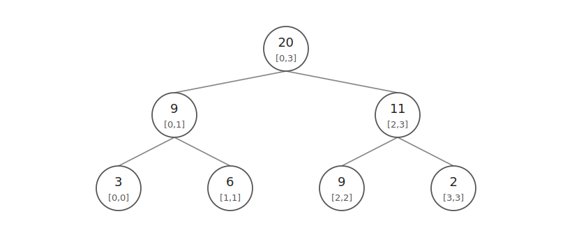
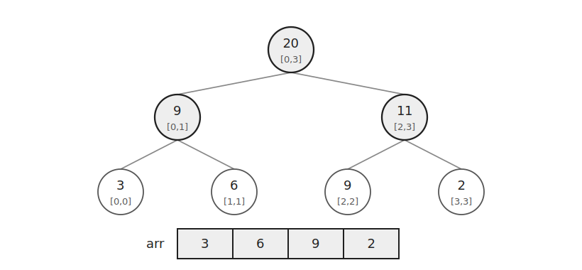
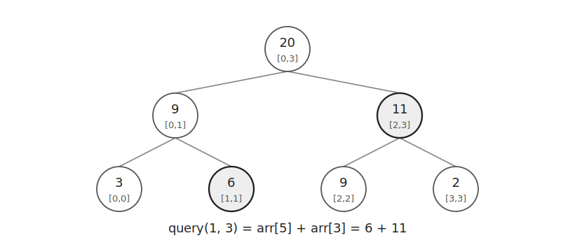
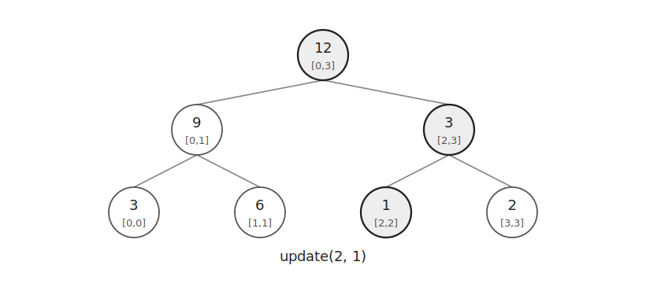

세그먼트 트리는 배열의 구간 정보를 저장하는 자료구조이다.

구간 합, 구간 최솟값, 구간 최댓값처럼 두 구간의 값을 합쳐 더 큰 구간의 값을 만들 수 있을 때 사용한다.

이 글에서는 구간 합을 기준으로 설명한다.

## 구조

세그먼트 트리는 완전 이진 트리 형태로 구간 정보를 저장한다.



리프 노드는 원래 배열의 값을 저장한다.

부모 노드는 두 자식 노드가 담당하는 구간의 합을 저장한다.

```cpp
arr[i]=arr[i*2]+arr[i*2+1];
```

배열로 구현할 때는 보통 $1$번 노드를 루트로 사용한다.

그러면 `i`번 노드의 왼쪽 자식은 `i*2`, 오른쪽 자식은 `i*2+1`이다.

## 초기화

원소의 개수를 $n$이라고 하자.

먼저 `SZ`를 $n$ 이상인 가장 작은 $2$의 거듭제곱으로 만든다.

```cpp
while(SZ<n) SZ<<=1;
```

원래 배열의 값은 리프 위치에 저장한다.

```cpp
for(int i=0;i<n;i++) {
    cin >> arr[SZ+i];
}
```

이후 아래에서 위로 올라가며 부모 값을 채운다.



```cpp
for(int i=SZ-1;i>0;i--) {
    arr[i]=arr[i*2]+arr[i*2+1];
}
```

초기화는 $O(N)$에 처리할 수 있다.

## 구간 쿼리

구간 $[1,3]$의 합을 구한다고 하자.

이 구간은 세그먼트 트리에서 $[1,1]$과 $[2,3]$ 두 구간으로 나눌 수 있다.



따라서 `arr[5]`와 `arr[3]`을 더하면 답을 구할 수 있다.

```text
query(1, 3) = arr[5] + arr[3]
```

비재귀 구현에서는 `L`과 `R`을 리프 위치로 옮긴 뒤 양쪽 끝에서 필요한 구간만 선택한다.

`L`이 오른쪽 자식이면 현재 노드를 사용하고 오른쪽으로 이동한다.

```cpp
if(L&1) ret+=arr[L++];
```

`R`이 왼쪽 자식이면 현재 노드를 사용하고 왼쪽으로 이동한다.

```cpp
if(!(R&1)) ret+=arr[R--];
```

이후 부모로 올라간다.

```cpp
L>>=1;
R>>=1;
```

구간 쿼리는 $O(\log N)$에 처리할 수 있다.

## 값 변경

인덱스 $2$의 값을 $1$로 바꾼다고 하자.

먼저 리프 노드의 값을 바꾼다.

그 뒤 루트까지 올라가며 부모 노드의 값을 다시 계산한다.



```cpp
void update(int i, ll val) {
    i+=SZ;
    arr[i]=val;
    while(i>1) {
        i>>=1;
        arr[i]=arr[i*2]+arr[i*2+1];
    }
}
```

변경된 원소를 포함하는 구간만 갱신하므로 값 변경은 $O(\log N)$에 처리할 수 있다.

## 구현

구간 합 세그먼트 트리는 다음과 같이 구현할 수 있다.

```cpp
ll SZ=1, arr[MAX*4];

void build(int n) {
    while(SZ<n) SZ<<=1;
}

void update(int i, ll val) {
    i+=SZ;
    arr[i]=val;
    while(i>1) {
        i>>=1;
        arr[i]=arr[i*2]+arr[i*2+1];
    }
}

ll query(int L, int R) {
    ll ret=0;
    for(L+=SZ, R+=SZ;L<=R;L>>=1, R>>=1) {
        if(L&1) ret+=arr[L++];
        if(!(R&1)) ret+=arr[R--];
    }
    return ret;
}
```

공간복잡도는 $O(N)$이다.

## 연습 문제

[https://soj.services/problems/54](https://soj.services/problems/54)

<details>
<summary>코드 보기</summary>

```cpp
#include<bits/stdc++.h>
using namespace std;

typedef long long ll;
const int MAX=200'001*4;

ll SZ=1, a[MAX];

void update(int i, ll val) {
    i+=SZ;
    a[i]=val;
    while(i>1) {
        i>>=1;
        a[i]=a[i*2]+a[i*2+1];
    }
}

ll query(int L, int R) {
    ll ret=0;
    for(L+=SZ, R+=SZ;L<=R;L>>=1, R>>=1) {
        if(L&1) ret+=a[L++];
        if(!(R&1)) ret+=a[R--];
    }
    return ret;
}

int main() {
    cin.tie(0)->sync_with_stdio(0);
    int n, q; cin >> n >> q;
    while(SZ<n) SZ<<=1;
    for(int i=0;i<n;i++) cin >> a[SZ+i];
    for(int i=SZ-1;i>0;i--) a[i]=a[i*2]+a[i*2+1];

    while(q--) {
        int op; cin >> op;
        if(op==1) {
            int i, x; cin >> i >> x;
            update(i-1, x);
        } else {
            int l, r; cin >> l >> r;
            cout << query(l-1, r-1) << '\n';
        }
    }
}
```

</details>