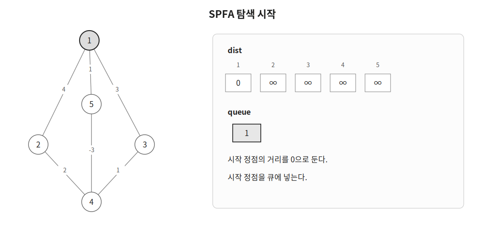
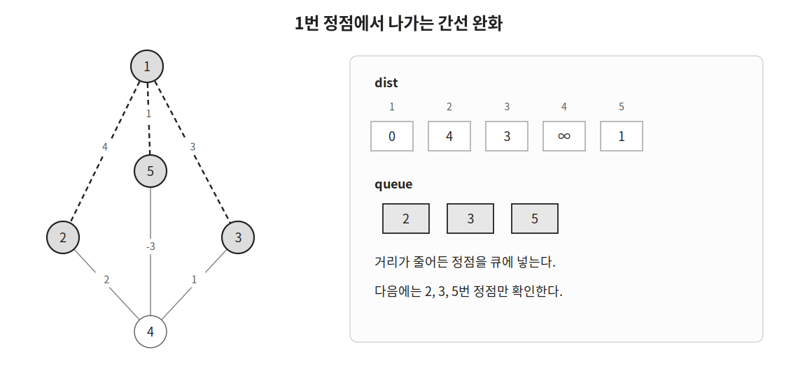
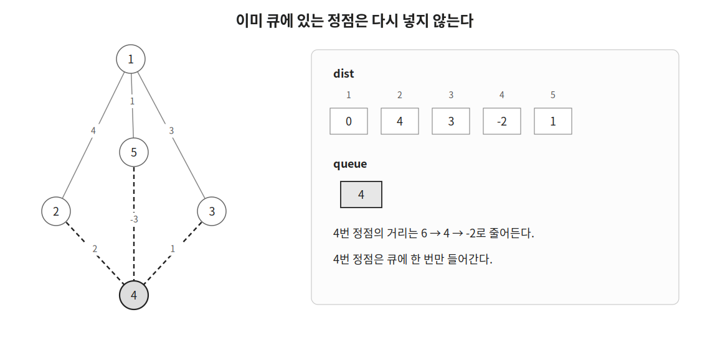
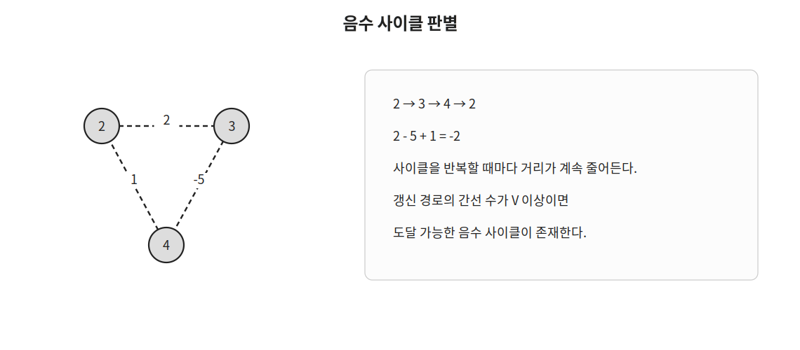

SPFA는 벨만-포드를 기반으로 시작 정점으로부터의 최단 거리를 구하는 알고리즘이다.

벨만-포드는 모든 간선을 반복해서 확인하지만 SPFA는 거리가 줄어든 정점만 큐에 넣어 다시 확인한다.

가중치가 음수인 간선이 있어도 사용할 수 있으며 시작 정점에서 도달 가능한 음수 사이클의 존재 여부도 판별할 수 있다.

## 동작 원리

다음과 같은 방향 그래프에서 `1`번 정점으로부터의 최단 거리를 구한다고 하자.

처음에는 시작 정점의 거리를 `0`으로 두고 나머지 정점의 거리를 무한대로 둔다.

시작 정점은 큐에 넣고 `inQueue` 배열에 표시한다.

```cpp
dist[1]=0;
q.push(1);
inQueue[1]=true;
```



큐의 맨 앞에서 정점을 하나 꺼낸 뒤 해당 정점에서 나가는 간선을 확인한다.

현재 정점 `cur`을 거쳐 더 짧게 이동할 수 있다면 `dist[nxt]`를 갱신한다.

```cpp
if(dist[nxt]>dist[cur]+w) {
    dist[nxt]=dist[cur]+w;
}
```

처음에는 `1`번 정점을 꺼낸다.

`1`번 정점에서 이동할 수 있는 `2`, `3`, `5`번 정점의 거리가 각각 `4`, `3`, `1`로 줄어든다.

거리가 줄어든 정점은 이후 다시 확인해야 하므로 큐에 넣는다.



다음으로 `2`, `3`, `5`번 정점을 차례대로 확인한다고 하자.

`4`번 정점의 거리는 `6`, `4`, `-2`로 계속 줄어든다.

하지만 `4`번 정점이 이미 큐에 들어 있다면 다시 넣지 않는다.



큐가 비면 더 이상 확인해야 하는 정점이 없으므로 알고리즘을 종료한다.

## 큐 중복 방지

한 정점이 큐에 여러 번 들어가면 같은 정점을 불필요하게 반복해서 확인할 수 있다.

따라서 `inQueue` 배열을 이용해 큐에 들어 있는 정점을 관리한다.

```cpp
if(!inQueue[nxt]) {
    q.push(nxt);
    inQueue[nxt]=true;
}
```

큐에서 정점을 꺼낼 때는 다시 `false`로 바꾼다.

```cpp
int cur=q.front(); q.pop();
inQueue[cur]=false;
```

사실 처음에는 큐에 시작 정점 하나만 들어 있으므로 시작 정점을 넣을 때는 `inQueue[start]=true`를 하지 않아도 된다.

이후 간선 완화로 정점을 큐에 추가할 때만 `inQueue`를 확인하고 값을 바꾼다.

## 음수 사이클

음수 사이클은 간선 가중치의 합이 음수인 사이클이다.

음수 사이클을 반복해서 돌면 경로의 길이를 계속 줄일 수 있다.



`cnt[i]`에는 `i`번 정점이 큐에 들어간 횟수를 저장한다.

```cpp
if(++cnt[nxt]==n) return false;
```

정점이 `n`개인 그래프에서 하나의 정점이 `n`번 큐에 들어갔다면 시작 정점에서 도달 가능한 음수 사이클이 존재한다고 판단할 수 있다.

거리 갱신이 발생해도 해당 정점이 이미 큐에 있다면 다시 넣지 않는다.

따라서 `cnt[nxt]`도 실제로 큐에 넣을 때만 증가시킨다.

```cpp
if(!inQueue[nxt]) {
    if(++cnt[nxt]==n) return false;
    q.push(nxt);
    inQueue[nxt]=true;
}
```

시작 정점에서 도달할 수 없는 정점은 큐에 들어가지 않으므로 연결되지 않은 음수 사이클은 판별하지 않는다.

## 구현

SPFA는 다음과 같이 구현할 수 있다.

```cpp
ll dist[MAX];
int cnt[MAX];
bool inQueue[MAX];
vector<vector<pair<int, ll>>> conn(MAX);

bool spfa(int start, int n) {
    fill(dist, dist+n+1, LINF);
    queue<int> q; q.push(start);
    dist[start]=0;
    while(!q.empty()) {
        int cur=q.front(); q.pop();
        inQueue[cur]=false;
        for(auto [nxt, w]:conn[cur]) {
            if(dist[nxt]<=dist[cur]+w) continue;
            dist[nxt]=dist[cur]+w;
            if(!inQueue[nxt]) {
                if(++cnt[nxt]==n) return false;
                q.push(nxt);
                inQueue[nxt]=true;
            }
        }
    }
    return true;
}
```

음수 사이클이 없다면 `true`를 반환한다.

시작 정점에서 도달 가능한 음수 사이클이 있다면 `false`를 반환한다.

방향 간선 `u → v`의 가중치가 `w`라면 다음과 같이 저장한다.

```cpp
conn[u].push_back({v, w});
```

## 시간복잡도

SPFA는 많은 입력에서 벨만-포드보다 빠르게 동작한다.

갱신이 필요한 정점만 큐에 넣어 확인하기 때문이다.

하지만 최악의 경우에는 하나의 정점이 여러 번 큐에 들어갈 수 있으며 시간복잡도는 $O(VE)$이다.

따라서 최악 시간복잡도가 중요한 문제에서는 입력 조건을 확인한 뒤 사용해야 한다.

## 연습 문제

[https://soj.services/problems/39](https://soj.services/problems/39)

<details>
<summary>코드 보기</summary>

```cpp
#include<bits/stdc++.h>
using namespace std;

typedef long long ll;
const ll LINF=0x3f3f3f3f3f3f3f3f;

ll inQ[1001], dist[1001], cnt[1001];
vector<vector<pair<ll, ll>>> conn(1001);

int main() {
    cin.tie(0)->sync_with_stdio(0);
    int n, m, s; cin >> n >> m >> s;
    while(m--) {
        ll u, v, w; cin >> u >> v >> w;
        conn[u].push_back({v, w});
    }

    fill(dist, dist+n+1, LINF);
    dist[s]=0;
    queue<int> q; q.push(s);
    while(!q.empty()) {
        int cur = q.front(); q.pop();
        inQ[cur]=false;
        for(auto [nxt, w]:conn[cur]) {
            if(dist[nxt]<=dist[cur]+w) continue;
            dist[nxt]=dist[cur]+w;
            if(!inQ[nxt]) {
                if(++cnt[nxt]==n) return !(cout << "NEGATIVE CYCLE");
                inQ[nxt]=true;
                q.push(nxt);
            }
        }
    }
    for(int i=1;i<=n;i++) {
        if(dist[i]==LINF) cout << "INF\n";
        else cout << dist[i] << '\n';
    }
}
```

</details>
