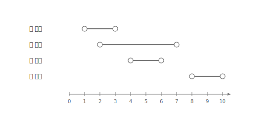
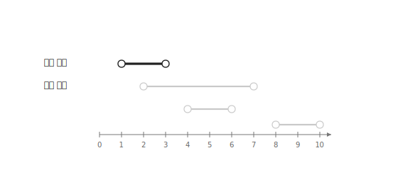
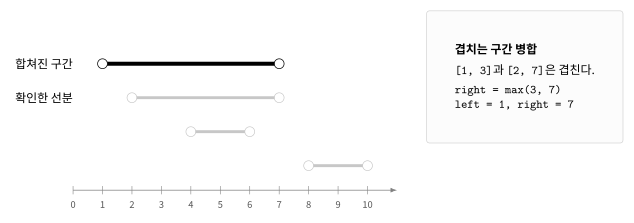
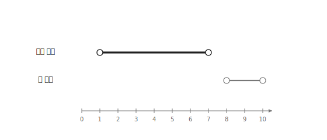

스위핑은 데이터를 일정한 기준으로 정렬한 뒤 한 방향으로 훑으며 답을 구하는 알고리즘이다.

문제마다 유지해야 하는 정보는 달라진다. 이 글에서는 선분이 차지하는 전체 길이를 구하는 문제를 예로 설명한다.

## 선분의 전체 길이

다음과 같이 네 개의 선분이 있다고 하자.

```text
[2, 7]
[1, 3]
[4, 6]
[8, 10]
```

서로 겹치는 부분은 한 번만 세어야 한다.

따라서 선분들을 합치면 `[1, 7]`, `[8, 10]`이 남고 전체 길이는 `8`이다.

## 정렬

먼저 선분을 시작점 기준으로 오름차순 정렬한다.



정렬한 선분은 다음과 같다.

```text
[1, 3]
[2, 7]
[4, 6]
[8, 10]
```

정렬해두면 현재 구간과 다음 선분만 비교하면 된다.

## 현재 구간

처음에는 첫 번째 선분을 현재 구간으로 둔다.



```cpp
int left=lines[0].first;
int right=lines[0].second;
```

현재 구간은 `[1, 3]`이다.

## 겹치는 구간 합치기

다음 선분의 시작점이 `right` 이하라면 현재 구간과 겹친다.

```cpp
if(lines[i].first<=right) {
    right=max(right, lines[i].second);
}
```



`[2, 7]`은 `[1, 3]`과 겹치므로 하나의 구간으로 합친다.

```text
[1, 3] + [2, 7] = [1, 7]
```

다음 선분인 `[4, 6]`도 현재 구간 안에 포함되므로 `[1, 7]`을 그대로 유지한다.

## 겹치지 않는 구간

다음 선분의 시작점이 `right`보다 크다면 현재 구간과 겹치지 않는다.

이 경우 현재 구간의 길이를 답에 더한 뒤 새로운 구간을 시작한다.

```cpp
sum+=right-left;
left=lines[i].first;
right=lines[i].second;
```



`[8, 10]`은 `[1, 7]`과 겹치지 않는다.

따라서 `[1, 7]`의 길이인 `6`을 더하고 현재 구간을 `[8, 10]`으로 바꾼다.

반복이 끝난 뒤에는 마지막 구간의 길이도 더해야 한다.

```cpp
sum+=right-left;
```

최종 답은 다음과 같다.

```text
(7 - 1) + (10 - 8) = 8
```

## 구현

선분이 차지하는 전체 길이는 다음과 같이 구할 수 있다.

```cpp
sort(lines.begin(), lines.end());

int sum=0;
int left=lines[0].first;
int right=lines[0].second;

for(int i=1;i<n;i++) {
    if(right<lines[i].first) {
        sum+=right-left;
        left=lines[i].first;
        right=lines[i].second;
    } else {
        right=max(right, lines[i].second);
    }
}
sum+=right-left;
```

정렬에 $O(n \log n)$이 걸리고 모든 선분을 한 번씩 확인하므로 전체 시간복잡도는 $O(n \log n)$이다.

## 연습 문제

[https://soj.services/problems/29](https://soj.services/problems/29)

<details>
<summary>코드 보기</summary>

```cpp
#include<bits/stdc++.h>
using namespace std;

int main() {
    cin.tie(0)->sync_with_stdio(0);
    int n; cin >> n;
    vector<pair<int, int>> v(n);
    for(auto &[l, r]:v) cin >> l >> r;
    sort(v.begin(), v.end());

    int l=v[0].first, r=v[0].second, sum=0;
    for(int i=1;i<n;i++) {
        auto [a, b]=v[i];
        if(r<a) {
            sum+=r-l;
            l=a;
            r=b;
        } else {
            r=max(r, b);
        }
    }
    sum+=r-l;
    cout << sum;
}
```

</details>
