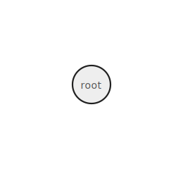
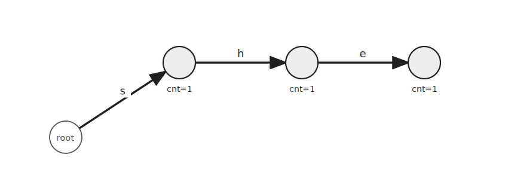
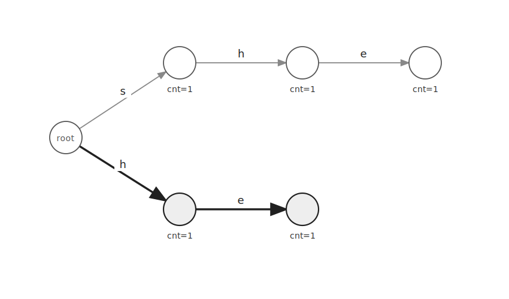
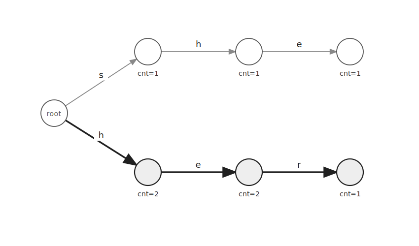
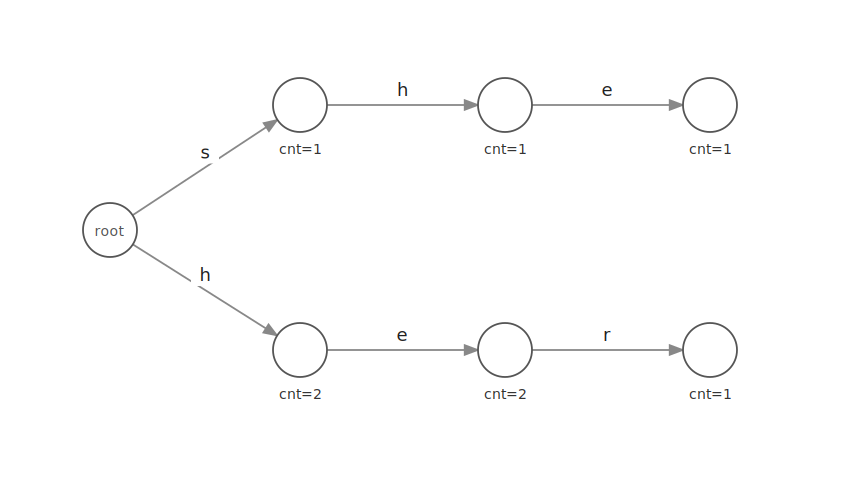
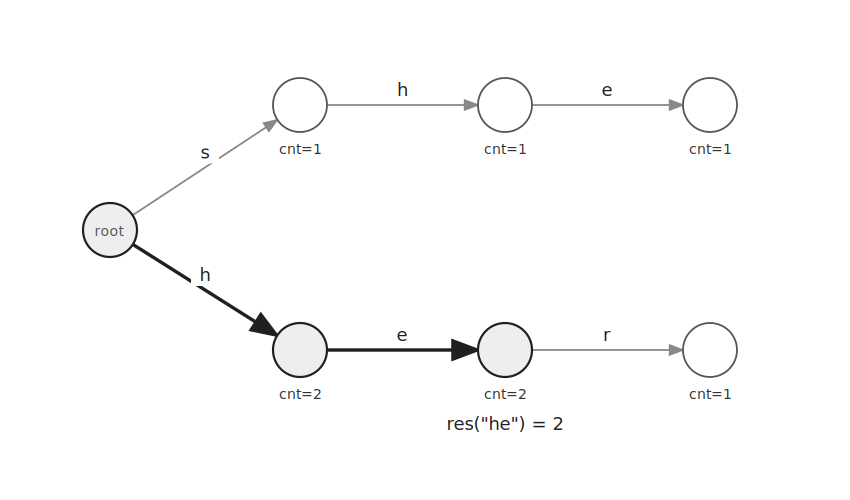
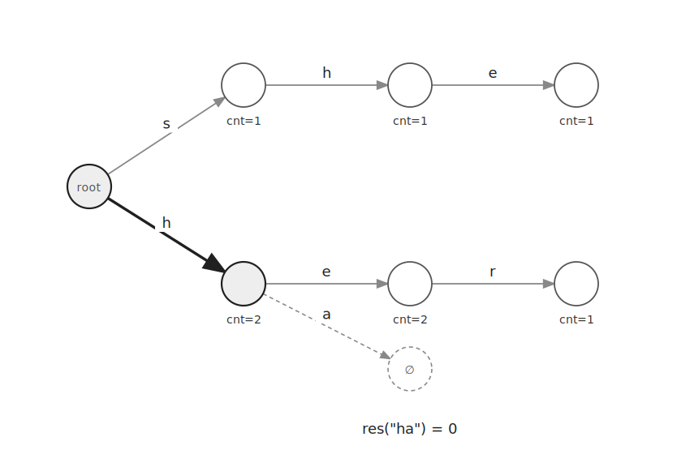

`Trie`는 여러 문자열을 공통 접두사 단위로 묶어 저장하는 자료구조이다.

같은 접두사를 공유하는 문자열은 같은 경로를 사용한다.

이 글에서는 각 접두사로 시작하는 문자열의 개수를 저장한다.

## 구조

처음에는 루트 노드만 존재한다.



각 간선은 하나의 문자를 의미한다.

각 노드의 `cnt`에는 루트에서 해당 노드까지 이어지는 접두사로 시작하는 문자열의 개수를 저장한다.

문자열을 삽입할 때는 루트부터 문자를 하나씩 따라간다.

이동할 간선이 없다면 새로운 노드를 만든다.

## 문자열 삽입

문자열 `she`를 삽입한다고 하자.

루트에서 `s`, `h`, `e`를 차례대로 따라간다.

처음에는 해당 경로가 없으므로 새로운 노드를 만든다.



각 노드에 도착할 때마다 `cnt`를 $1$ 증가시킨다.

```cpp
cur=cur->go[ch-'a'];
cur->cnt++;
```

다음으로 문자열 `he`를 삽입한다.

루트에서 `h`로 이동하는 간선이 없으므로 새로운 경로를 만든다.



문자열 `her`를 삽입할 때는 `h`, `e` 경로를 그대로 사용한다.

`r`로 이동하는 간선만 새로 만든다.



`h`와 `he`로 시작하는 문자열은 각각 두 개이므로 해당 노드의 `cnt`는 $2$가 된다.

세 문자열을 모두 삽입하면 다음과 같은 `Trie`가 만들어진다.



## 접두사 탐색

접두사로 시작하는 문자열의 개수를 확인할 때도 루트부터 문자를 하나씩 따라간다.

예를 들어 `he`로 시작하는 문자열은 `he`, `her` 두 개이다.



모든 문자를 따라간 뒤 마지막 노드의 `cnt`를 반환한다.

```cpp
return cur->cnt;
```

이동할 간선이 없다면 해당 접두사로 시작하는 문자열도 없다.



```cpp
if(!cur->go[ch-'a']) return 0;
```

## 구현

알파벳 소문자로 이루어진 문자열을 저장하는 `Trie`는 다음과 같이 구현할 수 있다.

```cpp
struct Trie {
    Trie* go[26] = {};
    int cnt=0;

    void insert(const string &s) {
        Trie *cur=this;
        for(char ch:s) {
            if(!cur->go[ch-'a']) cur->go[ch-'a'] = new Trie;
            cur = cur->go[ch-'a'];
            cur->cnt++;
        }
    }
    int res(const string &s) {
        Trie *cur=this;
        for(char ch:s) {
            if(!cur->go[ch-'a']) return 0;
            cur = cur->go[ch-'a'];
        }
        return cur->cnt;
    }
};
```

문자열의 길이를 $L$이라고 하자.

삽입과 접두사 탐색은 문자를 한 번씩 확인하므로 $O(L)$에 처리할 수 있다.

저장한 모든 문자열의 길이 합을 $S$라고 하면 공간복잡도는 $O(S)$이다.

## 연습 문제

[https://soj.services/problems/53](https://soj.services/problems/53)

<details>
<summary>코드 보기</summary>

```cpp
#include<bits/stdc++.h>
using namespace std;

struct Trie {
    Trie* go[26] = {};
    int cnt=0;

    void insert(const string &s) {
        Trie *cur=this;
        for(char ch:s) {
            if(!cur->go[ch-'a']) cur->go[ch-'a'] = new Trie;
            cur = cur->go[ch-'a'];
            cur->cnt++;
        }
    }
    int res(const string &s) {
        Trie *cur=this;
        for(char ch:s) {
            if(!cur->go[ch-'a']) return 0;
            cur = cur->go[ch-'a'];
        }
        return cur->cnt;
    }
};

int main() {
    cin.tie(0)->sync_with_stdio(0);
    Trie *root = new Trie;
    int q; cin >> q;
    while(q--) {
        int op; string s; cin >> op >> s;
        if(op==1) root->insert(s);
        else cout << root->res(s) << '\n';
    }
}
```

</details>