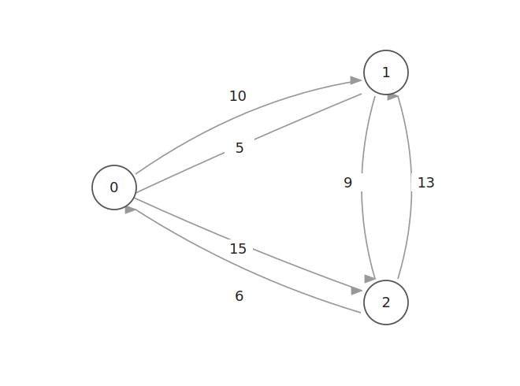
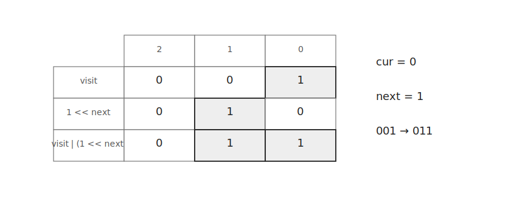
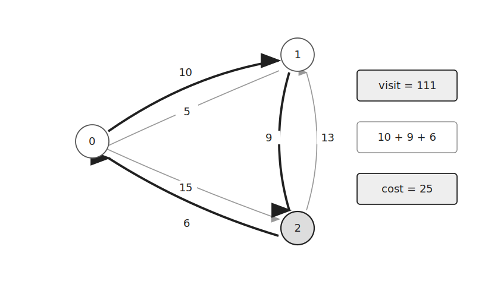
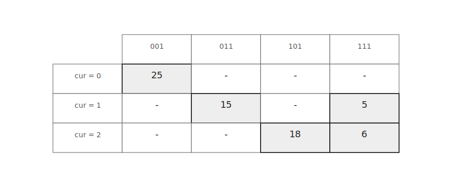

TSP는 모든 도시를 한 번씩 방문하고 시작 도시로 돌아오는 경로의 최소 비용을 구하는 문제이다.

방문 순서를 모두 확인하면 $O(N!)$이 걸린다.

비트마스크를 이용해 방문한 도시의 집합을 저장하면 중복되는 상태를 재사용할 수 있다.

## 상태 정의

다음과 같은 방향 그래프가 있다고 하자.



`w[cur][next]`는 `cur`번 도시에서 `next`번 도시로 이동하는 비용이다.

이동할 수 없는 경우에는 `0`을 저장한다.

`visit`에는 현재까지 방문한 도시의 집합을 비트마스크로 저장한다.

```text
visit = 001
```

위 상태는 `0`번 도시를 방문했다는 뜻이다.

`next`번 도시를 방문했는지는 다음과 같이 확인한다.

```cpp
visit&(1<<next)
```

새로운 도시를 방문할 때는 해당 비트를 켠다.



```cpp
visit|(1<<next)
```

`dp[cur][visit]`는 현재 도시가 `cur`이고 방문한 도시의 집합이 `visit`일 때 남은 경로의 최소 비용이다.

## 동작 원리

탐색은 `0`번 도시에서 시작한다.

```cpp
dfs(0, 1);
```

현재 도시에서 아직 방문하지 않은 도시로 이동하며 최소 비용을 구한다.

```cpp
for(int next=0;next<n;next++) {
    if(!(visit&(1<<next)) && w[cur][next]) {
        ...
    }
}
```

예를 들어 다음 경로를 먼저 확인할 수 있다.

```text
0 → 1 → 2 → 0
```



모든 도시를 방문한 뒤에는 현재 도시에서 시작 도시로 돌아가는 비용을 반환한다.

```cpp
if(vis+1==1<<n) {
    return dp[cur][vis] = w[cur][0] ? w[cur][0] : INF;
}
```

위 경로의 비용은 `25`이다.

다른 순서로 방문하는 경로도 확인한다.

```text
0 → 2 → 1 → 0
```



이 경로의 비용은 `33`이다.

두 경로 중 더 작은 값인 `25`가 답이다.

## 메모이제이션

같은 `cur`과 `visit` 상태는 이후에도 같은 결과를 갖는다.

따라서 한 번 계산한 값은 `dp`에 저장한다.


```cpp
if(dp[cur][vis]!=-1) {
    return dp[cur][vis];
}
```

아직 계산하지 않은 상태라면 가능한 다음 도시를 모두 확인한다.

```cpp
dp[cur][vis]=INF;
for(int next=0;next<n;next++) {
    if(!(vis&(1<<next)) && w[cur][next]) {
        dp[cur][vis] = min(dp[cur][vis], dfs(next, vis|(1<<next))+w[cur][next]);
    }
}
```

## 구현

TSP는 다음과 같이 구현할 수 있다. $O(N^2 2^N)$

```cpp
int n;
long long w[MAX][MAX], dp[MAX][1<<MAX];

long long dfs(int cur, int vis) {
    if(vis+1==1<<n) return dp[cur][vis] = w[cur][0] ? w[cur][0] : INF;
    if(dp[cur][vis]!=-1) return dp[cur][vis];
    dp[cur][vis]=INF;
    for(int next=0;next<n;next++) {
        if(!(vis&(1<<next)) && w[cur][next]) {
            dp[cur][vis] = min(dp[cur][vis], dfs(next, vis|(1<<next))+w[cur][next]);
        }
    }
    return dp[cur][vis];
}
```

## 시간복잡도

현재 도시의 경우의 수는 `N`개이고 방문한 도시 집합의 경우의 수는 $2^N$개이다.

각 상태에서 다음 도시를 최대 `N`개 확인한다.

따라서 시간복잡도는 $O(N^2 2^N)$이다.

저장하는 상태의 개수는 최대 $N2^N$개이므로 공간복잡도는 $O(N2^N)$이다.

## 연습 문제

[https://soj.services/problems/52](https://soj.services/problems/52)

<details>
<summary>코드 보기</summary>

```cpp
#include<bits/stdc++.h>
using namespace std;

int n;
long long c[17][17], dp[17][1<<17];

long long dfs(int cur, int vis) {
    if(vis+1==1<<n) return dp[cur][vis]=c[cur][0];
    if(dp[cur][vis]!=-1) return dp[cur][vis];
    dp[cur][vis]=LONG_LONG_MAX;
    for(int i=0;i<n;i++) {
        if(!(vis&(1<<i))) {
            dp[cur][vis] = min(dp[cur][vis], dfs(i, vis|(1<<i))+c[cur][i]);
        }
    }
    return dp[cur][vis];
}

int main() {
    cin.tie(0)->sync_with_stdio(0);
    cin >> n;
    for(int i=0;i<n;i++) for(int j=0;j<n;j++) cin >> c[i][j];
    memset(dp, -1, sizeof dp);
    cout << dfs(0, 1);
}
```

</details>
