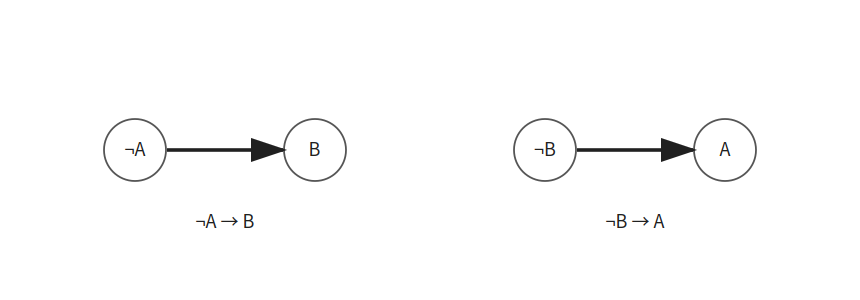
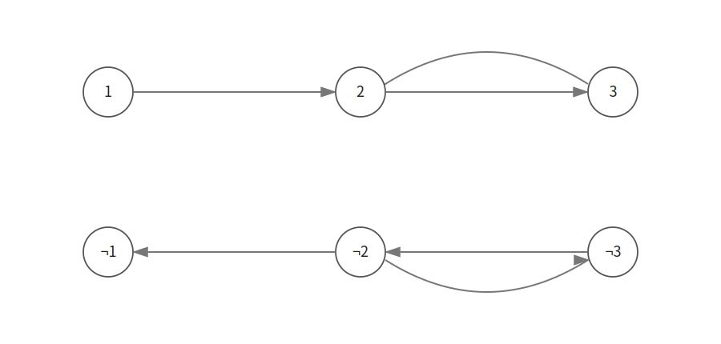
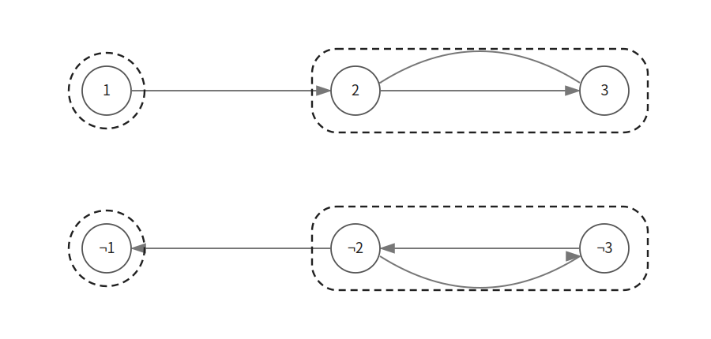
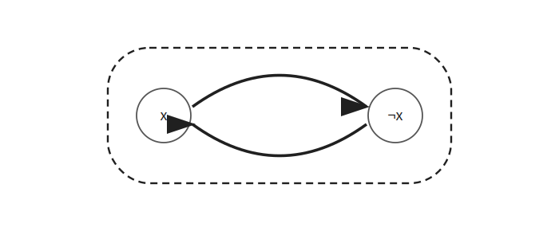
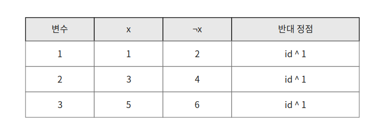

2-SAT은 각 절에 리터럴이 두 개씩 포함된 논리식이 주어졌을 때 식을 만족하는 값 할당이 존재하는지 판별하는 알고리즘이다.

리터럴은 변수 `x` 또는 변수의 부정 `¬x`를 의미한다.

예를 들어 다음 식은 세 개의 절로 이루어져 있다.

```text
(A ∨ B) ∧ (¬B ∨ C) ∧ (A ∨ ¬C)
```

## Implication Graph

하나의 절 `(A ∨ B)`를 생각해 보자.

`A`가 거짓이라면 절을 만족시키기 위해 `B`는 반드시 참이어야 한다.

같은 방식으로 `B`가 거짓이라면 `A`는 반드시 참이어야 한다.

따라서 `(A ∨ B)`는 다음 두 조건으로 바꿀 수 있다.

```text
¬A → B
¬B → A
```



각 리터럴을 정점으로 두고 이러한 조건을 방향 간선으로 나타낸 그래프를 implication graph라고 한다.

절 `(x ∨ y)`가 주어졌다면 다음 두 간선을 추가한다.

```text
¬x → y
¬y → x
```

예를 들어 다음 식을 생각해 보자.

```text
(¬1 ∨ 2) ∧ (¬2 ∨ 3) ∧ (2 ∨ ¬3)
```

implication graph에는 다음 간선을 추가한다.

```text
1 → 2
¬2 → ¬1

2 → 3
¬3 → ¬2

¬2 → ¬3
3 → 2
```



## SCC를 이용한 판별

implication graph에서 SCC를 구한다.

같은 SCC에 속한 리터럴은 서로 도달할 수 있으므로 반드시 같은 논리 값을 가져야 한다.



예시에서는 `2`와 `3`이 같은 SCC에 속하고 `¬2`와 `¬3`도 같은 SCC에 속한다.

하지만 어떤 변수와 그 부정이 같은 SCC에 속한다면 식을 만족하는 값 할당은 존재하지 않는다.



`x`에서 `¬x`로 도달할 수 있고 `¬x`에서도 `x`로 도달할 수 있다면 `x`는 참이면서 동시에 거짓이어야 한다.

따라서 다음 조건을 만족하는 변수가 하나라도 있다면 식을 만족시킬 수 없다.

```cpp
if(par[i]==par[i+1]) return false;
```

모든 변수와 그 부정이 서로 다른 SCC에 속한다면 식을 만족하는 값 할당이 존재한다.

## 구현

각 변수마다 참 리터럴과 거짓 리터럴을 연속한 두 정점으로 저장한다.



변수 `x`가 참인 리터럴은 홀수 정점에 저장하고 `¬x`는 바로 다음 정점에 저장한다.

반대 리터럴은 마지막 비트를 뒤집어 구할 수 있다.

```cpp
int neg(int x) { return x%2 ? x+1 : x-1; }
```

절 `(x ∨ y)`는 다음과 같이 추가한다.

```cpp
void addEdge(int x, int y) {
    x = x<0 ? -2*x : 2*x-1;
    y = y<0 ? -2*y : 2*y-1;
    conn[neg(x)].push_back(y);
    conn[neg(y)].push_back(x);
}
```

Tarjan 알고리즘을 이용한 2-SAT 구현은 다음과 같다. $O(V+E)$

```cpp
stack<int> stk;
int idx, vis[MAX], par[MAX];
vector<vector<int>> conn(MAX), SCCs;

int dfs(int cur) {
    int rem = par[cur] = ++idx;
    stk.push(cur);
    for(int next:conn[cur]) {
        if(!par[next]) rem=min(rem, dfs(next));
        else if(!vis[next]) rem=min(rem, par[next]);
    }
    if(rem==par[cur]) {
        SCCs.push_back(vector<int>());
        while(true) {
            int top = stk.top(); stk.pop();
            SCCs.back().push_back(top);
            vis[top]=true;
            par[top]=rem;
            if(top==cur) break;
        }
    }
    return rem;
}

int neg(int x) { return x%2 ? x+1 : x-1; }

void addEdge(int x, int y) {
    x = x<0 ? -2*x : 2*x-1;
    y = y<0 ? -2*y : 2*y-1;
    conn[neg(x)].push_back(y);
    conn[neg(y)].push_back(x);
}

bool twoSat(int n) {
    for(int i=1;i<=2*n;i++) if(!vis[i]) dfs(i);
    for(int i=1;i<=2*n;i+=2) {
        if(par[i]==par[i+1]) return false;
    }
    return true;
}
```

## 시간복잡도

변수가 `N`개이고 절이 `M`개라면 implication graph에는 정점 `2N`개와 간선 `2M`개가 생긴다.

Tarjan 알고리즘은 각 정점과 간선을 한 번씩 확인한다.

따라서 전체 시간복잡도는 $O(N+M)$이다.

## 연습 문제

[https://soj.services/problems/49](https://soj.services/problems/49)

<details>
<summary>코드 보기</summary>

```cpp
#include<bits/stdc++.h>
using namespace std;

const int MAX = 20001;

stack<int> stk;
int idx, vis[MAX], par[MAX];
vector<vector<int>> conn(MAX), SCCs;

int dfs(int cur) {
    int rem = par[cur] = ++idx;
    stk.push(cur);
    for(int next:conn[cur]) {
        if(!par[next]) rem=min(rem, dfs(next));
        else if(!vis[next]) rem=min(rem, par[next]);
    }
    if(rem==par[cur]) {
        SCCs.push_back(vector<int>());
        while(true) {
            int top = stk.top(); stk.pop();
            SCCs.back().push_back(top);
            vis[top]=true;
            par[top]=rem;
            if(top==cur) break;
        }
    }
    return rem;
}

int neg(int x) { return x%2 ? x+1 : x-1; }

int main() {
    cin.tie(0)->sync_with_stdio(0);
    int n, m; cin >> n >> m;
    while(m--) {
        int a, b; cin >> a >> b;
        a = a<0 ? -2*a : 2*a-1;
        b = b<0 ? -2*b : 2*b-1;
        conn[neg(a)].push_back(b);
        conn[neg(b)].push_back(a);
    }
    for(int i=1;i<=2*n;i++) if(!vis[i]) dfs(i);

    for(int i=1;i<=2*n;i+=2) {
        if(par[i]==par[i+1]) return !(cout << "No");
    }
    cout << "Yes";
}
```

</details>
