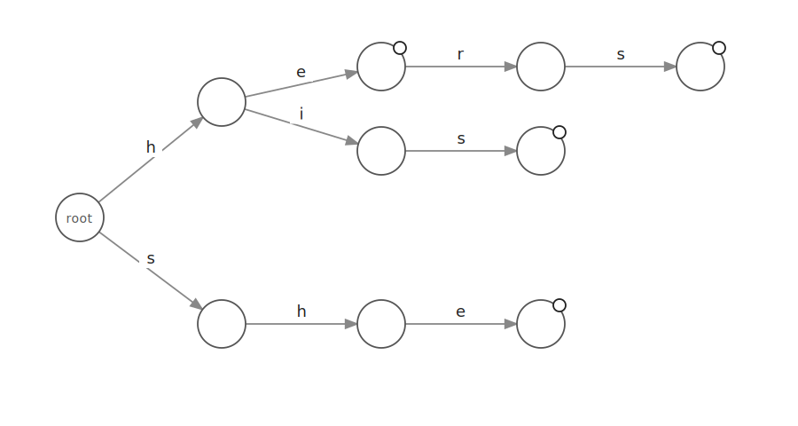
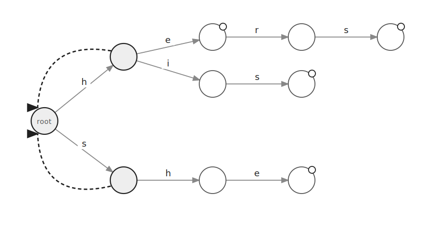
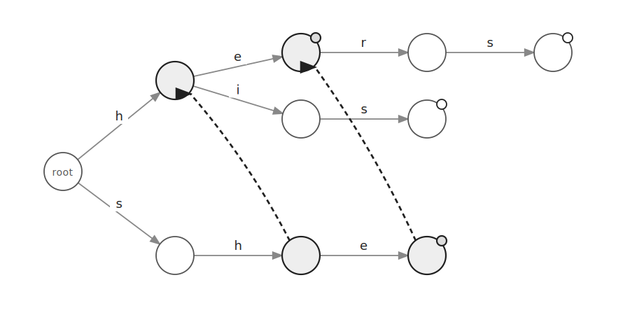
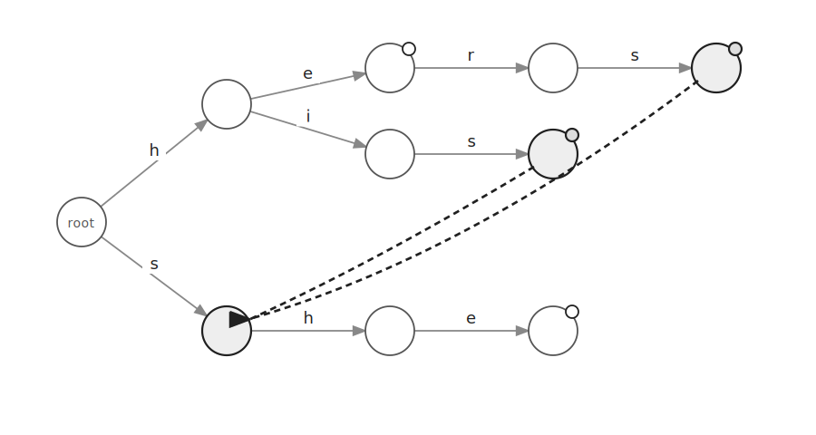
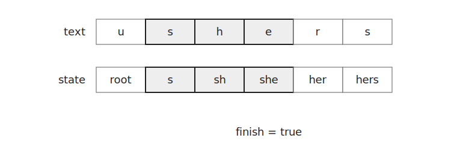
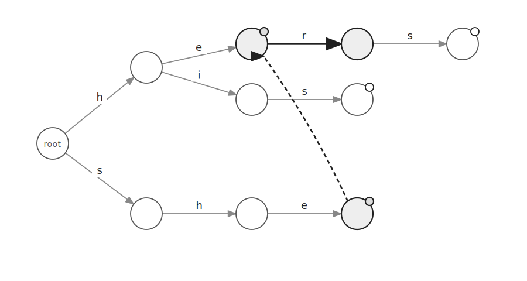

아호-코라식은 여러 패턴을 동시에 찾는 문자열 탐색 알고리즘이다.

`Trie`에 실패 링크를 추가해 문자가 일치하지 않았을 때 다시 탐색할 위치를 빠르게 찾는다.

## Trie 구성

다음 네 문자열을 `Trie`에 삽입한다고 하자.

```text
he
hers
his
she
```



각 노드는 다음 문자로 이동하는 간선과 패턴이 끝나는지 여부를 저장한다.

```cpp
Trie *go[26]={};
bool finish=false;
Trie *fail;
```

문자열을 삽입할 때는 현재 문자의 간선이 없으면 새 노드를 만든다.

```cpp
if(!cur->go[ch-'a']) cur->go[ch-'a']=new Trie;
cur=cur->go[ch-'a'];
```

문자열이 끝나는 노드에는 `finish=true`를 저장한다.

```cpp
cur->finish=true;
```

## 실패 링크

실패 링크는 현재 노드에서 다음 문자로 이동할 수 없을 때 돌아갈 노드를 가리킨다.

루트의 자식 노드는 모두 루트를 실패 링크로 갖는다.



나머지 노드의 실패 링크는 `BFS` 순서로 구한다.

현재 노드가 `cur`이고 문자 `i`를 따라간 자식이 `next`라고 하자.

`cur`이 루트라면 `next`의 실패 링크는 루트이다.

```cpp
if(cur==root) next->fail=root;
````

그 외에는 `cur->fail`에서 시작해 문자 `i`로 이동할 수 있는 가장 가까운 노드를 찾는다.

```cpp
Trie *dest=cur->fail;
while(dest!=root && !dest->go[i]) dest=dest->fail;
if(dest->go[i]) dest=dest->go[i];
next->fail=dest;
```

즉 `next`가 나타내는 문자열의 접미사 중 `Trie`에 존재하는 가장 긴 접두사로 실패 링크를 연결한다.

예를 들어 `sh`의 실패 링크는 `h`를 가리키고 `she`의 실패 링크는 `he`를 가리킨다.



`his`와 `hers`의 실패 링크는 `s`를 가리킨다.



실패 링크가 가리키는 노드에서 패턴이 끝난다면 현재 노드에서도 패턴을 찾은 것으로 처리한다.

```cpp
if(next->fail->finish) next->finish=true;
```

예를 들어 `she` 노드의 실패 링크가 `he`를 가리키면 `she`를 찾은 순간 `he`도 함께 찾은 것이다.

## 문자열 탐색

문자열 `ushers`에서 패턴을 찾는다고 하자.



현재 노드에서 문자 `ch`로 이동할 수 없다면 실패 링크를 따라 올라간다.

```cpp
while(cur!=root && !cur->go[ch-'a']) cur=cur->fail;
```

이후 문자 `ch`로 이동할 수 있다면 이동한다.

```cpp
if(cur->go[ch-'a']) cur=cur->go[ch-'a'];
```

도착한 노드의 `finish`가 `true`라면 패턴이 하나 이상 존재한다.

```cpp
if(cur->finish) break;
```

문자 `u`로 이동하는 간선은 없으므로 루트에 머문다.

이후 `s`, `h`, `e`를 읽으면 `she` 노드에 도착한다.

해당 노드의 `finish`가 `true`이므로 패턴이 존재한다.

실패 링크를 이용하면 기존에 확인한 접미사를 버리지 않고 탐색을 이어갈 수 있다.

예를 들어 `she` 상태에서 문자 `r`을 읽으면 `he`로 돌아간 뒤 `her`로 이동할 수 있다.



## 구현

아호-코라식은 다음과 같이 구현할 수 있다.

```cpp
struct Trie {
    Trie *go[26]={};
    bool finish=false;
    Trie *fail;
    void insert(const string& s) {
        Trie *cur=this;
        for(char ch:s) {
            if(!cur->go[ch-'a']) cur->go[ch-'a']=new Trie;
            cur=cur->go[ch-'a'];
        }
        cur->finish=true;
    }
};
```

먼저 모든 패턴을 `Trie`에 삽입한다.

그 뒤 `BFS`로 실패 링크를 만든다.

```cpp
queue<Trie*> q; q.push(root);
while(!q.empty()) {
    Trie *cur=q.front(); q.pop();
    for(int i=0;i<26;i++) {
        if(!cur->go[i]) continue;
        Trie *next=cur->go[i];
        if(cur==root) {
            next->fail=root;
        } else {
            Trie *dest=cur->fail;
            while(dest!=root && !dest->go[i]) dest=dest->fail;
            if(dest->go[i]) dest=dest->go[i];
            next->fail=dest;
        }
        if(next->fail->finish) next->finish=true;
        q.push(next);
    }
}
```

문자열을 탐색할 때 이동할 수 있는 간선이 나올 때까지 실패 링크를 따라 올라간다.

```cpp
Trie *cur=root;
for(char ch:t) {
    while(cur!=root && !cur->go[ch-'a']) cur=cur->fail;
    if(cur->go[ch-'a']) cur=cur->go[ch-'a'];
    if(cur->finish) break;
}
```

`cur->finish`가 `true`라면 현재 문자열 안에 패턴이 하나 이상 포함되어 있다.

모든 패턴의 길이 합을 $S$라고 하자.

`Trie`를 만드는 데 $O(S)$가 걸린다.

실패 링크를 만들 때 각 노드와 간선을 `BFS`로 처리한다.

탐색할 문자열의 길이를 $L$이라고 하면 문자열 탐색은 실패 링크 이동을 포함해 보통 $O(L)$에 동작한다.

공간복잡도는 $O(S)$이다.

## 연습 문제

[https://soj.services/problems/61](https://soj.services/problems/61)

<details>
<summary>코드 보기</summary>

```cpp
#include<bits/stdc++.h>
using namespace std;

struct Trie {
    Trie *go[26]={};
    bool finish=false;
    Trie *fail;
    void insert(const string& s) {
        Trie *cur=this;
        for(char ch:s) {
            if(!cur->go[ch-'a']) cur->go[ch-'a']=new Trie;
            cur = cur->go[ch-'a'];
        }
        cur->finish=true;
    }
};

int main() {
    cin.tie(0)->sync_with_stdio(0);
    Trie *root=new Trie;
    int n; cin >> n;
    while(n--) {
        string p; cin >> p;
        root->insert(p);
    }

    queue<Trie*> q; q.push(root);
    while(!q.empty()) {
        Trie *cur = q.front(); q.pop();
        for(int i=0;i<26;i++) {
            if(!cur->go[i]) continue;
            Trie *next = cur->go[i];
            if(cur==root) {
                next->fail=root;
            } else {
                Trie *dest=cur->fail;
                while(dest!=root && !dest->go[i]) dest=dest->fail;
                if(dest->go[i]) dest=dest->go[i];
                next->fail=dest;
            }
            if(next->fail->finish) next->finish=true;
            q.push(next);
        }
    }

    int Q; cin >> Q;
    while(Q--) {
        string t; cin >> t;
        Trie *cur=root;
        for(char ch:t) {
            while(cur!=root && !cur->go[ch-'a']) cur=cur->fail;
            if(cur->go[ch-'a']) cur=cur->go[ch-'a'];
            if(cur->finish) break;
        }
        cout << (cur->finish ? "Yes\n" : "No\n");
    }
}
```

</details>