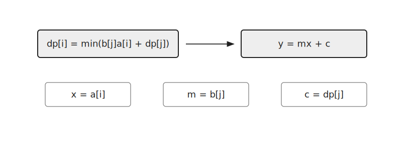
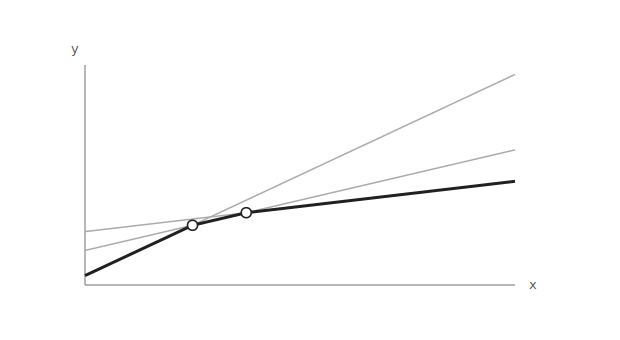
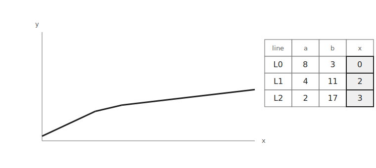
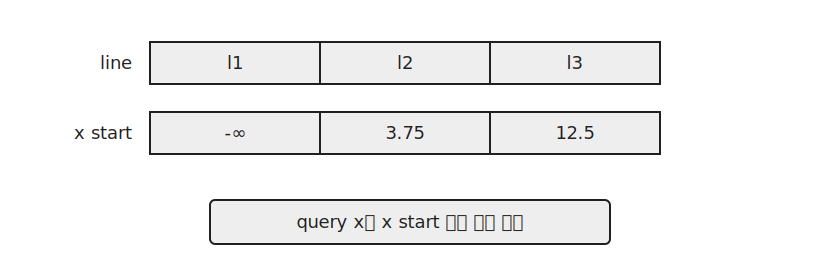

`CHT`는 여러 직선 중 특정 $x$에서의 최솟값이나 최댓값을 빠르게 구하는 기법이다.

이 글에서는 직선을 추가하고 특정 $x$에서 최솟값을 구하는 문제를 기준으로 설명한다.

## 문제 형태

두 종류의 쿼리가 주어진다고 하자.

```text
1 a b    직선 y = ax + b 추가
2 x      현재 직선들 중 x에서의 최솟값 출력
```



직선이 여러 개 있을 때 모든 직선을 매번 확인하면 쿼리 하나에 $O(N)$이 걸린다.

`CHT`는 최솟값이 될 수 있는 직선만 남겨 쿼리를 빠르게 처리한다.

## Lower Hull

최솟값을 구하는 경우에는 아래쪽 껍질만 필요하다.



어떤 직선이 어떤 $x$에서도 최솟값이 되지 않는다면 그 직선은 답이 될 수 없다.

따라서 그런 직선은 스택에서 제거한다.

예제 구현은 직선의 기울기 $a$가 단조 증가하거나 단조 감소하는 형태로 추가될 때 사용할 수 있다.

## 교점 저장

직선은 다음과 같이 저장한다.

```cpp
struct element {
    ll a, b;
    ld x=1e-150;
};
```

여기서 하나의 원소는 다음 직선을 나타낸다.

$$
y=ax+b
$$

`x`에는 이 직선이 이전 직선보다 더 좋은 값을 가지기 시작하는 좌표를 저장한다.



두 직선의 교점은 다음과 같이 계산한다.

```cpp
ld meetX(element a, element b) { return (ld)(a.b-b.b)/(b.a-a.a); }
```

두 직선 $y=a_1x+b_1$과 $y=a_2x+b_2$의 값이 같아지는 지점은 다음 식에서 나온다.

$$
a_1x+b_1=a_2x+b_2
$$

따라서 교점의 $x$좌표는 다음과 같다.

$$
x=\frac{b_1-b_2}{a_2-a_1}
$$

스택 안에서는 각 직선의 시작 좌표 `x`가 증가하도록 유지한다.

## 직선 추가

새 직선 `cur`를 넣을 때는 스택의 마지막 직선과 교점을 구한다.

새 직선이 좋아지기 시작하는 좌표가 마지막 직선의 시작 좌표보다 작거나 같다면 마지막 직선은 담당하는 구간이 없어진다.

따라서 마지막 직선을 제거한다.

이 과정을 반복한 뒤 새 직선을 스택에 넣는다.

```cpp
while(!stk.empty()) {
    cur.x=meetX(stk.back(), cur);
    if(cur.x>stk.back().x) break;
    stk.pop_back();
}
stk.push_back(cur);
```

이렇게 하면 스택에는 lower hull을 이루는 직선만 남는다.

## 쿼리

쿼리 $x$가 주어지면 시작 좌표를 기준으로 이분 탐색해 해당 $x$에서 최적인 직선을 찾는다.

```cpp
int l=0, r=stk.size()-1;
while(l<r) {
    int m=l+r+1>>1;
    if(x<=stk[m].x) r=m-1;
    else l=m;
}
```



찾은 직선이 $y=ax+b$라면 답은 다음과 같다.

```cpp
cout << stk[l].a*x+stk[l].b << '\n';
```

이분 탐색을 사용하므로 쿼리 하나의 시간복잡도는 $O(\log N)$이다.

## 구현

최솟값 `CHT`는 다음과 같이 구현할 수 있다.

```cpp
struct element {
    ll a, b;
    ld x=1e-150;
};

ld meetX(element a, element b) { return (ld)(a.b-b.b)/(b.a-a.a); }

vector<element> stk;
void addLine(ll a, ll b) {
    element cur={a, b};
    while(!stk.empty()) {
        cur.x=meetX(stk.back(), cur);
        if(cur.x>stk.back().x) break;
        stk.pop_back();
    }
    stk.push_back(cur);
}

ll query(ll x) {
    int l=0, r=stk.size()-1;
    while(l<r) {
        int m=l+r+1>>1;
        if(x<=stk[m].x) r=m-1;
        else l=m;
    }
    return stk[l].a*x+stk[l].b;
}
```

직선 추가는 각 직선이 스택에 한 번 들어가고 최대 한 번 제거되므로 전체 $O(N)$이다.

쿼리는 이분 탐색으로 최적 직선을 찾으므로 $O(\log N)$이다.

따라서 전체 시간복잡도는 $O(N+Q\log N)$이다.

공간복잡도는 스택에 저장되는 직선 수에 비례하므로 $O(N)$이다.

## 연습 문제

[https://soj.services/problems/73](https://soj.services/problems/73)

<details>
<summary>코드 보기</summary>

```cpp
#include<bits/stdc++.h>
using namespace std;
typedef long long ll;
typedef long double ld;

struct element {
    ll a, b;
    ld x=1e-150;
};

ld meetX(element a, element b) { return (ld)(a.b-b.b)/(b.a-a.a); }

int main() {
    cin.tie(0)->sync_with_stdio(0);
    int q; cin >> q;
    vector<element> stk;
    while(q--) {
        int op; cin >> op;
        if(op==1) {
            int a, b; cin >> a >> b;
            element cur = {a, b};
            while(!stk.empty()) {
                cur.x=meetX(stk.back(), cur);
                if(cur.x>stk.back().x) break;
                stk.pop_back();
            }
            stk.push_back(cur);
        } else {
            int x; cin >> x;
            int l=0, r=stk.size()-1;
            while(l<r) {
                int m=l+r+1>>1;
                if(x<=stk[m].x) r=m-1;
                else l=m;
            }
            cout << stk[l].a*x+stk[l].b << '\n';
        }
    }
}
```

</details>
