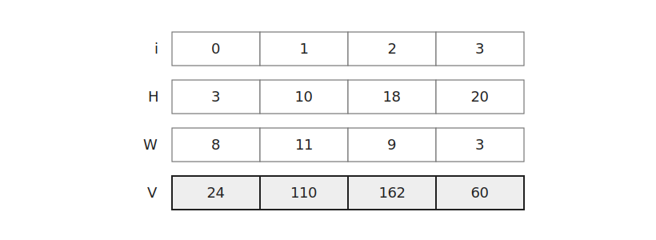
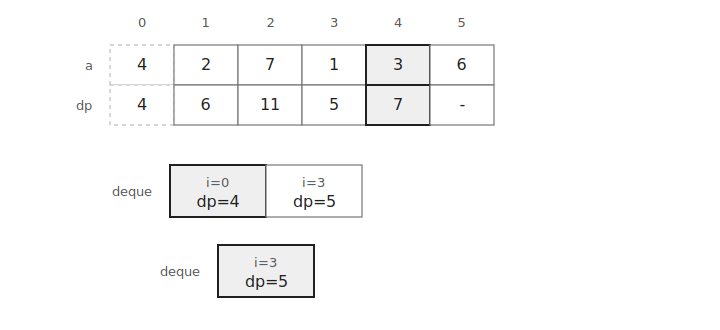
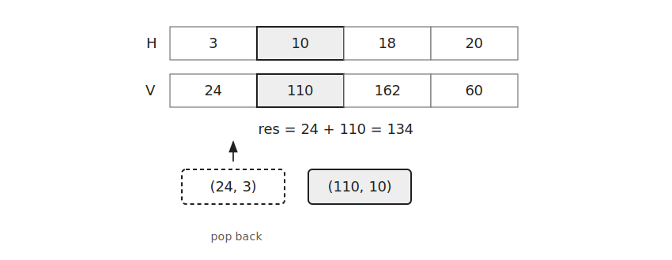
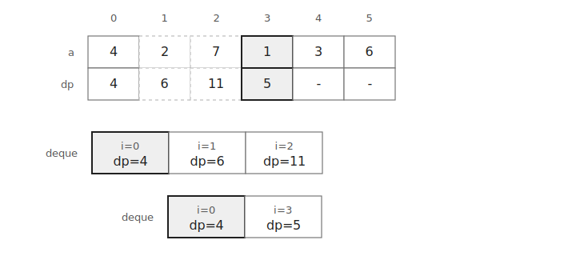

`Deque Trick`은 후보를 덱에 저장하면서 필요 없는 후보를 제거하는 테크닉이다.

일정 범위 안의 최솟값이나 최댓값을 반복해서 구해야 할 때 사용할 수 있다.

이 글에서는 슬라이딩 윈도우 최솟값을 이용한 DP를 기준으로 설명한다.

## 문제 형태

수열 $a$가 있고 한 번에 최대 $k$칸 전의 위치에서 현재 위치로 올 수 있다고 하자.

$dp_i$를 $i$번째 위치까지 오는 최소 비용으로 두면 점화식은 다음과 같다.

$$
dp_i=a_i+\min_{i-k \le j < i}dp_j
$$

즉 매 위치마다 직전 $k$개 $dp$ 값 중 최솟값이 필요하다.

이를 직접 확인하면 한 위치에 $O(k)$가 걸리지만 `Deque Trick`을 사용하면 전체를 $O(N)$에 처리할 수 있다.

## 처리 과정

덱에는 후보의 인덱스와 $dp$ 값을 함께 저장한다.

```cpp
deque<pair<int, long long>> deq;
```

덱의 원소는 다음 형태이다.

$$
(i, dp_i)
$$

덱은 인덱스와 $dp$ 값이 모두 앞에서 뒤로 갈수록 증가하도록 유지한다.

따라서 덱의 맨 앞에는 현재 사용할 수 있는 후보 중 $dp$ 값이 가장 작은 원소가 있다.

처음에는 이전 위치가 없으므로 입력값이 그대로 $dp_0$이 된다.



현재 위치가 $i$일 때 사용할 수 있는 이전 위치는 $i-k$ 이상이어야 한다.

따라서 덱의 앞쪽 후보가 범위를 벗어나면 제거한다.

```cpp
while(!deq.empty() && i-deq.front().first>k) deq.pop_front();
```



그 뒤 덱이 비어 있지 않다면 맨 앞 후보를 이용해 현재 $dp$ 값을 계산한다.

```cpp
if(!deq.empty()) a[i]+=deq.front().second;
```



이 코드는 다음 계산을 한 것이다.

$$
dp_i=a_i+\min_{i-k \le j < i}dp_j
$$

현재 $dp_i$를 구한 뒤에는 덱 뒤쪽 후보를 확인한다.

뒤쪽 후보의 $dp$ 값이 현재 $dp_i$보다 크다면 이후에도 현재 후보보다 좋을 수 없으므로 제거한다.

```cpp
while(!deq.empty() && deq.back().second>a[i]) deq.pop_back();
```



마지막으로 현재 위치와 $dp_i$를 덱 뒤에 넣는다.

```cpp
deq.push_back({i, a[i]});
```

## 구현

`Deque Trick`은 다음과 같이 구현할 수 있다.

```cpp
deque<pair<int, long long>> deq;
for(int i=0;i<n;i++) {
    while(!deq.empty() && i-deq.front().first>k) deq.pop_front();
    if(!deq.empty()) a[i]+=deq.front().second;
    while(!deq.empty() && deq.back().second>a[i]) deq.pop_back();
    deq.push_back({i, a[i]});
}
```

각 원소는 덱에 한 번 들어간다.

또 각 원소는 앞이나 뒤에서 최대 한 번 제거된다.

따라서 전체 시간복잡도는 $O(N)$이다.

공간복잡도는 덱에 저장되는 후보 수에 비례하므로 $O(N)$이다.

## 연습 문제

[https://soj.services/problems/69](https://soj.services/problems/69)

<details>
<summary>코드 보기</summary>

```cpp
#include<bits/stdc++.h>
using namespace std;

int main() {
    cin.tie(0)->sync_with_stdio(0);
    int n, k; cin >> n >> k;
    deque<pair<int, long long>> deq;
    for(int i=0;i<n;i++) {
        while(!deq.empty() && i-deq.front().first>k) deq.pop_front();
        long long a; cin >> a;
        if(!deq.empty()) a+=deq.front().second;
        while(!deq.empty() && deq.back().second>a) deq.pop_back();
        deq.push_back({i, a});
    }
    cout << deq.back().second;
}
```

</details>
