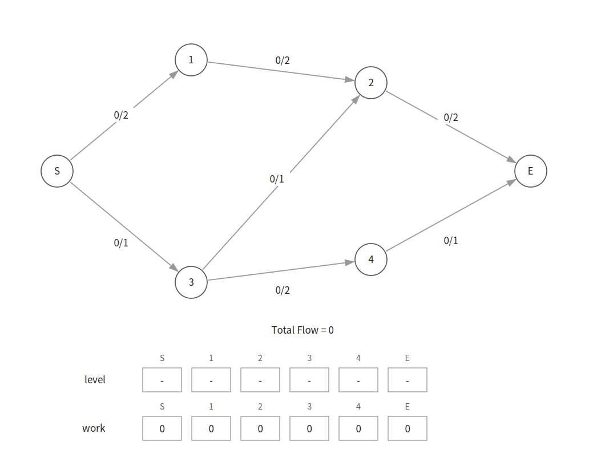
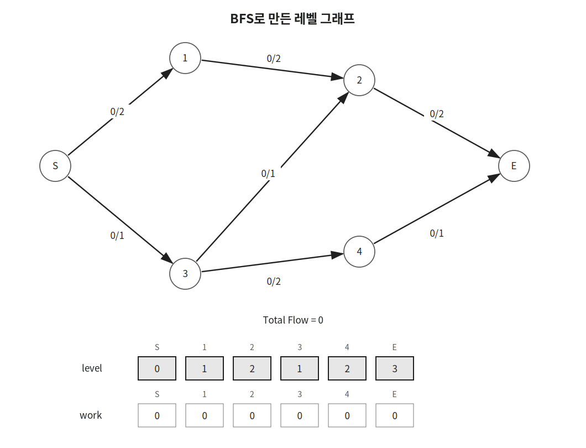
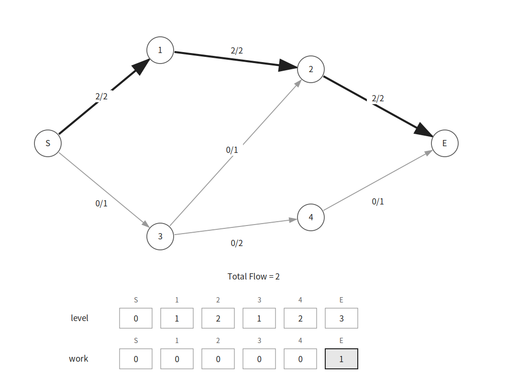
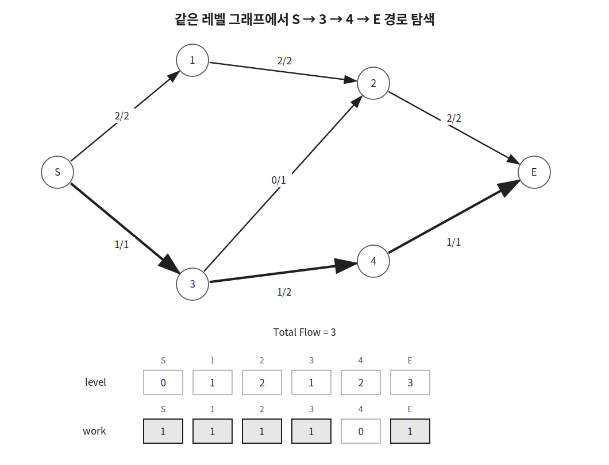
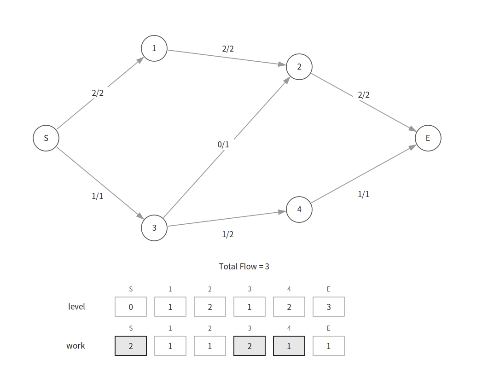
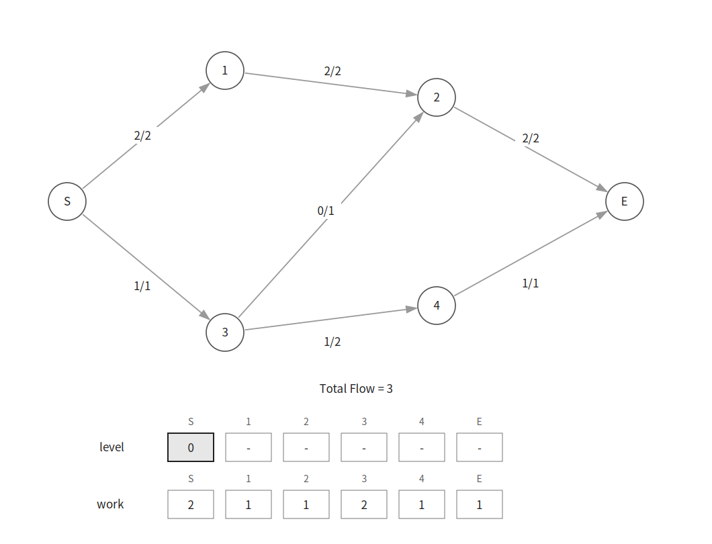

Dinic은 source에서 sink까지 보낼 수 있는 최대 유량을 구하는 알고리즘이다.

에드몬드-카프는 BFS로 증가 경로를 하나씩 찾지만 Dinic은 레벨 그래프에서 여러 증가 경로를 한 번에 처리한다.

## 동작 원리

다음과 같은 유량 네트워크가 있다고 하자.



그림의 `f/c`에서 `f`는 현재 유량이고 `c`는 간선의 용량이다.

먼저 잔여 용량이 있는 간선만 따라가며 BFS를 수행한다.

```cpp
if(c[cur][next]-f[cur][next] && level[next]==-1) {
    level[next]=level[cur]+1;
}
```

`level[i]`에는 source에서 `i`번 정점까지의 거리를 저장한다.



DFS에서는 `level`이 정확히 `1` 증가하는 간선만 따라간다.

```cpp
if(level[edge.next]!=level[cur]+1) continue;
```

따라서 DFS는 source에서 sink 방향으로만 이동한다.

처음에는 다음 경로를 찾는다.

```text
S → 1 → 2 → E
```



이 경로를 통해 유량 `2`를 보낼 수 있다.

같은 레벨 그래프에서 DFS를 다시 수행하면 다음 경로를 찾을 수 있다.

```text
S → 3 → 4 → E
```



이 경로를 통해 유량 `1`을 추가로 보낼 수 있다.

## 차단 유량

현재 레벨 그래프에서 source부터 sink까지 더 이상 유량을 보낼 수 없는 상태를 차단 유량이라고 한다.



차단 유량을 구한 뒤에는 BFS를 다시 수행해 새로운 레벨 그래프를 만든다.



새로운 레벨 그래프에서도 sink에 도달할 수 없다면 더 이상 증가 경로가 존재하지 않는다.

따라서 알고리즘을 종료한다.

최대 유량은 `3`이다.

## 현재 간선 최적화

DFS에서 한 번 확인한 간선을 매번 처음부터 다시 확인할 필요는 없다.

`work[cur]`에는 `cur`번 정점에서 다음으로 확인할 간선의 인덱스를 저장한다.

```cpp
for(int &i=work[cur];i<conn[cur].size();i++) {
    ...
}
```

이미 유량을 보낼 수 없다고 확인한 간선은 이후 DFS에서도 건너뛴다.

`i`를 참조자로 선언했으므로 반복문이 끝난 뒤에도 확인한 위치가 `work[cur]`에 남는다.

새로운 레벨 그래프를 만들 때마다 `work` 배열을 초기화한다.

```cpp
memset(work, 0, sizeof work);
```

## 구현

Dinic은 다음과 같이 구현할 수 있다. $O(V^2E)$

```cpp
int source, sink, n;
ll f[MAX][MAX], c[MAX][MAX];
int level[MAX], work[MAX];
vector<vector<int>> conn(MAX);

bool bfs() {
    queue<int> q; q.push(s);
    memset(level, -1, sizeof level);
    level[s]=0;
    while(!q.empty()) {
        int cur = q.front(); q.pop();
        for(int next:conn[cur]) {
            if(c[cur][next]-f[cur][next] && level[next]==-1) {
                level[next]=level[cur]+1;
                q.push(next);
            }
        }
    }
    return level[t]!=-1;
}

ll dfs(int cur, ll curFlow) {
    if(cur==t) return curFlow;
    for(int &i=work[cur];i<conn[cur].size();i++) {
        int next=conn[cur][i];
        if(level[next]==level[cur]+1 && c[cur][next]-f[cur][next]) {
            ll flow = dfs(next, min(curFlow, c[cur][next]-f[cur][next]));
            if(flow) {
                f[cur][next]+=flow;
                f[next][cur]-=flow;
                return flow;
            }
        }
    }
    return 0;
}

ll dinic() {
    ll flow=0;
    while(bfs()) {
        memset(work, 0, sizeof work);
        while(ll ret=dfs(source, LINF)) {
            flow+=ret;
        }
    }
    return flow;
}
```

## 시간복잡도

일반적인 유량 네트워크에서 Dinic의 시간복잡도는 $O(V^2E)$이다.

에드몬드-카프의 시간복잡도 $O(VE^2)$보다 빠르게 동작한다.

단위 용량 그래프나 이분 매칭 그래프에서는 더 빠른 시간복잡도를 보인다.

## 연습 문제

[https://soj.services/problems/46](https://soj.services/problems/46)

<details>
<summary>코드 보기</summary>

```cpp
#include<bits/stdc++.h>
using namespace std;

typedef long long ll;
const ll LINF = 0x3f3f3f3f3f3f3f3f;
const int MAX = 2001;

int s, t;
ll f[MAX][MAX], c[MAX][MAX];
int level[MAX], work[MAX];
vector<vector<int>> conn(MAX);

bool bfs() {
    queue<int> q; q.push(s);
    memset(level, -1, sizeof level);
    level[s]=0;
    while(!q.empty()) {
        int cur = q.front(); q.pop();
        for(int next:conn[cur]) {
            if(c[cur][next]-f[cur][next] && level[next]==-1) {
                level[next]=level[cur]+1;
                q.push(next);
            }
        }
    }
    return level[t]!=-1;
}

ll dfs(int cur, ll curFlow) {
    if(cur==t) return curFlow;
    for(int &i=work[cur];i<conn[cur].size();i++) {
        int next=conn[cur][i];
        if(level[next]==level[cur]+1 && c[cur][next]-f[cur][next]) {
            ll flow = dfs(next, min(curFlow, c[cur][next]-f[cur][next]));
            if(flow) {
                f[cur][next]+=flow;
                f[next][cur]-=flow;
                return flow;
            }
        }
    }
    return 0;
}

int main() {
    cin.tie(0)->sync_with_stdio(0);
    int n, m; cin >> n >> m >> s >> t;
    while(m--) {
        ll u, v, w; cin >> u >> v >> w;
        conn[u].push_back(v);
        conn[v].push_back(u);
        c[u][v]+=w;
    }

    ll res=0;
    while(bfs()) {
        memset(work, 0, sizeof work);
        while(ll ret=dfs(s, LINF)) {
            res+=ret;
        }
    }
    cout << res;
}
```

</details>
