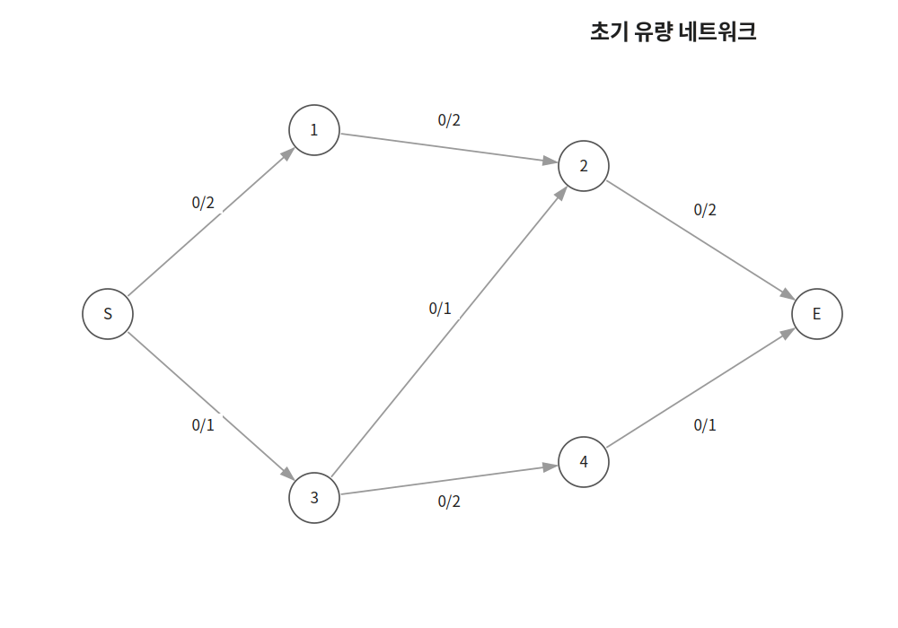
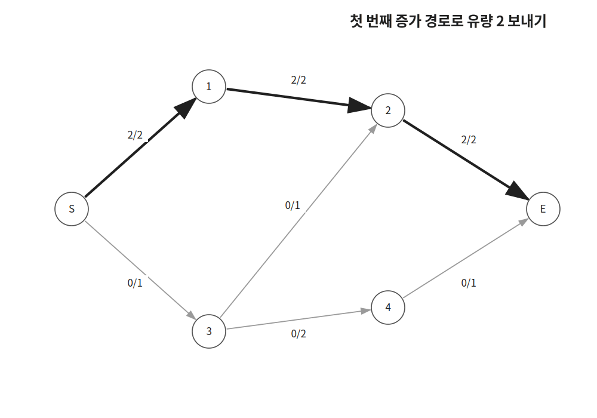
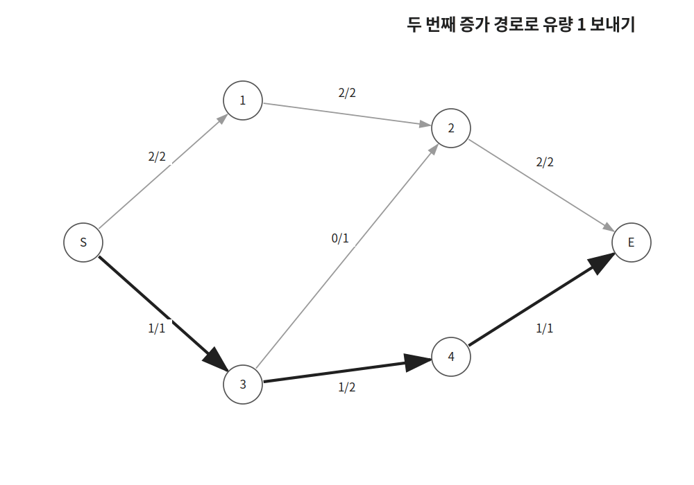
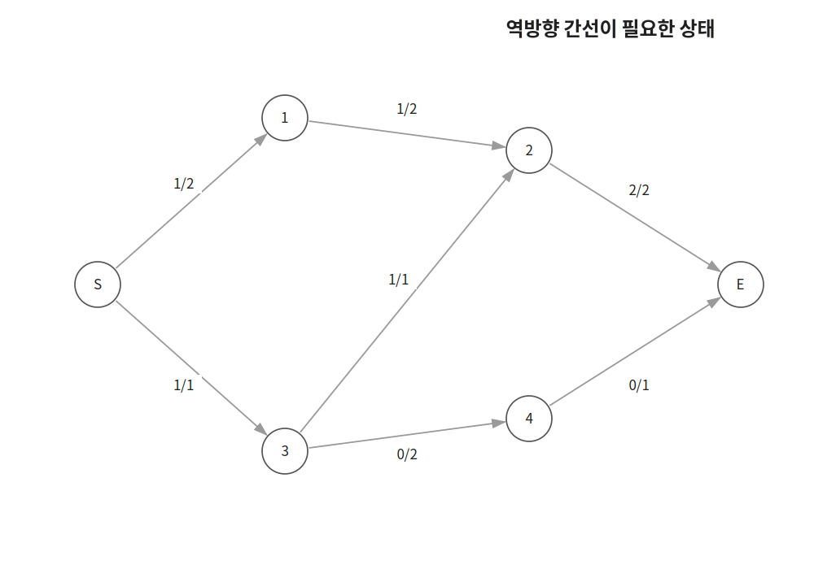
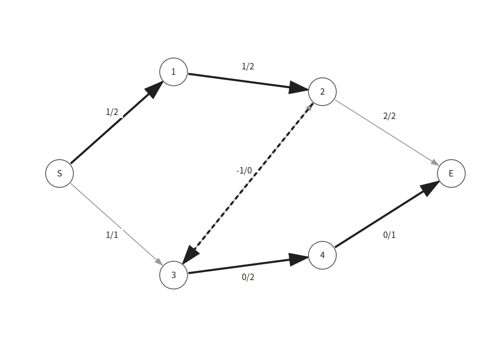
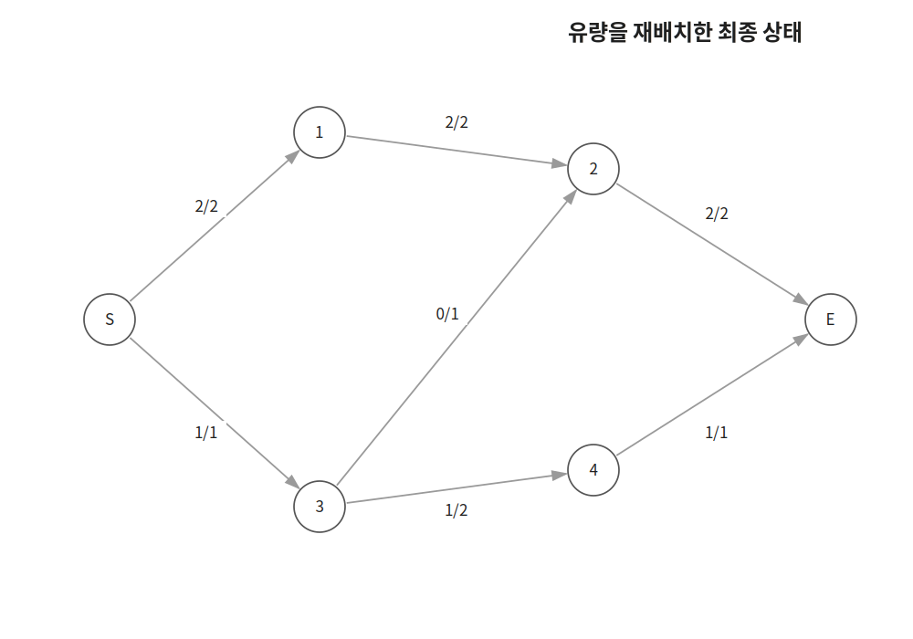

`Edmonds-Karp`는 `source`에서 `sink`까지 보낼 수 있는 최대 유량을 구하는 알고리즘이다.

잔여 용량이 있는 간선만 따라가며 `BFS`로 증가 경로를 찾고 더 이상 증가 경로가 없을 때까지 유량을 보낸다.

## 최대 유량

유량 네트워크는 방향 그래프의 각 간선에 용량이 정해져 있는 그래프이다.

`source`는 유량이 출발하는 정점이고 `sink`는 유량이 도착하는 정점이다.

간선의 용량은 해당 간선을 통해 보낼 수 있는 유량의 최댓값이다.



그림의 `f/c`에서 `f`는 현재 유량이고 `c`는 간선의 용량이다.

예를 들어 `0/2`는 현재 유량이 $0$이고 최대 $2$만큼 보낼 수 있다는 뜻이다.

## 증가 경로 찾기

현재 유량이 `f[u][v]`이고 용량이 `c[u][v]`라고 하자.

간선 `u → v`를 통해 추가로 보낼 수 있는 유량은 다음과 같다.

```cpp
c[u][v]-f[u][v]
```

이 값을 잔여 용량이라고 한다.

잔여 용량이 양수인 간선만 따라가며 `BFS`를 수행한다.

```cpp
if(c[cur][next]-f[cur][next] && prv[next]==-1) {
    prv[next]=cur;
    q.push(next);
}
```

`prv[x]`에는 `BFS`에서 정점 `x`로 오기 직전의 정점을 저장한다.

`sink`에 도달하면 `prv`를 따라 `source`까지 거슬러 올라가 증가 경로를 복원한다.

첫 번째 `BFS`에서는 다음 증가 경로를 찾을 수 있다.

```text
S → 1 → 2 → E
```



이 경로의 잔여 용량은 각각 $2$, $2$, $2$이다.

따라서 경로를 통해 보낼 수 있는 유량은 $2$이다.

```cpp
flow=min(flow, c[prv[i]][i]-f[prv[i]][i]);
```

경로의 모든 간선에 유량을 더한다.

```cpp
f[prv[i]][i]+=flow;
```

다시 `BFS`를 수행하면 다음 경로를 찾을 수 있다.

```text
S → 3 → 4 → E
```



이 경로를 통해 유량 $1$을 추가로 보낼 수 있다.

더 이상 `source`에서 `sink`까지 도달할 수 있는 증가 경로가 없다면 알고리즘을 종료한다.

예시에서 최대 유량은 $3$이다.

## 역방향 간선

유량을 보낸 뒤 더 좋은 경로가 나타날 수 있다.

따라서 한 번 보낸 유량을 취소할 수 있어야 한다.



순방향 간선 `u → v`로 유량 `flow`를 보낼 때 역방향 간선 `v → u`의 유량은 `flow`만큼 감소시킨다.

```cpp
f[u][v]+=flow;
f[v][u]-=flow;
```

역방향 간선의 초기 용량은 $0$이지만 유량이 음수가 되므로 잔여 용량이 생긴다.

```text
c[v][u] - f[v][u]
= 0 - (-flow)
= flow
```

따라서 잔여 그래프에서는 역방향 간선을 따라가며 기존 유량을 취소할 수 있다.



그림에서는 다음 증가 경로를 찾는다.

```text
S → 1 → 2 → 3 → 4 → E
```

`2 → 3`은 기존 `3 → 2` 유량을 취소하기 위해 사용하는 역방향 간선이다.



최종적으로 `3 → 2`의 유량을 취소하고 `3 → 4 → E`로 다시 보낸다.

## 구현

`Edmonds-Karp`는 다음과 같이 구현할 수 있다. $O(VE^2)$

```cpp
ll f[MAX][MAX], c[MAX][MAX], prv[MAX];
vector<vector<int>> conn(MAX);

ll edmondsKarp(int s, int t) {
    ll res=0;
    while(true) {
        queue<int> q; q.push(s);
        memset(prv, -1, sizeof prv);
        while(!q.empty() && prv[t]==-1) {
            int cur=q.front(); q.pop();
            for(int next:conn[cur]) {
                if(c[cur][next]-f[cur][next] && prv[next]==-1) {
                    prv[next]=cur;
                    q.push(next);
                }
            }
        }
        if(prv[t]==-1) break;

        ll flow=LINF;
        for(int i=t;i!=s;i=prv[i]) flow=min(flow, c[prv[i]][i]-f[prv[i]][i]);
        for(int i=t;i!=s;i=prv[i]) {
            f[prv[i]][i]+=flow;
            f[i][prv[i]]-=flow;
        }
        res+=flow;
    }
    return res;
}
```

방향 간선 `u → v`의 용량이 `w`라면 다음과 같이 추가한다.

```cpp
c[u][v]+=w;
conn[u].push_back(v);
conn[v].push_back(u);
```

역방향 간선도 인접 리스트에 넣어야 `BFS`에서 기존 유량을 취소하는 경로를 찾을 수 있다.

같은 두 정점 사이에 여러 간선이 들어올 수 있으므로 용량은 더한다.

```cpp
c[u][v]+=w;
```

한 번의 `BFS`에는 $O(E)$가 걸린다.

`Edmonds-Karp`에서는 증가 경로를 최대 $O(VE)$번 찾는다.

따라서 전체 시간복잡도는 $O(VE^2)$이다.

행렬로 용량과 유량을 저장하는 위 구현의 공간복잡도는 $O(V^2+E)$이다.

## 연습 문제

[https://soj.services/problems/44](https://soj.services/problems/44)

<details>
<summary>코드 보기</summary>

```cpp
#include<bits/stdc++.h>
using namespace std;

typedef long long ll;

ll f[101][101], c[101][101], prv[101];
vector<vector<int>> conn(101);

int main() {
    cin.tie(0)->sync_with_stdio(0);
    int n, m, s, t; cin >> n >> m >> s >> t;
    while(m--) {
        ll u, v, w; cin >> u >> v >> w;
        c[u][v]+=w;
        conn[u].push_back(v);
        conn[v].push_back(u);
    }

    ll res=0;
    while(true) {
        queue<int> q; q.push(s);
        memset(prv, -1, sizeof prv);
        while(!q.empty() && prv[t]==-1) {
            int cur=q.front(); q.pop();
            for(int next:conn[cur]) {
                if(c[cur][next]-f[cur][next] && prv[next]==-1) {
                    prv[next]=cur;
                    q.push(next);
                }
            }
        }
        if(prv[t]==-1) break;

        ll flow=0x3f3f3f3f;
        for(int i=t;i!=s;i=prv[i]) flow=min(flow, c[prv[i]][i]-f[prv[i]][i]);
        for(int i=t;i!=s;i=prv[i]) {
            f[prv[i]][i]+=flow;
            f[i][prv[i]]-=flow;
        }
        res+=flow;
    }
    cout << res;
}
```

</details>