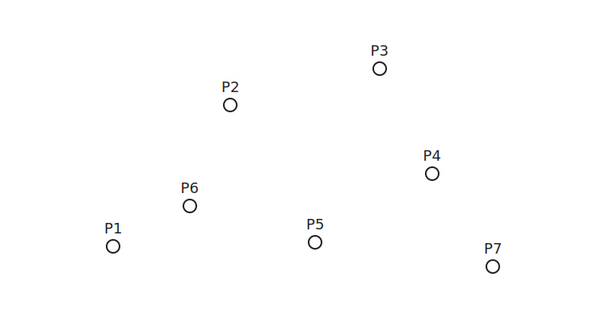
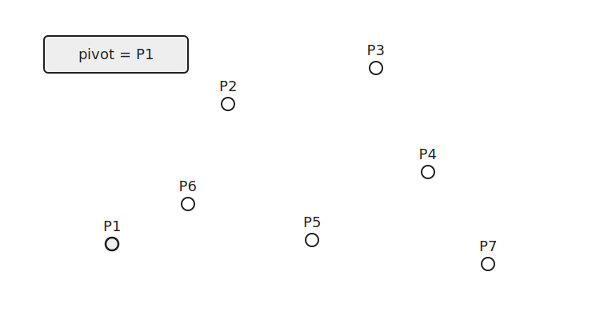
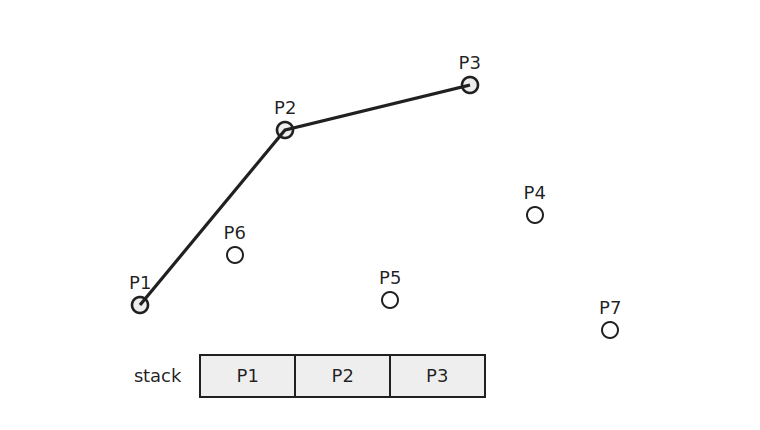
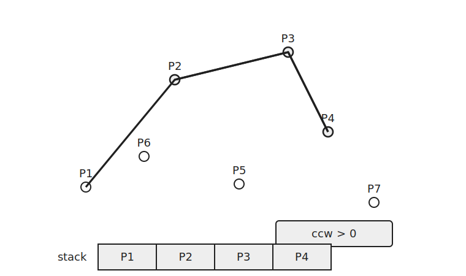
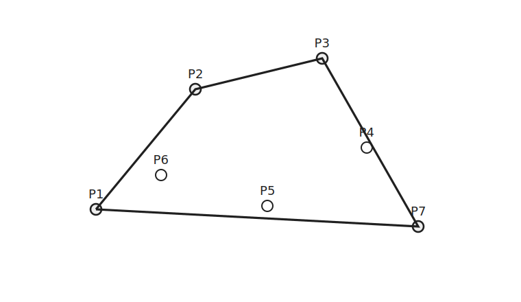

Graham's Scan은 볼록 껍질을 구하는 알고리즘이다.

볼록 껍질은 모든 점을 포함하는 가장 바깥쪽 볼록 다각형이다.

Graham's Scan은 기준점을 잡고 점들을 각도 순으로 정렬한 뒤 스택을 이용해 볼록 껍질에 남을 점만 선택한다.

## 기준점

다음과 같은 점들이 있다고 하자.



먼저 기준점을 하나 정한다.

보통 `y`좌표가 가장 작은 점을 고르고 `y`좌표가 같다면 `x`좌표가 가장 작은 점을 고른다.

```cpp
sort(v.begin(), v.end());
```

`operator<`에서 `y`, `x` 순서로 정렬하면 첫 번째 점이 기준점이 된다.

## 각도 정렬

기준점을 정한 뒤 다른 점들을 기준점에서 바라본 각도 순서로 정렬한다.



각 점에는 기준점과의 상대 위치를 저장한다.

```cpp
v[i].p=v[i].x-v[0].x;
v[i].q=v[i].y-v[0].y;
```

두 점의 각도 순서는 외적으로 비교할 수 있다.

```cpp
if(p*b.q!=q*b.p) return p*b.q>q*b.p;
```

기준점에서 반시계 방향으로 점들을 확인하기 위한 정렬이다.

## 스택

각도 순서대로 점을 보면서 스택을 유지한다.

처음에는 앞쪽 점들을 스택에 넣는다.


새 점을 넣기 전에 스택의 마지막 두 점과 새 점의 CCW를 확인한다.

결과가 양수이면 반시계 방향이므로 새 점을 넣을 수 있다.



결과가 `0` 이하이면 오른쪽으로 꺾이거나 일직선이므로 마지막 점은 볼록 껍질에 남을 수 없다.



```cpp
while(stk.size()>=2 && ccw(stk[stk.size()-2], stk[stk.size()-1], cur)<=0) stk.pop_back();
```

모든 점을 처리하면 스택에 남은 점들이 볼록 껍질을 이룬다.



## 구현

Graham's Scan은 다음과 같이 구현할 수 있다.

```cpp
struct point {
    ll x, y, p=0, q=0;
    bool operator<(const point b) const {
        if(p*b.q!=b.p*q) return p*b.q>b.p*q;
        if(y!=b.y) return y<b.y;
        return x<b.x;
    }
};

ll ccw(point a, point b, point c) {
    point v1 = {b.x-a.x, b.y-a.y};
    point v2 = {c.x-a.x, c.y-a.y};
    return v1.x*v2.y-v2.x*v1.y;
}

vector<point> graham_scan(vector<point> v) {
    sort(v.begin(), v.end());
    for(int i=1;i<v.size();i++) {
        v[i].p=v[i].x-v[0].x;
        v[i].q=v[i].y-v[0].y;
    }
    sort(v.begin(), v.end());

    vector<point> stk;
    for(auto e:v) {
        while(stk.size()>=2 && ccw(stk[stk.size()-2], stk.back(), e)<=0) stk.pop_back();
        stk.push_back(e);
    }
    return stk;
}
```

점들을 정렬하는 데 $O(N\log N)$이 걸린다.

스택에서 각 점은 한 번 들어가고 최대 한 번 빠져 스캔 과정은 $O(N)$이다.

전체 시간복잡도는 $O(N\log N)$이다.

공간복잡도는 $O(N)$이다.

## 연습 문제

[https://soj.services/problems/66](https://soj.services/problems/66)

<details>
<summary>코드 보기</summary>

```cpp
#include<bits/stdc++.h>
using namespace std;

typedef long long ll;

struct point {
    ll x, y, p=0, q=0;
    bool operator<(const point b) const {
        if(p*b.q!=b.p*q) return p*b.q>b.p*q;
        if(y!=b.y) return y<b.y;
        return x<b.x;
    }
};

ll ccw(point a, point b, point c) {
    point v1 = {b.x-a.x, b.y-a.y};
    point v2 = {c.x-a.x, c.y-a.y};
    return v1.x*v2.y-v2.x*v1.y;
}

vector<point> graham_scan(vector<point> v) {
    sort(v.begin(), v.end());
    for(int i=1;i<v.size();i++) {
        v[i].p=v[i].x-v[0].x;
        v[i].q=v[i].y-v[0].y;
    }
    sort(v.begin(), v.end());

    vector<point> stk;
    for(auto e:v) {
        while(stk.size()>=2 && ccw(stk[stk.size()-2], stk.back(), e)<=0) stk.pop_back();
        stk.push_back(e);
    }
    return stk;
}

int main() {
    cin.tie(0)->sync_with_stdio(0);
    int n; cin >> n;
    vector<point> v(n);
    for(int i=0;i<n;i++) cin >> v[i].x >> v[i].y;
    cout << graham_scan(v).size();
}
```

</details>
