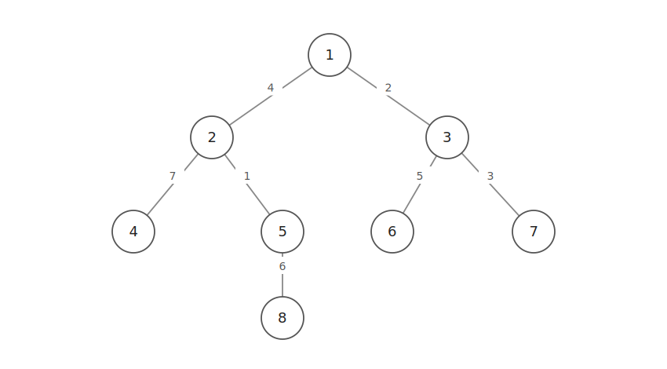
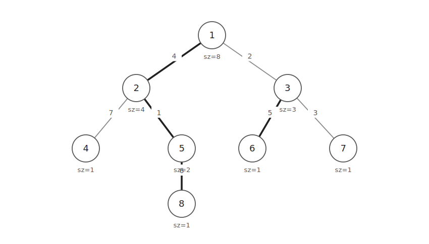
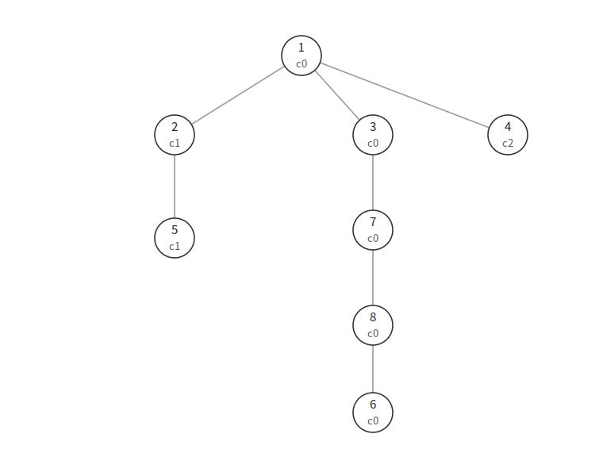
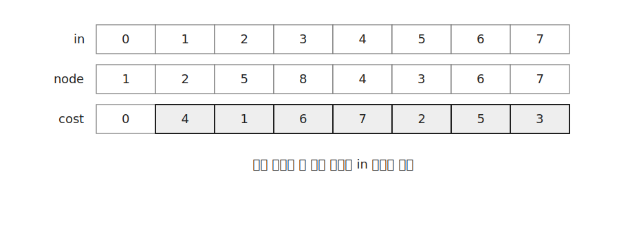

`HLD`는 트리의 경로를 여러 개의 구간으로 나누는 알고리즘이다.

트리에서 두 정점 사이의 경로 쿼리를 배열의 구간 쿼리로 바꾸어 처리한다.

경로의 최댓값, 최솟값, 합처럼 세그먼트 트리로 처리할 수 있는 연산에 사용할 수 있다.

이 글에서는 정점 값의 경로 최댓값을 구하는 쿼리를 기준으로 설명한다.

## 구조

다음과 같은 트리가 있다고 하자.



트리의 경로는 일반 배열처럼 연속된 구간이 아니다.

따라서 먼저 트리를 여러 개의 chain으로 나누고 각 정점에 새로운 번호를 붙인다.

같은 chain에 있는 정점들은 배열에서 연속한 구간이 된다.

이 배열 위에 세그먼트 트리를 만들면 트리 경로 쿼리를 구간 쿼리로 처리할 수 있다.

## Heavy Child

먼저 `dfs1()`로 각 정점의 서브트리 크기를 구한다.

각 정점에서 서브트리 크기가 가장 큰 자식을 `heavy child`로 둔다.



굵게 표시된 간선이 `heavy edge`이다.

`heavy edge`를 따라가면 하나의 긴 chain이 된다.

예제 코드에서는 `child[cur]`의 첫 번째 원소가 `heavy child`가 되도록 유지한다.

```cpp
child[cur].push_back(nxt);
if(subTreeCnt[child[cur].front()]<subTreeCnt[child[cur].back()]) swap(child[cur].front(), child[cur].back());
```

`dfs1()`은 다음과 같이 작성한다.

```cpp
void dfs1(int cur=0) {
    subTreeCnt[cur]=1;
    for(int nxt:conn[cur]) {
        if(!subTreeCnt[nxt]) {
            dfs1(nxt);
            subTreeCnt[cur]+=subTreeCnt[nxt];
            child[cur].push_back(nxt);
            if(subTreeCnt[child[cur].front()]<subTreeCnt[child[cur].back()]) swap(child[cur].front(), child[cur].back());
        }
    }
}
```

## Chain 분해

`dfs2()`에서는 정점에 새로운 번호를 붙인다.

```cpp
int u=nodeNum[cur]=nodeCnt++;
```

`nodeNum[cur]`는 원래 정점 `cur`이 배열에서 차지하는 위치이다.

`groupNum[u]`는 새 번호 `u`가 속한 chain 번호이다.

```cpp
groupNum[u]=groupCnt;
```

`head[groupCnt]`는 현재 chain의 가장 위 정점이다.

```cpp
if(head[groupCnt]==-1) head[groupCnt]=u;
```



`child[cur]`에서 `heavy child`가 맨 앞에 있으므로 먼저 방문하는 자식은 같은 chain에 들어간다.

leaf에 도착하면 현재 chain이 끝나므로 `groupCnt`를 증가시킨다.

```cpp
if(child[cur].empty()) {
    groupCnt++;
    return;
}
```

전체 `dfs2()`는 다음과 같다.

```cpp
void dfs2(int cur=0, int dep=0) {
    int u=nodeNum[cur]=nodeCnt++;
    depth[u]=dep;
    groupNum[u]=groupCnt;
    if(head[groupCnt]==-1) head[groupCnt]=u;
    if(child[cur].empty()) {
        groupCnt++;
        return;
    }
    for(int nxt:child[cur]) {
        dfs2(nxt, dep+1);
        par[nodeNum[nxt]]=u;
    }
}
```

같은 chain에 있는 정점들은 `nodeNum`이 연속한다.

따라서 같은 chain 안의 경로는 세그먼트 트리의 한 구간으로 처리할 수 있다.

## 정점 값 저장

예제 코드는 간선 비용이 아니라 정점 값을 처리한다.

원래 정점 `i`의 값은 새 번호 `nodeNum[i]` 위치에 저장한다.

```cpp
for(int i=0;i<n;i++) arr[SZ+nodeNum[i]]=v[i];
```

정점 값을 바꿀 때도 `nodeNum`을 이용해 배열 위치를 찾는다.

```cpp
void update(int i, int val) {
    i=nodeNum[i-1]+SZ;
    arr[i]=val;
    while(i>1) {
        i>>=1;
        arr[i]=max(arr[i*2], arr[i*2+1]);
    }
}
```

입력 정점은 1-indexed이므로 `i-1`로 바꾸어 사용한다.

## 경로 쿼리

정점 `u`와 정점 `v` 사이의 경로 최댓값을 구한다고 하자.



먼저 입력 정점을 새 번호로 바꾼다.

```cpp
u=nodeNum[u-1];
v=nodeNum[v-1];
```

두 정점이 서로 다른 chain에 속해 있다면 더 깊은 chain부터 위로 올린다.

```cpp
while(groupNum[u]!=groupNum[v]) {
    int uHead=head[groupNum[u]];
    int vHead=head[groupNum[v]];
    if(depth[uHead]>depth[vHead]) {
        ret=max(ret, maxRange(uHead, u));
        u=par[uHead];
    } else {
        ret=max(ret, maxRange(vHead, v));
        v=par[vHead];
    }
}
```

현재 정점에서 해당 chain의 head까지는 배열에서 연속한 구간이다.

따라서 세그먼트 트리로 한 번에 처리할 수 있다.

두 정점이 같은 chain에 들어오면 남은 구간을 한 번 더 확인한다.

```cpp
return max(ret, maxRange(min(u, v), max(u, v)));
```

## 구현

`HLD`는 다음과 같이 구현할 수 있다.

```cpp
int SZ=1, arr[MAX*4];
int subTreeCnt[MAX];
vector<vector<int>> conn(MAX), child(MAX);
int nodeCnt, nodeNum[MAX], groupCnt, groupNum[MAX], head[MAX], par[MAX], depth[MAX];

void dfs1(int cur=0) {
    subTreeCnt[cur]=1;
    for(int nxt:conn[cur]) {
        if(!subTreeCnt[nxt]) {
            dfs1(nxt);
            subTreeCnt[cur]+=subTreeCnt[nxt];
            child[cur].push_back(nxt);
            if(subTreeCnt[child[cur].front()]<subTreeCnt[child[cur].back()]) swap(child[cur].front(), child[cur].back());
        }
    }
}

void dfs2(int cur=0, int dep=0) {
    int u=nodeNum[cur]=nodeCnt++;
    depth[u]=dep;
    groupNum[u]=groupCnt;
    if(head[groupCnt]==-1) head[groupCnt]=u;
    if(child[cur].empty()) {
        groupCnt++;
        return;
    }
    for(int nxt:child[cur]) {
        dfs2(nxt, dep+1);
        par[nodeNum[nxt]]=u;
    }
}

int query(int u, int v) {
    int ret=INT_MIN;
    u=nodeNum[u-1];
    v=nodeNum[v-1];
    while(groupNum[u]!=groupNum[v]) {
        int uHead=head[groupNum[u]], vHead=head[groupNum[v]];
        if(depth[uHead]>depth[vHead]) {
            ret=max(ret, maxRange(uHead, u));
            u=par[uHead];
        } else {
            ret=max(ret, maxRange(vHead, v));
            v=par[vHead];
        }
    }
    return max(ret, maxRange(min(u, v), max(u, v)));
}
```

초기화는 다음과 같이 한다.

```cpp
void construct(int n) {
    dfs1();
    memset(head, -1, sizeof head);
    dfs2();
    while(SZ<=n) SZ<<=1;
    for(int i=0;i<n;i++) arr[SZ+nodeNum[i]]=v[i];
    for(int i=SZ-1;i;i--) arr[i]=max(arr[i*2], arr[i*2+1]);
}
```

`dfs1()`과 `dfs2()`는 모든 정점을 한 번씩 방문하므로 $O(N)$이다.

경로 쿼리는 경로를 최대 $O(\log N)$개의 chain 구간으로 나눈다.

각 구간마다 세그먼트 트리 쿼리를 수행하므로 시간복잡도는 $O(\log^2 N)$이다.

정점 값 변경은 세그먼트 트리의 한 점 업데이트이므로 $O(\log N)$이다.

공간복잡도는 $O(N)$이다.

## 연습 문제

[https://soj.services/problems/65](https://soj.services/problems/65)

<details>
<summary>코드 보기</summary>

```cpp
#include<bits/stdc++.h>
using namespace std;

const int MAX = 200'001;

int SZ=1, arr[MAX*4];
int subTreeCnt[MAX];
vector<vector<int>> conn(MAX), child(MAX);
int nodeCnt, nodeNum[MAX], groupCnt, groupNum[MAX], head[MAX], par[MAX], depth[MAX];

void dfs1(int cur=0) {
    subTreeCnt[cur]=1;
    for(int nxt:conn[cur]) {
        if(!subTreeCnt[nxt]) {
            dfs1(nxt);
            subTreeCnt[cur]+=subTreeCnt[nxt];
            child[cur].push_back(nxt);
            if(subTreeCnt[child[cur].front()]<subTreeCnt[child[cur].back()]) swap(child[cur].front(), child[cur].back());
        }
    }
}

void dfs2(int cur=0, int dep=0) {
    int u=nodeNum[cur]=nodeCnt++;
    depth[u]=dep;
    groupNum[u]=groupCnt;
    if(head[groupCnt]==-1) head[groupCnt]=u;
    if(child[cur].empty()) {
        groupCnt++;
        return;
    }
    for(int nxt:child[cur]) {
        dfs2(nxt, dep+1);
        par[nodeNum[nxt]]=u;
    }
}

void construct(int n) {
    vector<int> v(n);
    for(int i=0;i<n;i++) cin >> v[i];
    for(int i=1;i<n;i++) {
        int u, v; cin >> u >> v;
        conn[u-1].push_back(v-1);
        conn[v-1].push_back(u-1);
    }
    dfs1();
    memset(head, -1, sizeof head);
    dfs2();
    while(SZ<=n) SZ<<=1;
    for(int i=0;i<n;i++) arr[SZ+nodeNum[i]]=v[i];
    for(int i=SZ-1;i;i--) arr[i]=max(arr[i*2], arr[i*2+1]);
}

void update(int i, int val) {
    i=nodeNum[i-1]+SZ;
    arr[i]=val;
    while(i>1) {
        i>>=1;
        arr[i]=max(arr[i*2], arr[i*2+1]);
    }
}

int maxRange(int L, int R) {
    int ret=INT_MIN;
    for(L+=SZ, R+=SZ;L<=R;L>>=1, R>>=1) {
        if(L&1) ret=max(ret, arr[L++]);
        if(!(R&1)) ret=max(ret, arr[R--]);
    }
    return ret;
}

int query(int u, int v) {
    int ret=INT_MIN;
    u=nodeNum[u-1];
    v=nodeNum[v-1];
    while(groupNum[u]!=groupNum[v]) {
        int uHead=head[groupNum[u]], vHead=head[groupNum[v]];
        if(depth[uHead]>depth[vHead]) {
            ret=max(ret, maxRange(uHead, u));
            u=par[uHead];
        } else {
            ret=max(ret, maxRange(vHead, v));
            v=par[vHead];
        }
    }
    return max(ret, maxRange(min(u, v), max(u, v)));
}

int main() {
    cin.tie(0)->sync_with_stdio(0);
    int n, q; cin >> n >> q;
    construct(n);
    while(q--) {
        int a, b, c; cin >> a >> b >> c;
        if(a==1) update(b, c);
        else cout << query(b, c) << '\n';
    }
}
```

</details>