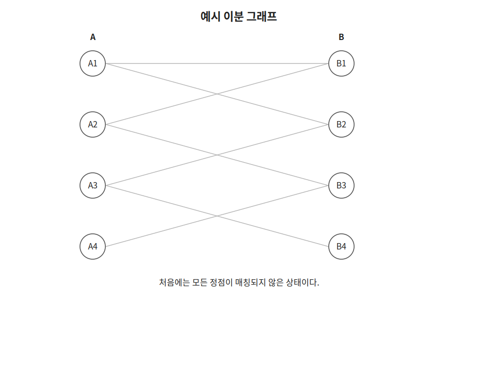
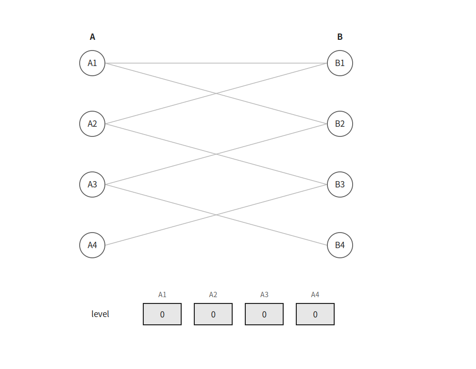
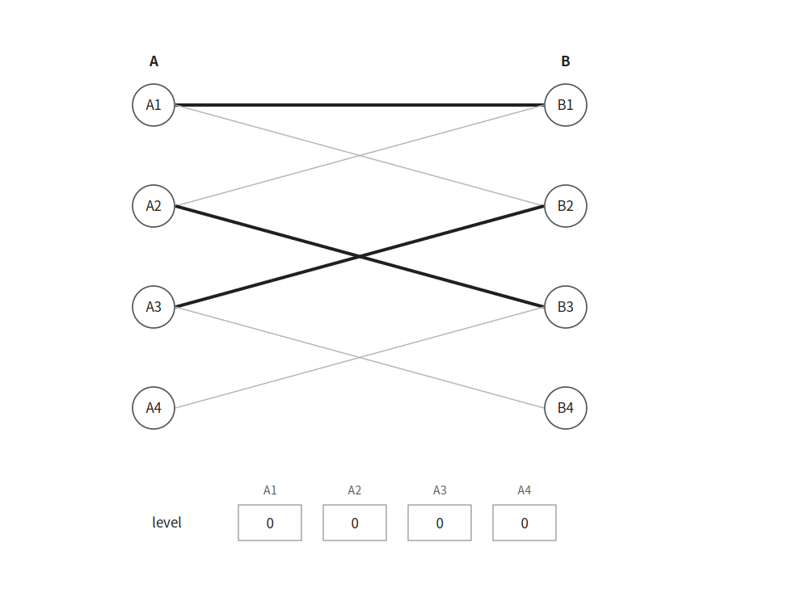
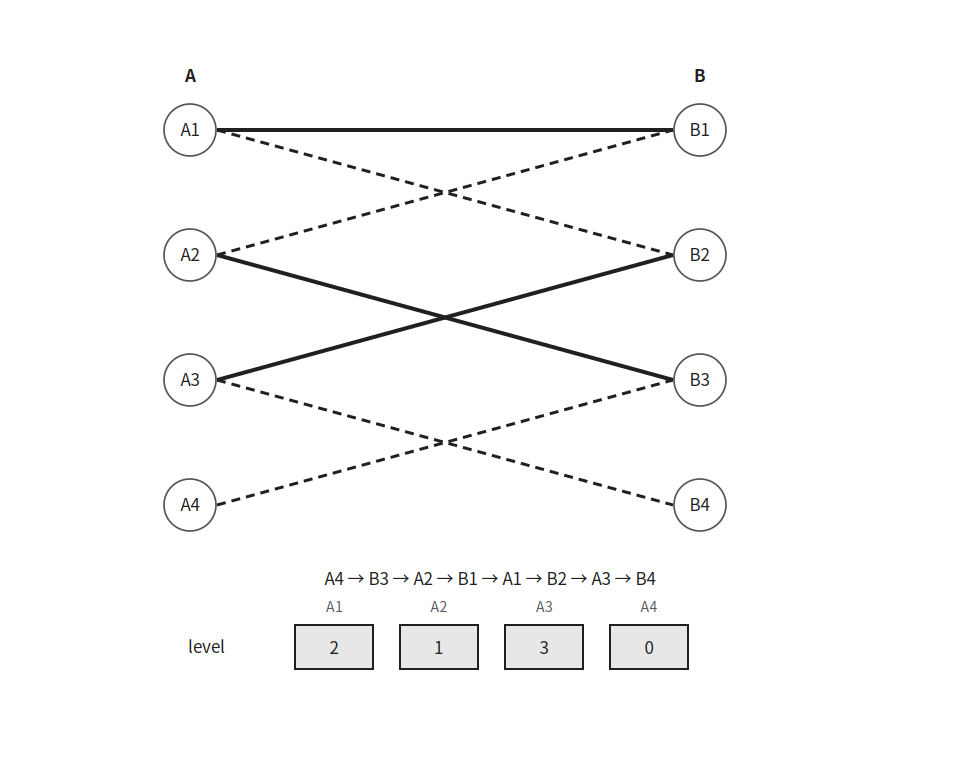
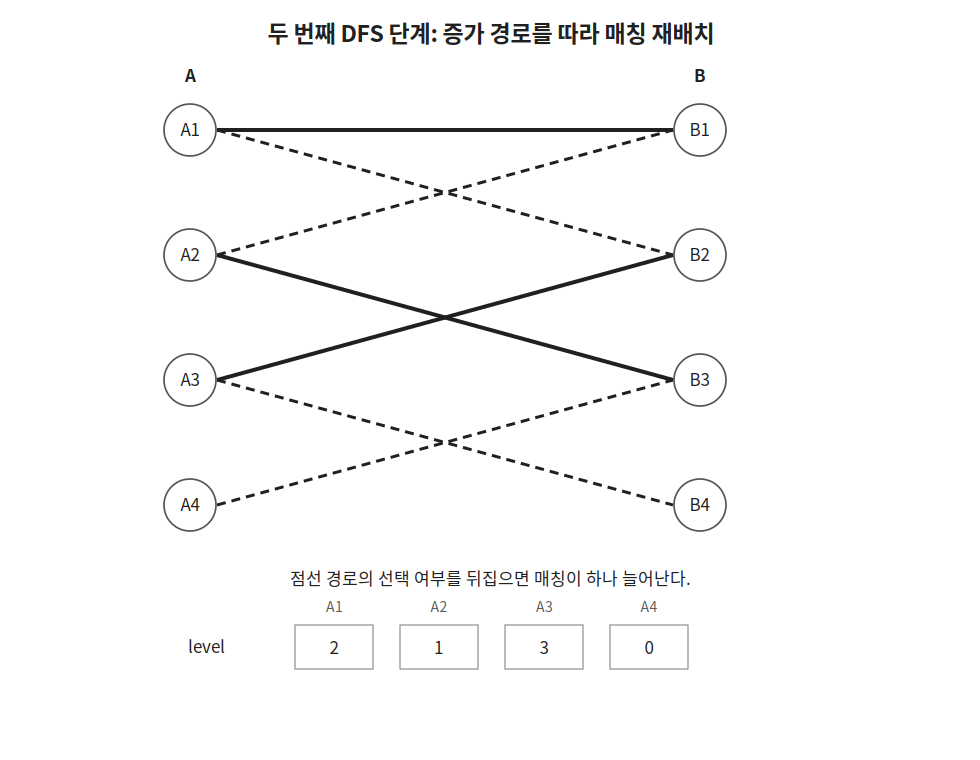
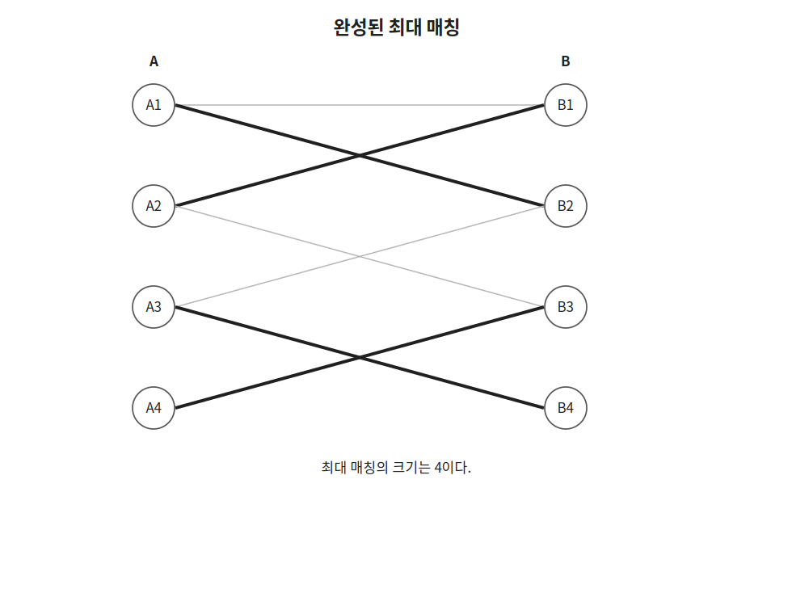

`Hopcroft-Karp`는 이분 그래프에서 최대 매칭을 구하는 알고리즘이다.

`Kuhn` 알고리즘은 왼쪽 정점마다 `DFS`를 수행하지만 `Hopcroft-Karp`는 `BFS`로 레벨을 만든 뒤 `DFS`로 여러 증가 경로를 한 단계에서 처리한다.

## 기본 구조

다음과 같은 이분 그래프가 있다고 하자.



왼쪽 그룹의 정점을 `A`, 오른쪽 그룹의 정점을 `B`라고 하자.

`a[i]`에는 왼쪽 정점 `i`와 매칭된 오른쪽 정점을 저장한다.

`b[j]`에는 오른쪽 정점 `j`와 매칭된 왼쪽 정점을 저장한다.

매칭되지 않은 정점에는 $-1$을 저장한다.

```cpp
memset(a, -1, sizeof a);
memset(b, -1, sizeof b);
```

## BFS

`BFS`에서는 아직 매칭되지 않은 왼쪽 정점의 레벨을 $0$으로 두고 큐에 넣는다.

```cpp
for(int i=1;i<=n;i++) {
    if(a[i]==-1) {
        level[i]=0;
        q.push(i);
    } else {
        level[i]=-1;
    }
}
```



매칭된 왼쪽 정점은 아직 방문하지 않은 상태를 나타내기 위해 레벨을 $-1$로 둔다.

큐에서 왼쪽 정점 `cur`을 꺼낸 뒤 연결된 오른쪽 정점을 확인한다.

오른쪽 정점 `next`가 다른 왼쪽 정점과 매칭되어 있다면 해당 왼쪽 정점까지 탐색을 이어간다.

```cpp
if(b[next]!=-1 && level[b[next]]==-1) {
    level[b[next]]=level[cur]+1;
    q.push(b[next]);
}
```

즉 `cur → next → b[next]`로 이동할 수 있다면 다음 왼쪽 정점의 레벨은 현재 레벨보다 $1$ 커진다.

## DFS

`DFS`에서는 오른쪽 정점 `next`가 비어 있으면 바로 매칭한다.

이미 다른 왼쪽 정점과 매칭되어 있다면 기존 매칭을 다른 위치로 옮길 수 있는지 재귀적으로 확인한다.

이때 레벨이 정확히 $1$ 증가하는 방향으로만 이동한다.

```cpp
if(b[next]==-1 || level[b[next]]==level[cur]+1 && dfs(b[next])) {
    b[next]=cur;
    a[cur]=next;
    return true;
}
```

첫 번째 단계에서는 다음 매칭을 한 번에 추가할 수 있다.

```text
A1 - B1
A2 - B3
A3 - B2
```



아직 매칭되지 않은 왼쪽 정점이 남아 있다면 `BFS`를 다시 수행한다.



이번에는 기존 매칭을 재배치하여 새로운 매칭을 추가할 수 있다.

```text
A4 → B3 → A2 → B1 → A1 → B2 → A3 → B4
```



경로에 포함된 간선의 선택 여부를 바꾸면 매칭이 하나 늘어난다.

```text
A1 - B2
A2 - B1
A3 - B4
A4 - B3
```



한 단계에서 새로운 매칭을 하나도 추가하지 못했다면 더 이상 증가 경로가 없으므로 종료한다.

## 구현

`Hopcroft-Karp`는 다음과 같이 구현할 수 있다.

```cpp
int n, m, k, a[MAX], b[MAX], level[MAX];
vector<vector<int>> conn(MAX);

void bfs() {
    queue<int> q;
    for(int i=1;i<=n;i++) {
        if(a[i]==-1) {
            level[i]=0;
            q.push(i);
        } else {
            level[i]=-1;
        }
    }
    while(!q.empty()) {
        int cur=q.front(); q.pop();
        for(int next:conn[cur]) {
            if(b[next]!=-1 && level[b[next]]==-1) {
                level[b[next]]=level[cur]+1;
                q.push(b[next]);
            }
        }
    }
}

bool dfs(int cur) {
    for(int next:conn[cur]) {
        if(b[next]==-1 || level[b[next]]==level[cur]+1 && dfs(b[next])) {
            b[next]=cur;
            a[cur]=next;
            return true;
        }
    }
    return false;
}

int hopcroftKarp() {
    memset(a, -1, sizeof a);
    memset(b, -1, sizeof b);
    int result=0;
    while(true) {
        bfs();
        int flow=0;
        for(int cur=1;cur<=n;cur++) flow+=a[cur]==-1 && dfs(cur);
        if(!flow) break;
        result+=flow;
    }
    return result;
}
```

위 구현은 핵심 구조를 간결하게 보여주기 위한 형태이다.

일반적인 `Hopcroft-Karp`의 시간복잡도는 $O(E\sqrt V)$이다.

최악 시간복잡도가 중요한 문제에서는 최단 증가 경로 제한과 현재 간선 최적화를 추가한 구현을 사용하는 편이 안전하다.

## 연습 문제

[https://soj.services/problems/47](https://soj.services/problems/47)

<details>
<summary>코드 보기</summary>

```cpp
#include<bits/stdc++.h>
using namespace std;

const int MAX = 100'001;

int n, m, k, a[MAX], b[MAX], level[MAX];
vector<vector<int>> conn(MAX);

void bfs() {
    queue<int> q;
    for(int i=1;i<=n;i++) {
        if(a[i]==-1) {
            level[i]=0;
            q.push(i);
        } else {
            level[i]=-1;
        }
    }
    while(!q.empty()) {
        int cur = q.front(); q.pop();
        for(int next:conn[cur]) {
            if(b[next]!=-1 && level[b[next]]==-1) {
                level[b[next]]=level[cur]+1;
                q.push(b[next]);
            }
        }
    }
}

bool dfs(int cur) {
    for(int next:conn[cur]) {
        if(b[next]==-1 || level[b[next]]==level[cur]+1 && dfs(b[next])) {
            b[next]=cur;
            a[cur]=next;
            return true;
        }
    }
    return false;
}

int main() {
    cin.tie(0)->sync_with_stdio(0);
    cin >> n >> m >> k;
    while(k--) {
        int a, b; cin >> a >> b;
        conn[a].push_back(b);
    }

    memset(a, -1, sizeof a);
    memset(b, -1, sizeof b);
    int res=0;
    while(true) {
        bfs();
        int flow=0;
        for(int i=1;i<=n;i++) flow+=a[i]==-1 && dfs(i);
        if(!flow) break;
        res+=flow;
    }
    cout << res;
}
```

</details>