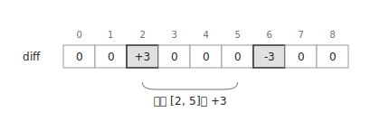
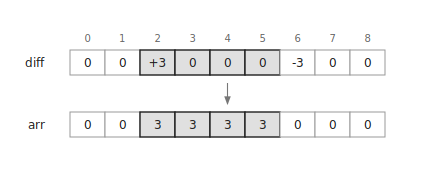
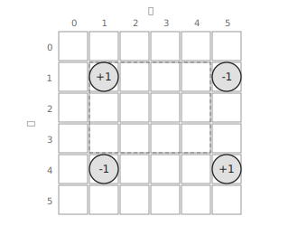
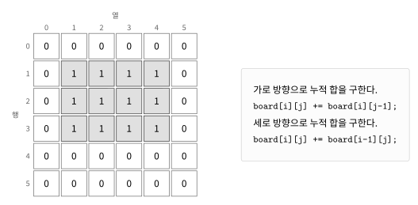
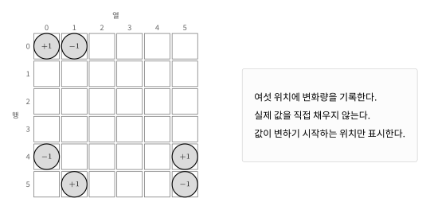
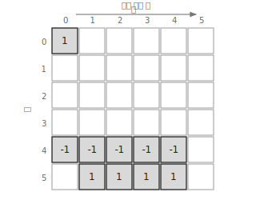
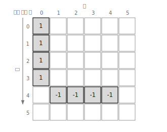
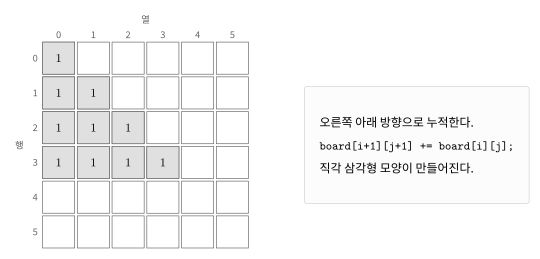

`Imos Method`는 여러 구간에 값을 더한 뒤 최종 상태를 빠르게 구하는 방법이다.

구간의 모든 원소를 직접 바꾸지 않고 값이 변하는 시작점과 끝 다음 위치만 기록한다.

모든 갱신을 기록한 뒤 누적 합을 구하면 실제 값을 복원할 수 있다.

## 1차원 구간 갱신

배열의 인덱스가 $l$ 이상 $r$ 이하인 모든 원소에 $x$를 더한다고 하자.

각 원소를 직접 바꾸면 한 번의 갱신에 $O(n)$이 걸릴 수 있다.

`Imos Method`에서는 변화량 배열 `diff`에 두 값만 기록한다.

```cpp
diff[l]+=x;
diff[r+1]-=x;
```

예를 들어 인덱스 $2$ 이상 $5$ 이하인 원소에 $3$을 더한다고 하자.



`diff[2]`에 $3$을 더하면 인덱스 $2$부터 값이 $3$ 증가한다.

`diff[6]`에서 $3$을 빼면 인덱스 $6$부터 증가량이 사라진다.

## 누적 합으로 복원하기

모든 갱신을 기록한 뒤 왼쪽에서 오른쪽으로 누적 합을 구한다.



```cpp
for(int i=1;i<=n;i++) {
    diff[i]+=diff[i-1];
}
```

누적 합을 구한 뒤 `diff[i]`에는 인덱스 $i$에 더해야 하는 값이 저장된다.

여러 구간을 갱신해도 시작점과 끝 다음 위치에 변화량을 계속 더하면 된다.

## 1차원 구현

길이가 $n$인 배열에 $q$개의 구간 갱신을 적용하는 코드는 다음과 같다. $O(n+q)$

```cpp
vector<int> diff(n+2);

while(q--) {
    int l, r, x; cin >> l >> r >> x;
    diff[l]+=x;
    diff[r+1]-=x;
}

for(int i=1;i<=n;i++) {
    diff[i]+=diff[i-1];
}
```

기존 배열 `a`에 갱신 결과를 적용하려면 각 위치에 `diff[i]`를 더하면 된다.

```cpp
for(int i=1;i<=n;i++) {
    diff[i]+=diff[i-1];
    a[i]+=diff[i];
}
```

## 2차원 사각형 갱신

`Imos Method`는 2차원 배열에서도 사용할 수 있다.

행이 $x_1$ 이상 $x_2$ 이하이고 열이 $y_1$ 이상 $y_2$ 이하인 사각형 영역에 $x$를 더한다고 하자.



네 위치에 변화량을 기록한다.

```cpp
board[x1][y1]+=x;
board[x1][y2+1]-=x;
board[x2+1][y1]-=x;
board[x2+1][y2+1]+=x;
```

이후 가로 방향과 세로 방향으로 누적 합을 구한다.



```cpp
for(int i=1;i<=h;i++) {
    for(int j=1;j<=w;j++) {
        board[i][j+1]+=board[i][j];
    }
}
for(int i=1;i<=h;i++) {
    for(int j=1;j<=w;j++) {
        board[i+1][j]+=board[i][j];
    }
}
```

크기가 $h \times w$인 배열에 $q$개의 사각형 갱신을 적용한다면 시간복잡도는 $O(hw+q)$이다.

## 사각형 연습 문제

[https://soj.services/problems/30](https://soj.services/problems/30)

<details>
<summary>코드 보기</summary>

```cpp
#include<bits/stdc++.h>
using namespace std;

int arr[1002][1002];

int main() {
    cin.tie(0)->sync_with_stdio(0);
    int h, w, n; cin >> h >> w >> n;
    while(n--) {
        int x1, y1, x2, y2; cin >> x1 >> y1 >> x2 >> y2;
        arr[y1][x1]++;
        arr[y2+1][x1]--;
        arr[y1][x2+1]--;
        arr[y2+1][x2+1]++;
    }

    for(int i=1;i<=h;i++) {
        for(int j=1;j<=w;j++) {
            arr[i][j+1]+=arr[i][j];
        }
    }
    for(int j=1;j<=w;j++) {
        for(int i=1;i<=h;i++) {
            arr[i+1][j]+=arr[i][j];
        }
    }
    for(int i=1;i<=h;i++) {
        for(int j=1;j<=w;j++) {
            cout << arr[i][j] << ' ';
        }
        cout << '\n';
    }
}
```

</details>

## 직각삼각형 영역

누적 합을 구하는 방향을 추가하면 사각형이 아닌 도형도 처리할 수 있다.

이번에는 한 변의 길이가 $4$인 직각삼각형 영역을 만든다고 하자.



삼각형 영역을 만들기 위해 여섯 위치에 값을 기록한다.

```cpp
board[a-1][b-1]++;
board[a-1][b]--;
board[a+x][b-1]--;
board[a+x][b+x+1]++;
board[a+x+1][b]++;
board[a+x+1][b+x+1]--;
```

이 단계에서는 실제 값을 채우지 않고 값이 변하기 시작하는 위치만 표시한다.

먼저 왼쪽에서 오른쪽으로 훑으며 가로 방향 누적 합을 구한다.



```cpp
for(int i=0;i<=n;i++) {
    for(int j=0;j<=n;j++) {
        board[i][j+1]+=board[i][j];
    }
}
```

이어서 위에서 아래로 훑으며 세로 방향 누적 합을 구한다.



```cpp
for(int i=0;i<=n;i++) {
    for(int j=0;j<=n;j++) {
        board[i+1][j]+=board[i][j];
    }
}
```

마지막으로 오른쪽 아래 대각선 방향으로 누적 합을 구한다.



```cpp
for(int i=0;i<=n;i++) {
    for(int j=0;j<=n;j++) {
        board[i+1][j+1]+=board[i][j];
    }
}
```

## 삼각형 연습 문제

[https://soj.services/problems/31](https://soj.services/problems/31)

<details>
<summary>코드 보기</summary>

```cpp
#include<bits/stdc++.h>
using namespace std;

int arr[1003][1003];

int main() {
    cin.tie(0)->sync_with_stdio(0);
    int h, w, n; cin >> h >> w >> n;
    while(n--) {
        int x, y, k; cin >> x >> y >> k;
        arr[y][x]++;
        arr[y][x+1]--;
        arr[y+k][x]--;
        arr[y+k][x+k+1]++;
        arr[y+k+1][x+1]++;
        arr[y+k+1][x+k+1]--;
    }

    for(int i=1;i<=h;i++) {
        for(int j=1;j<=w;j++) {
            arr[i][j+1]+=arr[i][j];
        }
    }
    for(int j=1;j<=w;j++) {
        for(int i=1;i<=h;i++) {
            arr[i+1][j]+=arr[i][j];
        }
    }
    for(int i=1;i<=h;i++) {
        for(int j=1;j<=w;j++) {
            arr[i+1][j+1]+=arr[i][j];
        }
    }
    for(int i=1;i<=h;i++) {
        for(int j=1;j<=w;j++) {
            cout << arr[i][j] << ' ';
        }
        cout << '\n';
    }
}
```

</details>