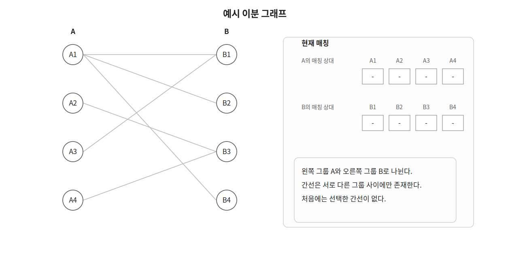
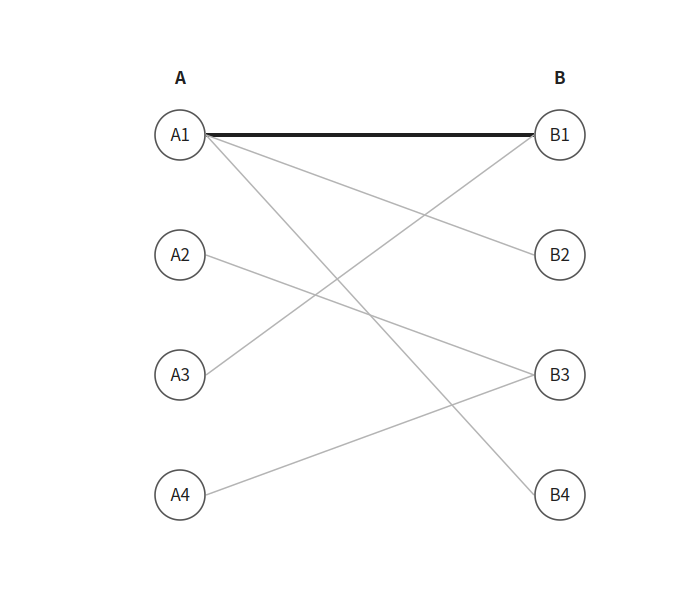
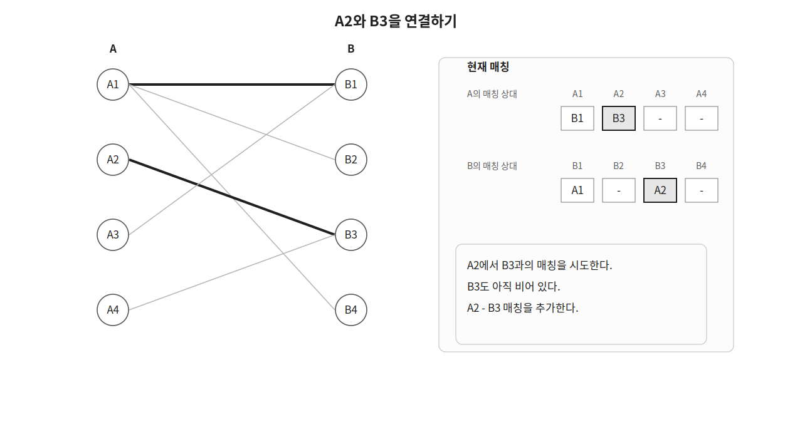
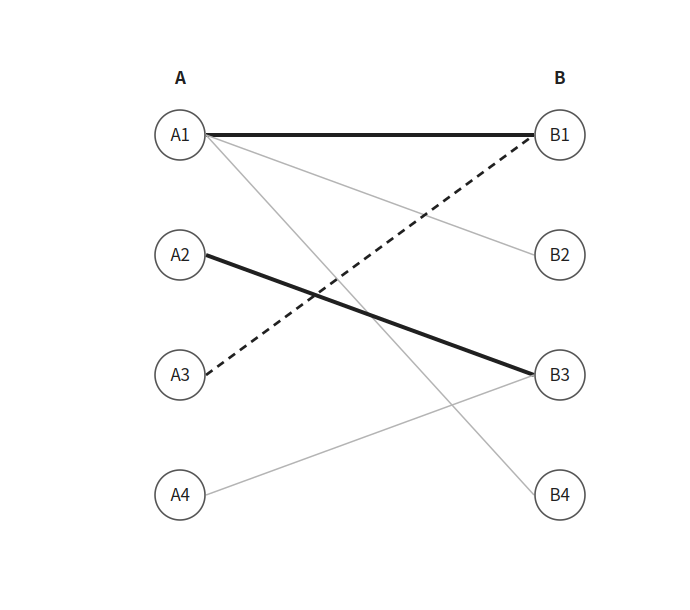
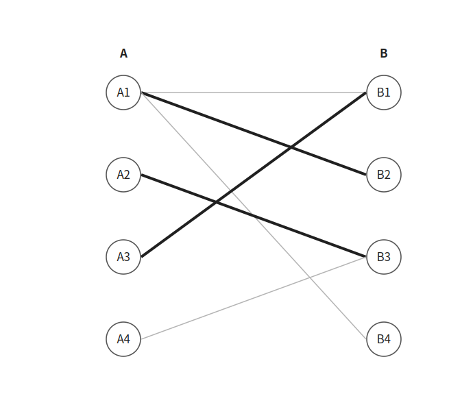

Kuhn 알고리즘은 이분 그래프에서 최대 매칭을 구하는 알고리즘이다.

기존 매칭을 재배치할 수 있는지 DFS로 확인하며 새로운 매칭을 하나씩 추가한다.

## 이분 그래프와 매칭

이분 그래프는 정점을 두 그룹으로 나누었을 때 모든 간선이 서로 다른 그룹 사이에만 존재하는 그래프이다.

다음과 같이 왼쪽 그룹 `A`와 오른쪽 그룹 `B`로 나뉜 그래프가 있다고 하자.



매칭은 서로 같은 정점을 공유하지 않는 간선의 집합이다.

최대 매칭은 선택할 수 있는 간선의 개수가 가장 많은 매칭이다.

## 동작 원리

왼쪽 정점을 하나씩 확인하며 연결할 수 있는 오른쪽 정점을 찾는다.

먼저 `A1`에서 `B1`과의 매칭을 시도한다.

`B1`은 아직 다른 정점과 연결되어 있지 않으므로 `A1 - B1`을 선택한다.



다음으로 `A2`에서 `B3`과의 매칭을 시도한다.

`B3`도 비어 있으므로 `A2 - B3`을 선택한다.



이제 `A3`을 확인한다.

`A3`은 `B1`과 연결되어 있지만 `B1`은 이미 `A1`과 매칭되어 있다.



이 경우 `A1`을 다른 정점과 매칭할 수 있는지 재귀적으로 확인한다.

`A1`을 `B2`로 옮기면 `B1`이 비게 된다.

따라서 `A3`을 `B1`과 새롭게 매칭할 수 있다.



마지막으로 `A4`를 확인한다.

`A4`는 `B3`과 연결되어 있지만 `B3`과 매칭된 `A2`를 다른 정점으로 옮길 수 없다.

따라서 `A4`의 매칭은 실패한다.


최대 매칭의 크기는 `3`이다.

```text
A1 - B2
A2 - B3
A3 - B1
```

## 증가 경로

기존 매칭과 아직 선택하지 않은 간선을 번갈아 따라가며 새로운 매칭을 추가할 수 있는 경로를 증가 경로라고 한다.

앞의 예시에서는 다음 경로를 찾았다.

```text
A3 → B1 → A1 → B2
```

기존에 선택한 `A1 - B1`을 제거하고 `A3 - B1`, `A1 - B2`를 선택하면 매칭의 크기가 하나 늘어난다.

Kuhn 알고리즘은 DFS를 이용해 이러한 재배치가 가능한지 확인한다.

## 구현

Kuhn 알고리즘은 다음과 같이 구현할 수 있다. $O(VE)$

```cpp
int A[MAX], B[MAX], visited[MAX];
vector<vector<int>> conn(MAX);

bool dfs(int cur) {
    visited[cur]=true;
    for(int nxt:conn[cur]) {
        if(!B[nxt] || dfs(B[nxt])) {
            A[cur]=nxt;
            B[nxt]=cur;
            return true;
        }
    }
    return false;
}

int kuhn(int n) {
    int result=0;
    for(int cur=1;cur<=n;cur++) {
        memset(visited, 0, sizeof visited);
        result+=dfs(cur);
    }
    return result;
}
```

`A[cur]`에는 왼쪽 정점 `cur`과 매칭된 오른쪽 정점을 저장한다.

`B[nxt]`에는 오른쪽 정점 `nxt`와 매칭된 왼쪽 정점을 저장한다.

`B[nxt]`가 `0`이라면 아직 매칭되지 않은 오른쪽 정점이다.

```cpp
if(!B[nxt] || dfs(B[nxt])) {
    ...
}
```

이미 매칭된 정점이라면 현재 연결된 왼쪽 정점을 다른 곳으로 옮길 수 있는지 재귀적으로 확인한다.

`visited` 배열은 하나의 왼쪽 정점에서 시작한 탐색 안에서 같은 정점을 반복해서 확인하지 않도록 막는다.

새로운 왼쪽 정점을 확인할 때마다 초기화해야 한다.

```cpp
memset(visited, 0, sizeof visited);
```

## 시간복잡도

각 왼쪽 정점마다 DFS를 한 번씩 수행한다.

한 번의 DFS에서는 최대 `E`개의 간선을 확인하므로 시간복잡도는 $O(VE)$이다.

여기서 `V`는 왼쪽 그룹의 정점 수이고 `E`는 간선의 개수이다.

## 연습 문제

[https://soj.services/problems/43](https://soj.services/problems/43)

<details>
<summary>코드 보기</summary>

```cpp
#include<bits/stdc++.h>
using namespace std;

int a[1001], b[1001], vis[1001];
vector<vector<int>> conn(1001);

bool dfs(int cur) {
    vis[cur]=true;
    for(int next:conn[cur]) {
        if(!b[next] || !vis[b[next]] && dfs(b[next])) {
            a[cur]=next;
            b[next]=cur;
            return true;
        }
    }
    return false;
}

int main() {
    cin.tie(0)->sync_with_stdio(0);
    int n, m, k; cin >> n >> m >> k;
    while(k--) {
        int a, b; cin >> a >> b;
        conn[a].push_back(b);
    }

    int cnt=0;
    for(int i=1;i<=n;i++) {
        memset(vis, 0, sizeof vis);
        cnt+=dfs(i);
    }
    cout << cnt;
}
```

</details>
