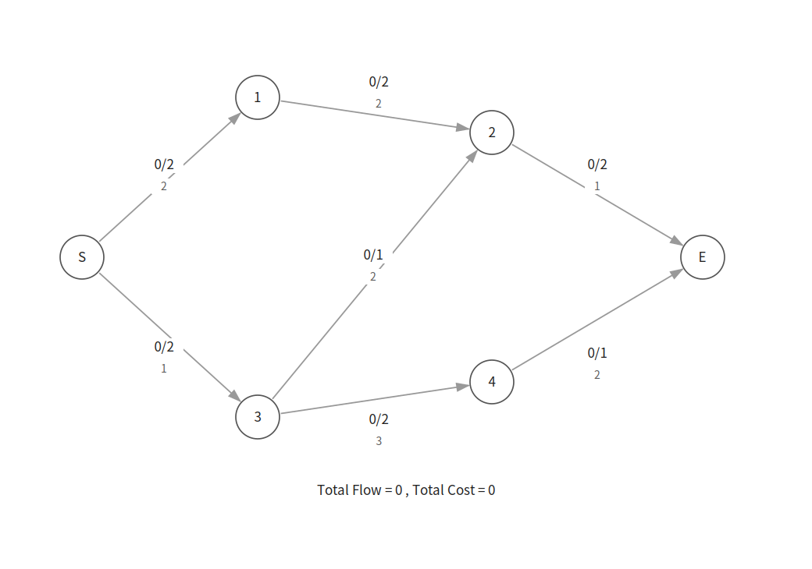
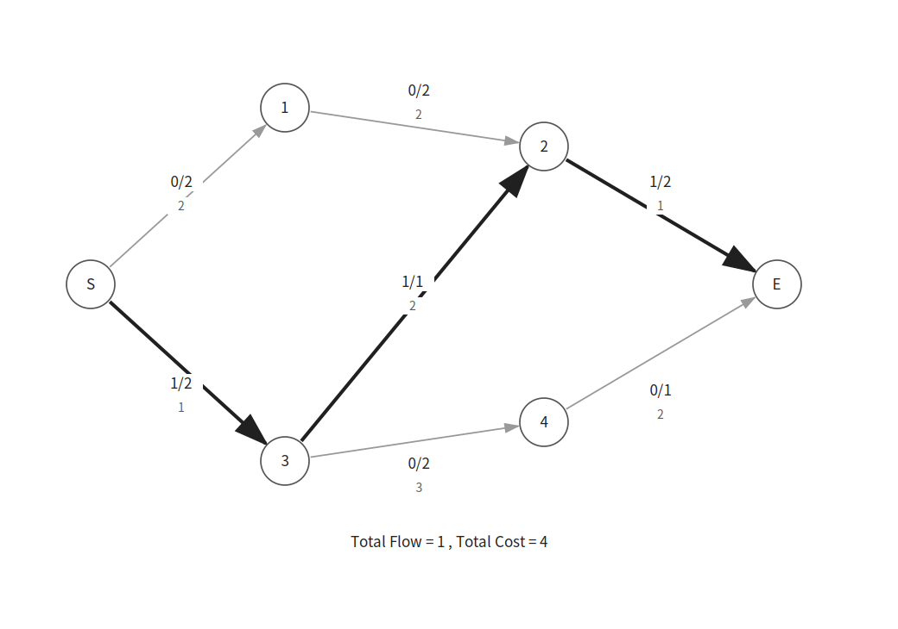
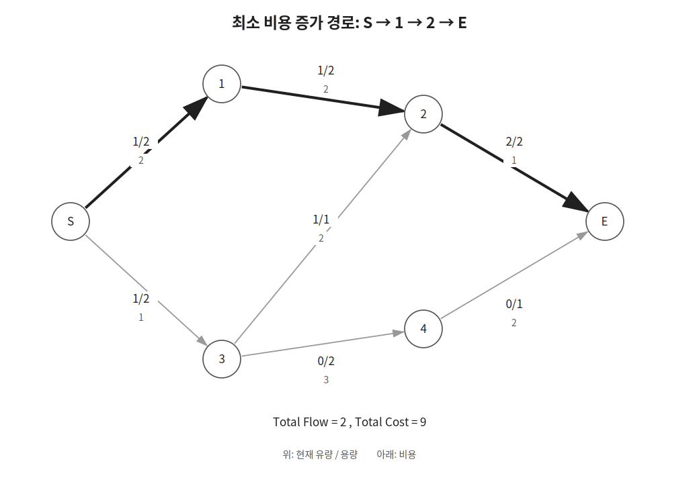
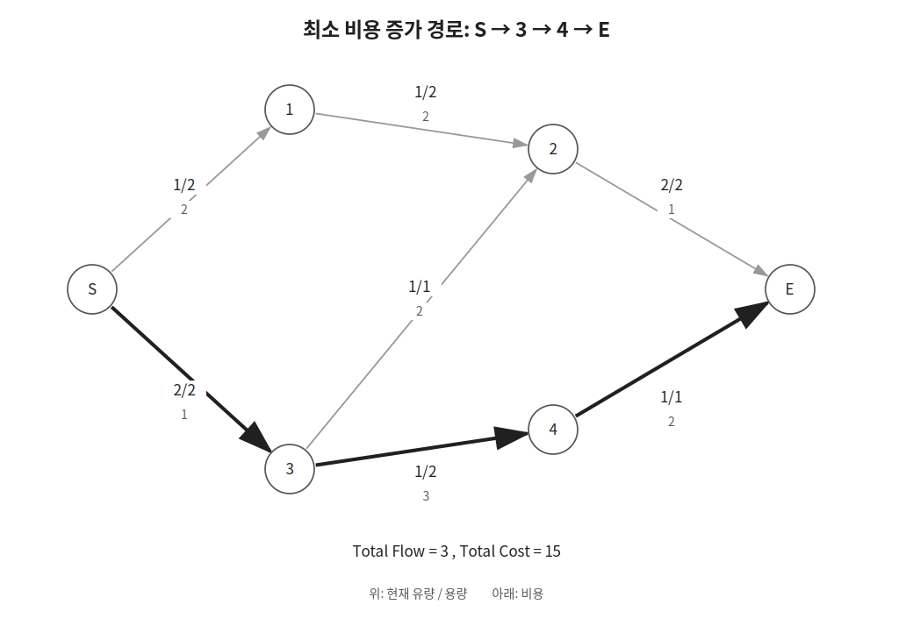
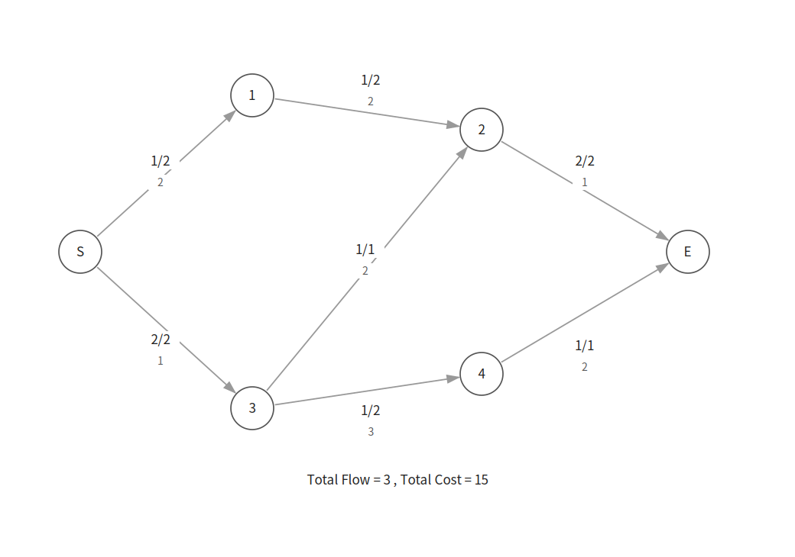

MCMF는 source에서 sink까지 보낼 수 있는 유량을 최대화하면서 전체 비용을 최소화하는 알고리즘이다.

에드몬드-카프처럼 증가 경로를 반복해서 찾지만 BFS 대신 SPFA를 이용해 비용이 가장 작은 경로를 찾는다.

## 최소 비용 최대 유량

유량 네트워크의 각 간선에는 용량과 비용이 정해져 있다.

용량은 해당 간선을 통해 보낼 수 있는 유량의 최댓값이다.

비용은 해당 간선을 통해 유량 `1`을 보낼 때 드는 비용이다.



그림에서 간선 위쪽의 `f/c`는 현재 유량과 용량을 의미한다.

간선 아래쪽의 값은 비용이다.

예를 들어 다음 간선은 용량이 `2`이고 유량 `1`을 보낼 때마다 비용이 `3` 든다는 뜻이다.

```text
0/2
 3
```

## 동작 원리

각 간선의 현재 유량을 `f[u][v]`에 저장하고 용량을 `c[u][v]`에 저장한다.

방향 간선 `u → v`의 잔여 용량은 다음과 같다.

```cpp
c[u][v]-f[u][v]
```

잔여 용량이 양수라면 해당 간선을 따라 추가로 유량을 보낼 수 있다.

현재 잔여 용량이 있는 간선만 따라가며 source에서 sink까지의 최소 비용 경로를 찾는다.

최소 비용 경로는 SPFA를 이용해 찾을 수 있다.

```cpp
if(c[cur][next]-f[cur][next]>0 &&
   cost[next]>cost[cur]+w[cur][next]) {
    cost[next]=cost[cur]+w[cur][next];
}
```

첫 번째 반복에서는 다음 경로를 찾는다.

```text
S → 3 → 2 → E
```



경로의 비용은 다음과 같다.

```text
1 + 2 + 1 = 4
```

경로의 잔여 용량 중 최솟값은 `1`이므로 유량 `1`을 보낸다.

다음 반복에서는 다음 경로를 찾는다.

```text
S → 1 → 2 → E
```



이 경로의 비용은 `5`이다.

현재까지 보낸 유량은 `2`이고 전체 비용은 `9`이다.

다음 반복에서는 다음 경로를 찾는다.

```text
S → 3 → 4 → E
```



이 경로의 비용은 `6`이다.

현재까지 보낸 유량은 `3`이고 전체 비용은 `15`이다.



더 이상 source에서 sink까지 도달할 수 있는 경로가 없으므로 알고리즘을 종료한다.

## 역방향 간선

유량을 보낸 뒤 더 나은 경로가 나타날 수 있다.

따라서 한 번 보낸 유량을 취소할 수 있어야 한다.

방향 간선 `u → v`의 비용이 `w[u][v]`라면 역방향 간선 `v → u`의 비용은 반대 부호로 저장한다.

```cpp
w[v][u]=-w[u][v];
```

또한 SPFA에서 역방향 간선을 확인할 수 있도록 양쪽 정점을 모두 인접 리스트에 추가한다.

```cpp
conn[u].push_back(v);
conn[v].push_back(u);
```

순방향 간선 `u → v`로 `flow`만큼의 유량을 보내면 다음과 같이 갱신한다.

```cpp
f[u][v]+=flow;
f[v][u]-=flow;
```

이제 역방향 간선 `v → u`의 잔여 용량은 다음과 같다.

```text
c[v][u] - f[v][u]
= 0 - (-flow)
= flow
```

따라서 역방향 간선을 따라 최대 `flow`만큼의 유량을 보낼 수 있다.

이는 이전에 보낸 유량을 취소하는 것과 같다.

역방향 간선의 비용은 반대 부호이므로 이전에 더한 비용도 함께 취소된다.

## 구현

MCMF는 다음과 같이 구현할 수 있다. $O(FVE)$

```cpp
bool inQ[MAX];
ll f[MAX][MAX], c[MAX][MAX], w[MAX][MAX], cost[MAX], prv[MAX];
vector<vector<int>> conn(MAX);

pair<ll, ll> mcmf(int source, int sink, int n) {
    ll totalFlow=0, totalCost=0;
    while(true) {
        queue<int> q; q.push(source);
        memset(prv, -1, sizeof prv);
        memset(inQ, 0, sizeof inQ);
        fill(cost, cost+n+1, LINF);
        cost[source]=0;
        while(!q.empty()) {
            int cur=q.front(); q.pop();
            inQ[cur]=false;
            for(int next:conn[cur]) {
                if(c[cur][next]-f[cur][next] && cost[next]>cost[cur]+w[cur][next]) {
                    prv[next]=cur;
                    cost[next]=cost[cur]+w[cur][next];
                    if(!inQ[next]) {
                        inQ[next]=true;
                        q.push(next);
                    }
                }
            }
        }
        if(prv[sink]==-1) break;

        ll flow=LINF;
        for(int cur=sink;cur!=source;cur=prv[cur]) flow=min(flow, c[prv[cur]][cur]-f[prv[cur]][cur]);
        for(int cur=sink;cur!=source;cur=prv[cur]) {
            f[prv[cur]][cur]+=flow;
            f[cur][prv[cur]]-=flow;
        }
        totalFlow+=flow;
        totalCost+=flow*cost[sink];
    }
    return {totalFlow, totalCost};
}
```

방향 간선 `u → v`의 용량이 `capacity`이고 비용이 `cost`라면 다음과 같이 추가한다.

```cpp
c[u][v]=capacity;
w[u][v]=cost;
w[v][u]=-cost;

conn[u].push_back(v);
conn[v].push_back(u);
```

이 구현은 두 정점 사이에 방향과 관계없이 간선이 최대 하나만 존재하는 경우에 사용할 수 있다.

반대 방향 간선이 함께 주어질 수 있거나 같은 방향 간선이 여러 개 주어질 수 있다면 간선을 구조체로 분리해서 관리해야 한다.

## 시간복잡도

한 번의 SPFA는 최악의 경우 $O(VE)$가 걸린다.

증가 경로를 최대 `F`번 찾으므로 전체 시간복잡도는 $O(FVE)$이다.

여기서 `F`는 최대 유량이고 `V`는 정점 수이며 `E`는 간선 수이다.

## 연습 문제

[https://soj.services/problems/45](https://soj.services/problems/45)

<details>
<summary>코드 보기</summary>

```cpp
#include<bits/stdc++.h>
using namespace std;

typedef long long ll;
const ll LINF = 0x3f3f3f3f3f3f3f3f;

ll f[101][101], c[101][101], w[101][101], cost[101], prv[101];
bool inQ[101];
vector<vector<int>> conn(101);

int main() {
    cin.tie(0)->sync_with_stdio(0);
    int n, m, s, t; cin >> n >> m >> s >> t;
    while(m--) {
        ll u, v; cin >> u >> v >> c[u][v] >> w[u][v];
        w[v][u]=-w[u][v];
        conn[u].push_back(v);
        conn[v].push_back(u);
    }

    ll totalF=0, totalW=0;
    while(true) {
        queue<int> q; q.push(s);
        memset(prv, -1, sizeof prv);
        fill(cost, cost+n+1, LINF);
        cost[s]=0;
        while(!q.empty()) {
            int cur=q.front(); q.pop();
            inQ[cur]=false;
            for(int next:conn[cur]) {
                if(c[cur][next]-f[cur][next] && cost[next]>cost[cur]+w[cur][next]) {
                    prv[next]=cur;
                    cost[next]=cost[cur]+w[cur][next];
                    if(!inQ[next]) {
                        inQ[next]=true;
                        q.push(next);
                    }
                }
            }
        }
        if(prv[t]==-1) break;

        ll flow=LINF;
        for(int i=t;i!=s;i=prv[i]) flow=min(flow, c[prv[i]][i]-f[prv[i]][i]);
        for(int i=t;i!=s;i=prv[i]) {
            f[prv[i]][i]+=flow;
            f[i][prv[i]]-=flow;
        }
        totalF+=flow;
        totalW+=flow*cost[t];
    }
    cout << totalF << '\n' << totalW;
}
```

</details>
