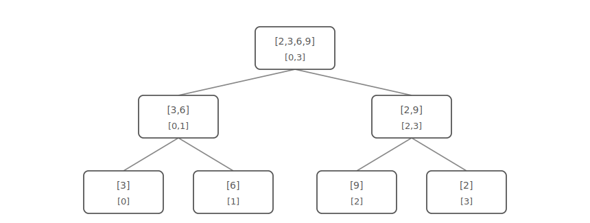
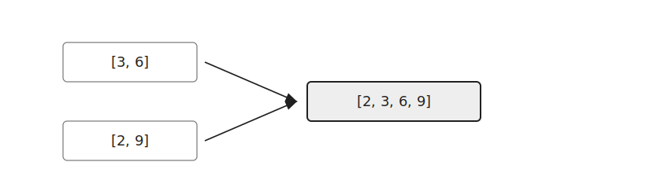
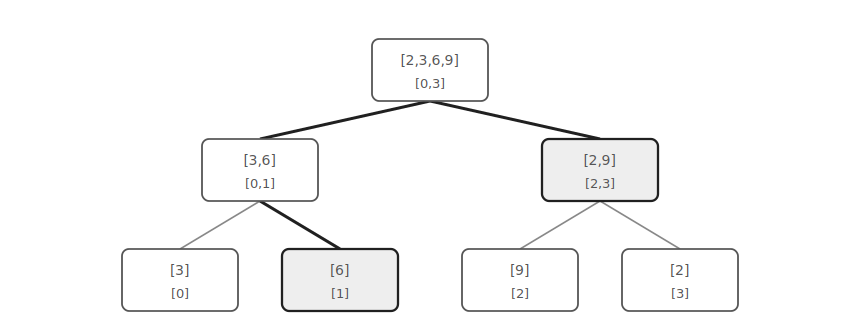

Merge Sort Tree는 세그먼트 트리의 각 노드에 정렬된 배열을 저장하는 자료구조이다.

일반 세그먼트 트리는 각 노드에 구간 합이나 최솟값처럼 하나의 값만 저장한다.

Merge Sort Tree는 각 노드가 담당하는 구간의 모든 원소를 정렬된 상태로 저장한다.

이 글에서는 구간 `[L, R]`에서 `k`보다 큰 원소의 개수를 구하는 쿼리를 기준으로 설명한다.

## 구조

배열이 다음과 같다고 하자.

```text
3 6 9 2
```

Merge Sort Tree는 각 노드에 해당 구간의 정렬된 배열을 저장한다.



리프 노드에는 원래 배열의 값 하나만 저장한다.

부모 노드는 두 자식 노드의 배열을 병합해 정렬된 배열을 만든다.



## 초기화

먼저 `SZ`를 `n` 이상인 가장 작은 2의 거듭제곱으로 만든다.

원래 배열의 값은 리프 노드에 저장한다.

```cpp
while(SZ<n) SZ<<=1;
for(int i=0;i<n;i++) {
    int x; cin >> x;
    arr[SZ+i].push_back(x);
}
```

이후 아래에서 위로 올라가며 두 자식의 배열을 병합한다.

```cpp
for(int i=SZ-1;i>0;i--) {
    int l=0, r=0;
    while(l<arr[i*2].size() || r<arr[i*2+1].size()) {
        if(r==arr[i*2+1].size() || l<arr[i*2].size() && arr[i*2][l]<arr[i*2+1][r]) arr[i].push_back(arr[i*2][l++]);
        else arr[i].push_back(arr[i*2+1][r++]);
    }
}
```

## 구간 쿼리

구간 `[1, 3]`에서 `5`보다 큰 원소의 개수를 구한다고 하자.

세그먼트 트리처럼 질의 구간을 몇 개의 노드로 나눈다.



구간 `[1, 3]`은 `arr[5]`와 `arr[3]`으로 표현할 수 있다.

각 노드의 배열은 정렬되어 있으므로 `upper_bound`로 `5`보다 큰 값이 처음 나타나는 위치를 찾는다.

```cpp
arr[node].end()-upper_bound(arr[node].begin(), arr[node].end(), k)
```

`arr[5]=[6]`에서는 `1`개를 찾는다.

`arr[3]=[2, 9]`에서도 `1`개를 찾는다.

따라서 답은 `2`이다.

배열 기반 세그먼트 트리에서는 `L`과 `R`을 리프 위치로 옮긴 뒤 필요한 노드만 사용한다.

```cpp
int query(int L, int R, int k) {
    int ret=0;
    for(L+=SZ, R+=SZ;L<=R;L>>=1, R>>=1) {
        if(L&1) ret+=arr[L].end()-upper_bound(arr[L].begin(), arr[L].end(), k), L++;
        if(!(R&1)) ret+=arr[R].end()-upper_bound(arr[R].begin(), arr[R].end(), k), R--;
    }
    return ret;
}
```

## 구현

구간에서 `k`보다 큰 원소의 개수를 구하는 Merge Sort Tree는 다음과 같이 구현할 수 있다.

```cpp
int SZ=1;
vector<int> arr[MAX*4];

void init(int n) {
    while(SZ<n) SZ<<=1;
    for(int i=0;i<n;i++) {
        int x; cin >> x;
        arr[SZ+i].push_back(x);
    }
    for(int i=SZ-1;i>0;i--) {
        int l=0, r=0;
        while(l<arr[i*2].size() || r<arr[i*2+1].size()) {
            if(r==arr[i*2+1].size() || l<arr[i*2].size() && arr[i*2][l]<arr[i*2+1][r]) arr[i].push_back(arr[i*2][l++]);
            else arr[i].push_back(arr[i*2+1][r++]);
        }
    }
}

int query(int L, int R, int k) {
    int ret=0;
    for(L+=SZ, R+=SZ;L<=R;L>>=1, R>>=1) {
        if(L&1) ret+=arr[L].end()-upper_bound(arr[L].begin(), arr[L].end(), k), L++;
        if(!(R&1)) ret+=arr[R].end()-upper_bound(arr[R].begin(), arr[R].end(), k), R--;
    }
    return ret;
}
```

초기화할 때 각 원소는 트리의 높이만큼 여러 배열에 저장된다.

따라서 초기화 시간복잡도와 공간복잡도는 $O(N\log N)$이다.

구간 쿼리는 최대 $O(\log N)$개의 노드를 사용한다.

각 노드에서 `upper_bound`를 수행하므로 쿼리 시간복잡도는 $O(\log^2 N)$이다.

## 연습 문제

[https://soj.services/problems/63](https://soj.services/problems/63)

<details>
<summary>코드 보기</summary>

```cpp
#include<bits/stdc++.h>
using namespace std;

const int MAX=200'001;

int SZ=1;
vector<vector<int>> arr(MAX*4);

int query(int L, int R, int x) {
    int ret=0;
    for(L+=SZ, R+=SZ;L<=R;L>>=1, R>>=1) {
        if(L&1) ret+=upper_bound(arr[L].begin(), arr[L].end(), x)-arr[L].begin(), L++;
        if(!(R&1)) ret+=upper_bound(arr[R].begin(), arr[R].end(), x)-arr[R].begin(), R--;
    }
    return ret;
}

int main() {
    cin.tie(0)->sync_with_stdio(0);
    int n, q; cin >> n >> q;
    while(SZ<n) SZ<<=1;
    for(int i=0;i<n;i++) {
        int a; cin >> a;
        arr[i+SZ].push_back(a);
    }
    for(int i=SZ-1;i>0;i--) {
        int l=0, r=0;
        while(l<arr[i*2].size() || r<arr[i*2+1].size()) {
            if(r==arr[i*2+1].size() || l<arr[i*2].size() && arr[i*2][l]<arr[i*2+1][r]) arr[i].push_back(arr[i*2][l++]);
            else arr[i].push_back(arr[i*2+1][r++]);
        }
    }

    int ans=0;
    while(q--) {
        int a, b, c; cin >> a >> b >> c;
        int l = (a^ans)%n;
        int r = (b^ans)%n;
        int x = c^ans;
        ans = query(min(l, r), max(l, r), x);
        cout << ans << '\n';
    }
}
```

</details>
