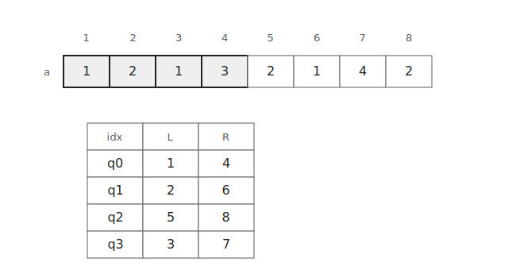
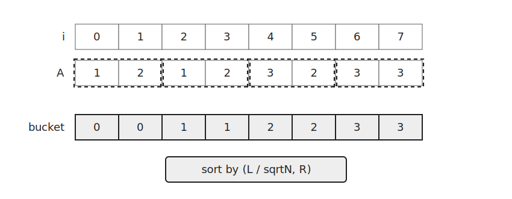
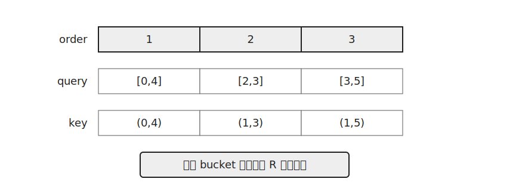
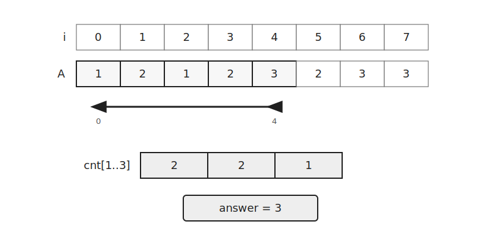

`Mo's Algorithm`은 값이 바뀌지 않는 배열에서 여러 구간 쿼리를 빠르게 처리하는 알고리즘이다.

쿼리를 입력 순서대로 처리하지 않고 블록 기준으로 정렬한 뒤 현재 구간을 조금씩 이동시키며 이전 결과를 재사용한다.

이 글에서는 구간 안의 같은 값 쌍의 개수를 구하는 문제를 기준으로 설명한다.

## 문제 형태

배열 $a$와 여러 구간 쿼리 $[l,r]$가 주어진다고 하자.

각 쿼리는 구간 안에서 값이 같은 두 위치를 고르는 경우의 수를 묻는다.

예를 들어 구간 안에 값 `2`가 세 번 등장하면 `2`끼리 만들 수 있는 쌍은 세 개이다.



각 쿼리를 독립적으로 처리하면 같은 원소를 여러 번 다시 세게 된다.

`Mo's Algorithm`은 쿼리 순서를 바꾸고 이전 구간의 계산 결과를 재사용해 이동량을 줄인다.

## 쿼리 정렬

배열을 크기 $\sqrt N$ 정도의 블록으로 나눈다.



예제 구현은 쿼리를 다음 기준으로 정렬한다.

```cpp
bool operator<(const query q) const {
    if(l/sq!=q.l/sq) return l/sq<q.l/sq;
    return r/sq<q.r/sq;
}
```

먼저 $l$이 속한 블록으로 정렬하고 같다면 $r$이 속한 블록으로 정렬한다.

이렇게 하면 비슷한 위치의 쿼리들이 가까이 모이므로 현재 구간을 조금씩 움직이며 처리할 수 있다.

## 현재 구간 유지

현재 구간을 $[cl,cr]$로 유지한다.

처음에는 빈 구간으로 시작한다.

```cpp
ll cur=0, cl=1, cr=0;
```

`cnt[x]`는 현재 구간에 값 $x$가 몇 번 등장하는지 저장한다.

새 값 $x$를 구간에 추가한다고 하자.

이미 같은 값이 `cnt[x]`개 있다면 새 원소는 기존 원소들과 같은 값 쌍을 `cnt[x]`개 만든다.

```cpp
cur+=cnt[x]++;
```

반대로 값 $x$를 제거할 때는 제거 후 남는 같은 값의 개수만큼 쌍이 사라진다.

```cpp
cur-=--cnt[x];
```

첫 번째 쿼리 구간을 만들면 `cnt`와 `cur`가 함께 갱신된다.



## 다음 쿼리로 이동

다음 쿼리로 넘어갈 때는 네 방향 이동만 처리하면 된다.

```cpp
while(cl>l) cur+=cnt[a[--cl]]++;
while(cr<r) cur+=cnt[a[++cr]]++;
while(cl<l) cur-=--cnt[a[cl++]];
while(cr>r) cur-=--cnt[a[cr--]];
```



왼쪽으로 확장하거나 오른쪽으로 확장할 때는 원소를 추가한다.

왼쪽을 줄이거나 오른쪽을 줄일 때는 원소를 제거한다.

구간이 쿼리 $[l,r]$와 같아지면 현재 `cur`가 그 쿼리의 답이다.

정렬된 순서로 처리하더라도 답은 원래 쿼리 번호에 저장한다.

```cpp
res[i]=cur;
```

## 구현

쿼리는 정렬 후에도 원래 순서로 답을 출력해야 하므로 `idx`를 함께 저장한다.

```cpp
struct query {
    int l, r, idx;
    bool operator<(const query q) const {
        if(l/sq!=q.l/sq) return l/sq<q.l/sq;
        return r/sq<q.r/sq;
    }
};
```

전체 처리는 다음과 같다.

```cpp
sort(queries.begin(), queries.end());

vector<ll> res(q);
ll cur=0, cl=1, cr=0;
for(auto [l, r, i]:queries) {
    while(cl>l) cur+=cnt[a[--cl]]++;
    while(cr<r) cur+=cnt[a[++cr]]++;
    while(cl<l) cur-=--cnt[a[cl++]];
    while(cr>r) cur-=--cnt[a[cr--]];
    res[i]=cur;
}
```

쿼리 정렬에는 $O(Q\log Q)$가 걸린다.

포인터 이동 횟수는 보통 $O((N+Q)\sqrt N)$으로 잡는다.

따라서 전체 시간복잡도는 $O((N+Q)\sqrt N+Q\log Q)$이다.

공간복잡도는 $O(N+Q)$이다.

## 연습 문제

[https://soj.services/problems/71](https://soj.services/problems/71)

<details>
<summary>코드 보기</summary>

```cpp
#include<bits/stdc++.h>
using namespace std;
typedef long long ll;

ll sq, a[200'001], cnt[200'000];

struct query {
    int l, r, idx;
    bool operator<(const query q) const {
        if(l/sq!=q.l/sq) return l/sq<q.l/sq;
        return r/sq<q.r/sq;
    }
};

int main() {
    cin.tie(0)->sync_with_stdio(0);
    int n, q; cin >> n >> q;
    sq=sqrt(n);

    vector<int> comp;
    for(int i=1;i<=n;i++) {
        cin >> a[i];
        comp.push_back(a[i]);
    }
    sort(comp.begin(), comp.end());
    comp.erase(unique(comp.begin(), comp.end()), comp.end());
    for(int i=1;i<=n;i++) a[i]=lower_bound(comp.begin(), comp.end(), a[i])-comp.begin();

    vector<query> queries(q);
    for(int i=0;i<q;i++) {
        cin >> queries[i].l >> queries[i].r;
        queries[i].idx=i;
    }
    sort(queries.begin(), queries.end());

    ll cur=0, cl=1, cr=0;
    vector<ll> res(q);
    for(auto [l, r, i]:queries) {
        while(cl>l) cur+=cnt[a[--cl]]++;
        while(cr<r) cur+=cnt[a[++cr]]++;
        while(cl<l) cur-=--cnt[a[cl++]];
        while(cr>r) cur-=--cnt[a[cr--]];
        res[i]=cur;
    }
    for(auto e:res) cout << e << '\n';
}
```

</details>