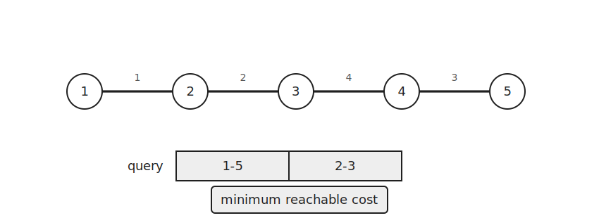
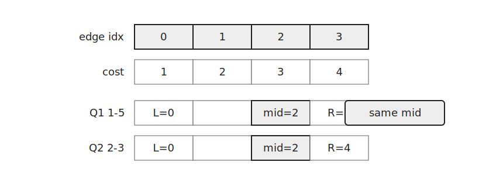
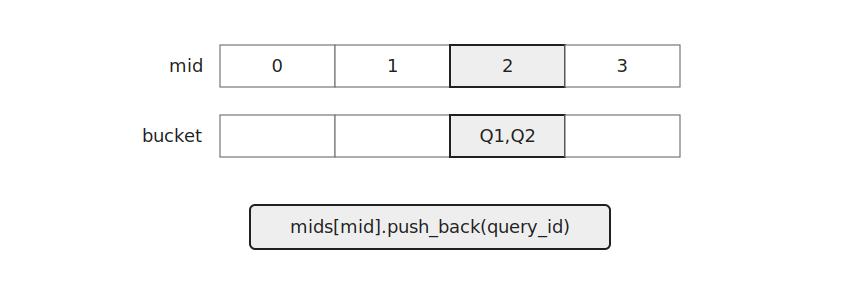
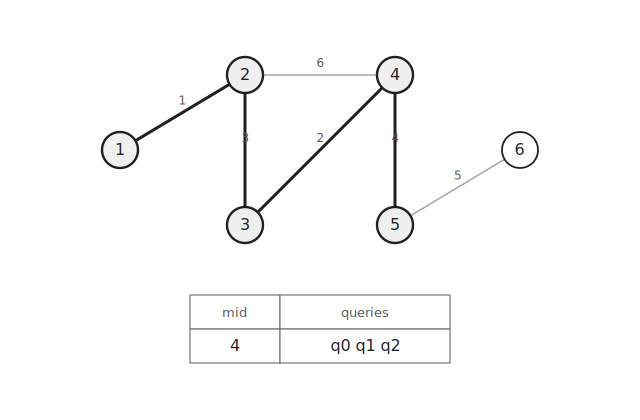
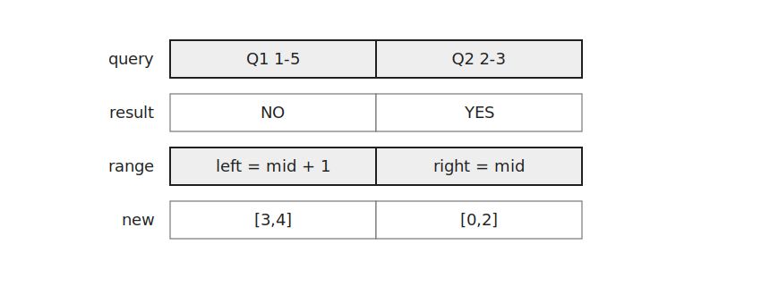
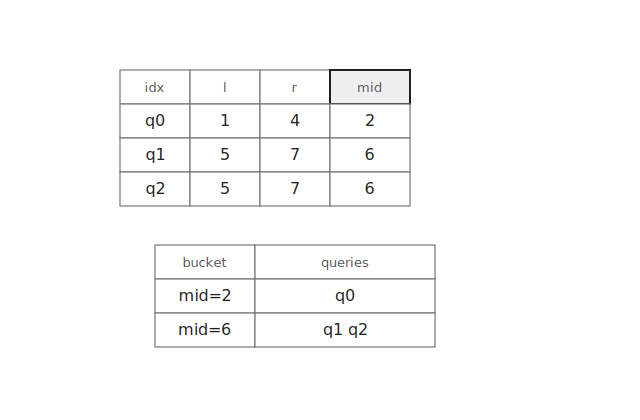

`PBS`는 여러 쿼리의 이분 탐색을 동시에 처리하는 기법이다.

각 쿼리를 따로 이분 탐색하면 같은 시점에 대한 검증을 여러 번 반복하게 된다.

`PBS`는 같은 `mid`를 가진 쿼리를 모아 한 번의 검증 과정에서 함께 처리한다.

이 글에서는 간선을 순서대로 추가할 때 두 정점이 처음 연결되는 시점을 찾는 문제를 기준으로 설명한다.

## 문제 형태

정점과 간선이 주어진다.

간선은 입력된 순서대로 하나씩 추가된다고 하자.



쿼리 `(a, b)`는 정점 `a`와 정점 `b`가 처음으로 연결되는 간선 번호를 묻는다.

끝까지 연결되지 않으면 `-1`을 출력한다.

## 이분 탐색 범위

쿼리의 답은 `1`번 간선부터 `m`번 간선까지 중 하나이다.

끝까지 연결되지 않는 경우를 나타내기 위해 오른쪽 끝을 `m+1`로 둔다.



```cpp
vector<int> l(q, 1), r(q, m+1);
```

## mid별로 쿼리 묶기

각 쿼리의 `mid`를 계산하고 같은 `mid`를 가진 쿼리들을 한곳에 모은다.



```cpp
vector<vector<int>> mid(m+2);
for(int i=0;i<q;i++) {
    if(l[i]<r[i]) {
        mid[l[i]+r[i]>>1].push_back(i);
    }
}
```

이렇게 하면 같은 시점에 검사해야 하는 쿼리들이 하나로 묶인다.

## DSU로 검증

한 라운드마다 DSU를 초기화한다.

그 뒤 간선을 `1`번부터 `m`번까지 차례대로 추가한다.

간선 `i`를 추가한 뒤 `mid[i]`에 들어 있는 쿼리들을 검사한다.



```cpp
for(int i=1;i<=m;i++) {
    merge(conn[i-1].first, conn[i-1].second);
    for(int idx:mid[i]) {
        if(find(query[idx].first)==find(query[idx].second)) r[idx]=i;
        else l[idx]=i+1;
    }
}
```

두 정점이 연결되어 있다면 더 이른 시점에도 가능한지 확인해야 하므로 `r[idx]=i`로 줄인다.

연결되어 있지 않다면 더 많은 간선이 필요하므로 `l[idx]=i+1`로 올린다.



## 다음 라운드

다음 라운드에서는 갱신된 범위로 다시 `mid`를 만든다.



쿼리마다 `mid`가 달라도 괜찮다.

간선을 한 번만 앞에서부터 훑으면서 해당 시점에 모인 쿼리만 검사하면 된다.

모든 쿼리에서 `l[i]==r[i]`가 되면 반복을 종료한다.

## 구현

PBS의 핵심 부분은 다음과 같다.

```cpp
vector<int> l(q, 1), r(q, m+1);
while(true) {
    vector<vector<int>> mid(m+2);
    bool chk=false;
    for(int i=0;i<q;i++) {
        if(l[i]<r[i]) {
            chk=true;
            mid[l[i]+r[i]>>1].push_back(i);
        }
    }
    if(!chk) break;

    for(int i=1;i<=n;i++) par[i]=i;
    for(int i=1;i<=m;i++) {
        merge(conn[i-1].first, conn[i-1].second);
        for(int idx:mid[i]) {
            if(find(query[idx].first)==find(query[idx].second)) r[idx]=i;
            else l[idx]=i+1;
        }
    }
}
```

각 이분 탐색마다 간선을 한 번씩 훑고 쿼리들을 한 번씩 검사한다.

이분 탐색은 $O(\log M)$번 반복된다.

따라서 전체 시간복잡도는 $O((M+Q)\log M \cdot \alpha(N))$이다.

## 연습 문제

[https://soj.services/problems/72](https://soj.services/problems/72)

<details>
<summary>코드 보기</summary>

```cpp
#include<bits/stdc++.h>
using namespace std;
typedef long long ll;

int par[200'001];

int find(int x) {
    if(x==par[x]) return x;
    return par[x]=find(par[x]);
}

void merge(int x, int y) {
    x=find(x);
    y=find(y);
    if(x<y) par[y]=x;
    else par[x]=y;
}

int main() {
    cin.tie(0)->sync_with_stdio(0);
    int n, m, q; cin >> n >> m >> q;
    vector<pair<int, int>> conn(m);
    for(auto &[u, v]:conn) cin >> u >> v;

    vector<pair<int, int>> query(q);
    for(auto &[a, b]:query) cin >> a >> b;
    vector<int> l(q, 1), r(q, m+1);
    while(true) {
        vector<vector<int>> mid(m+2);
        bool chk=false;
        for(int i=0;i<q;i++) {
            if(l[i]<r[i]) {
                chk=true;
                mid[l[i]+r[i]>>1].push_back(i);
            }
        }
        if(!chk) break;

        for(int i=1;i<=n;i++) par[i]=i;
        for(int i=1;i<=m;i++) {
            merge(conn[i-1].first, conn[i-1].second);
            for(int idx:mid[i]) {
                if(find(query[idx].first)==find(query[idx].second)) r[idx]=i;
                else l[idx]=i+1;
            }
        }
    }
    for(auto e:l) cout << (e==m+1 ? -1 : e) << '\n';
}
```

</details>
