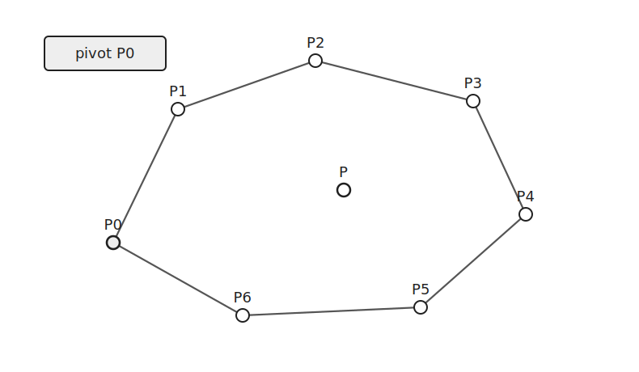
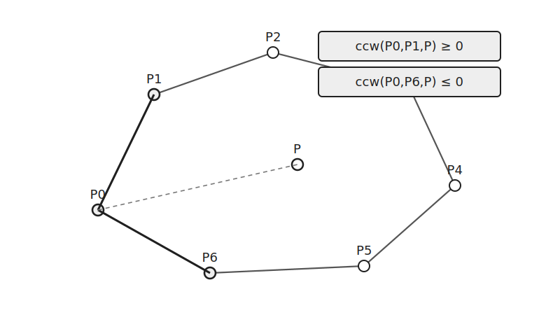
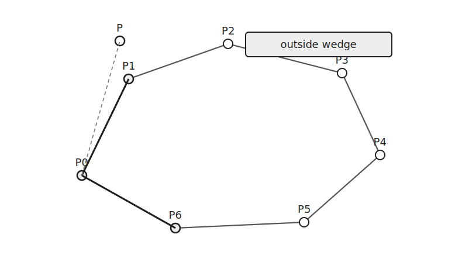
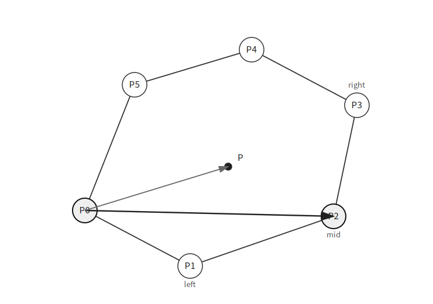
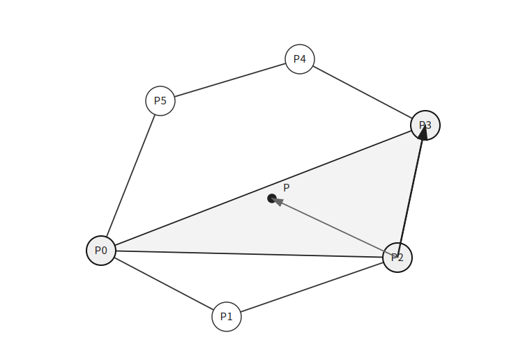

`Point in Convex Polygon`은 점이 볼록 다각형 내부에 있는지 판별하는 알고리즘이다.

볼록 다각형의 정점이 반시계 방향으로 주어져 있다고 하자.

이 글에서는 경계 위의 점은 내부로 보지 않는 기준으로 설명한다.

## 범위 확인

먼저 $\overrightarrow{P_0P}$가 가장 바깥 두 벡터 사이에 있는지 확인한다.



$\overrightarrow{P_0P_1}$을 기준으로 $P$가 오른쪽에 있거나 경계 위에 있으면 내부가 아니다.

```cpp
if(ccw(hull[0], hull[1], p)<=0) return false;
````

$\overrightarrow{P_0P_{n-1}}$을 기준으로 $P$가 왼쪽에 있거나 경계 위에 있어도 내부가 아니다.

```cpp
if(ccw(hull[0], hull[n-1], p)>=0) return false;
```

두 조건을 통과하면 $\overrightarrow{P_0P}$는 정점 벡터들의 각도 범위 안에 있다.

## 이분 탐색

이제 $\overrightarrow{P_0P}$가 들어갈 위치를 이분 탐색으로 찾는다.



처음에는 `left=1`, `right=n-1`로 둔다.

중간 정점 `mid`를 잡고 $\overrightarrow{P_0P_{\text{mid}}}$와 $\overrightarrow{P_0P}$의 방향을 비교한다.



```cpp
if(ccw(hull[0], hull[mid], p)>0) left=mid;
else right=mid;
```

`ccw(hull[0], hull[mid], p)>0`이면 $\overrightarrow{P_0P}$는 $\overrightarrow{P_0P_{\text{mid}}}$보다 반시계 방향 쪽에 있어서 `left`를 `mid`로 옮긴다.

그렇지 않으면 $\overrightarrow{P_0P}$는 $\overrightarrow{P_0P_{\text{mid}}}$보다 시계 방향 쪽에 있어서 `right`를 `mid`로 옮긴다.



이 과정을 반복하면 `left+1==right`가 된다.

이때 $\overrightarrow{P_0P}$는 $\overrightarrow{P_0P_{\text{left}}}$와 $\overrightarrow{P_0P_{\text{right}}}$ 사이에 있다.

따라서 점 $P$가 포함될 수 있는 삼각형은 $P_0$, $P_{\text{left}}$, $P_{\text{right}}$이다.

## 마지막 삼각형 확인

마지막으로 점 $P$가 삼각형 $P_0P_{\text{left}}P_{\text{right}}$ 안에 있는지 확인한다.



앞의 과정으로 $P_0$ 기준 방향은 이미 맞춰졌다.

남은 것은 변 $\overline{P_{\text{left}}P_{\text{right}}}$의 안쪽에 있는지 확인하는 것이다.

```cpp
return ccw(hull[left], hull[right], p)>0;
```

볼록 다각형의 정점은 반시계 방향으로 주어져 있다.

따라서 `ccw(hull[left], hull[right], p)>0`이면 $P$는 변 $\overline{P_{\text{left}}P_{\text{right}}}$의 왼쪽에 있고 삼각형 내부에 있다.

## 구현

볼록 다각형 내부 판별은 다음과 같이 구현할 수 있다.

```cpp
bool isInside(vector<point> &hull, point p) {
    if(ccw(hull[0], hull[1], p)<=0) return false;
    if(ccw(hull[0], hull[hull.size()-1], p)>=0) return false;
    int l=1, r=hull.size()-1;
    while(l+1<r) {
        int m = l+r>>1;
        if(ccw(hull[0], hull[m], p)>0) l=m;
        else r=m;
    }
    return ccw(hull[l], hull[r], p)>0;
}
```

처음 범위 확인은 $O(1)$이다.

이분 탐색은 정점 개수에 대해 $O(\log N)$번 수행된다.

각 단계에서 `CCW` 계산만 하므로 전체 시간복잡도는 $O(\log N)$이다.

공간복잡도는 $O(1)$이다.

## 연습 문제

[https://soj.services/problems/67](https://soj.services/problems/67)

<details>
<summary>코드 보기</summary>

```cpp
#include<bits/stdc++.h>
using namespace std;

typedef long long ll;

struct point {
    ll x, y;
};

ll ccw(point a, point b, point c) {
    point v1 = {b.x-a.x, b.y-a.y};
    point v2 = {c.x-a.x, c.y-a.y};
    return v1.x*v2.y-v2.x*v1.y;
}

bool isInside(vector<point> &hull, point p) {
    if(ccw(hull[0], hull[1], p)<=0) return false;
    if(ccw(hull[0], hull[hull.size()-1], p)>=0) return false;
    int l=1, r=hull.size()-1;
    while(l+1<r) {
        int m = l+r>>1;
        if(ccw(hull[0], hull[m], p)>0) l=m;
        else r=m;
    }
    return ccw(hull[l], hull[r], p)>0;
}

int main() {
    cin.tie(0)->sync_with_stdio(0);
    int n, q; cin >> n >> q;
    vector<point> v(n);
    for(int i=0;i<n;i++) cin >> v[i].x >> v[i].y;
    while(q--) {
        int x, y; cin >> x >> y;
        cout << (isInside(v, {x, y}) ? "Yes\n" : "No\n");
    }
}
```

</details>