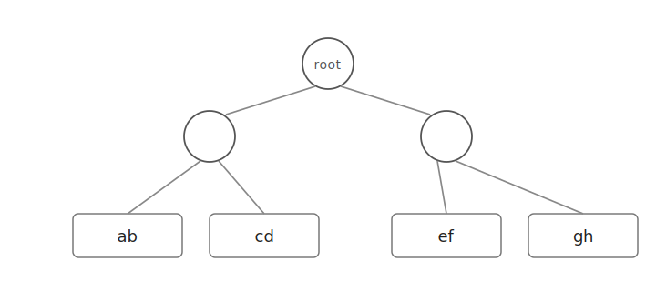
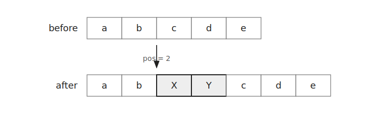
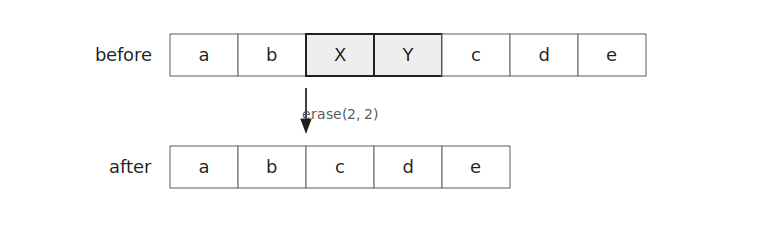
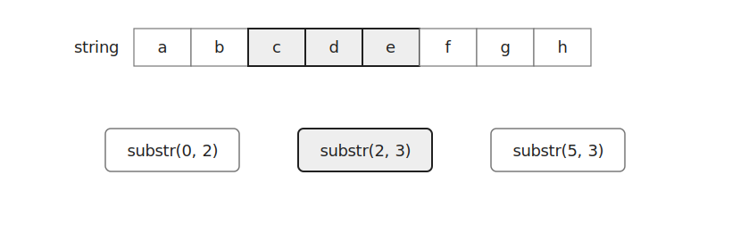
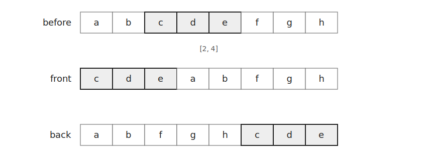

`Rope`는 긴 문자열을 여러 조각으로 나누어 저장하는 자료구조이다.

일반 `string`은 중간에 문자열을 삽입하거나 삭제하면 뒤쪽 문자를 많이 옮겨야 한다.

`Rope`는 문자열 조각을 트리 형태로 관리하므로 중간 삽입, 삭제, 부분 문자열 분리와 같은 연산을 빠르게 처리할 수 있다.

## 구조

`Rope`는 문자열 전체를 하나의 배열로 저장하지 않는다.

문자열을 여러 조각으로 나누고 조각들을 트리 형태로 연결한다.



따라서 문자열의 앞쪽이나 중간을 수정해도 전체 문자열을 매번 복사하지 않아도 된다.

GNU C++에서는 `<ext/rope>` 헤더의 `crope`를 사용할 수 있다.

```cpp
#include<ext/rope>
using namespace __gnu_cxx;
```

`crope`는 `char` 문자열을 저장하는 `Rope`이다.

처음 문자열을 넣을 때는 `string`을 입력받은 뒤 `c_str()`로 넘긴다.

```cpp
string s; cin >> s;
crope rp(s.c_str());
```

## 삽입

`insert(pos, str)`는 `pos` 위치 앞에 문자열 `str`을 삽입한다.



```cpp
rp.insert(pos, t.c_str());
```

## 삭제

`erase(pos, len)`은 `pos` 위치부터 길이 `len`만큼 문자열을 삭제한다.



```cpp
rp.erase(pos, len);
```

## 부분 문자열 출력

`substr(pos, len)`은 `pos` 위치부터 길이 `len`인 부분 문자열을 `Rope` 형태로 반환한다.



구간 `[l, r]`을 출력하려면 다음과 같이 작성한다.

```cpp
cout << rp.substr(pos, len);
```

`rp[i]`로 한 글자에 접근할 수도 있다.

```cpp
cout << rp[i];
```

인덱스는 `0`부터 시작한다.

## 구간 이동

`substr()`로 문자열을 세 부분으로 나누면 구간을 앞이나 뒤로 옮길 수 있다.



구간 `[l, r]`을 맨 앞으로 옮기려면 선택 구간을 맨 앞에 붙인다.

```cpp
rp = rp.substr(l-1, r-l+1) + rp.substr(0, l-1) + rp.substr(r, rp.size()-r);
```

구간 `[l, r]`을 맨 뒤로 옮기려면 선택 구간을 마지막에 붙인다.

```cpp
rp = rp.substr(0, l-1) + rp.substr(r, rp.size()-r) + rp.substr(l-1, r-l+1);
```

## 연습 문제

[https://soj.services/problems/60](https://soj.services/problems/60)

<details>
<summary>코드 보기</summary>

```cpp
#include<bits/stdc++.h>
#include<ext/rope>
using namespace std;
using namespace __gnu_cxx;

int main() {
    cin.tie(0)->sync_with_stdio(0);
    string s; cin >> s;
    crope rp(s.c_str());

    int q; cin >> q;
    while(q--) {
        int op, l, r, p; string t; cin >> op;
        if(op==1) {
            cin >> p >> t;
            rp.insert(p-1, t.c_str());
        } else if(op==2) {
            cin >> l >> r;
            rp.erase(l-1, r-l+1);
        } else if(op==3) {
            cin >> l >> r;
            cout << rp.substr(l-1, r-l+1) << '\n';
        } else if(op==4) {
            cin >> l >> r;
            rp = rp.substr(l-1, r-l+1)+rp.substr(0, l-1)+rp.substr(r, rp.size()-r);
        } else {
            cin >> l >> r;
            rp = rp.substr(0, l-1)+rp.substr(r, rp.size()-r+1)+rp.substr(l-1, r-l+1);
        }
    }
}
```

</details>