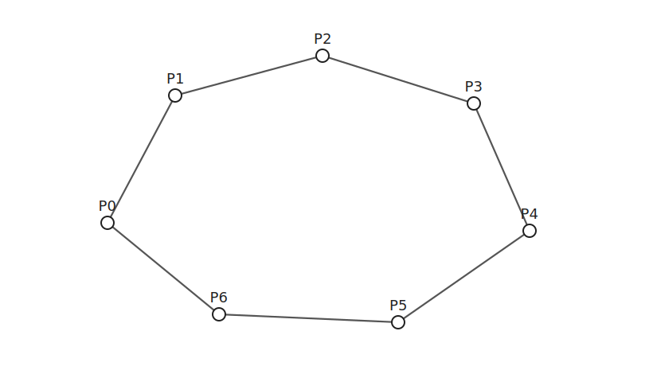
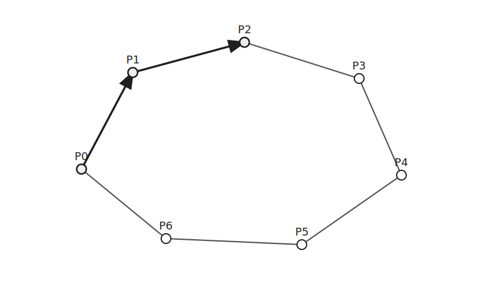
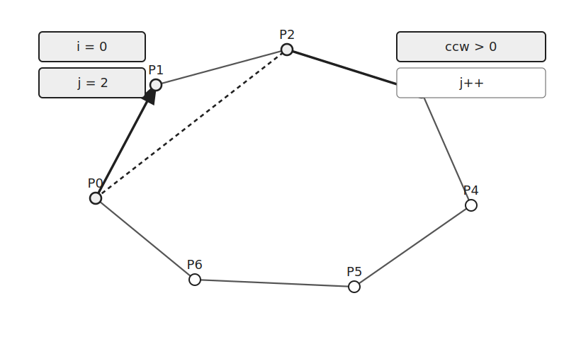
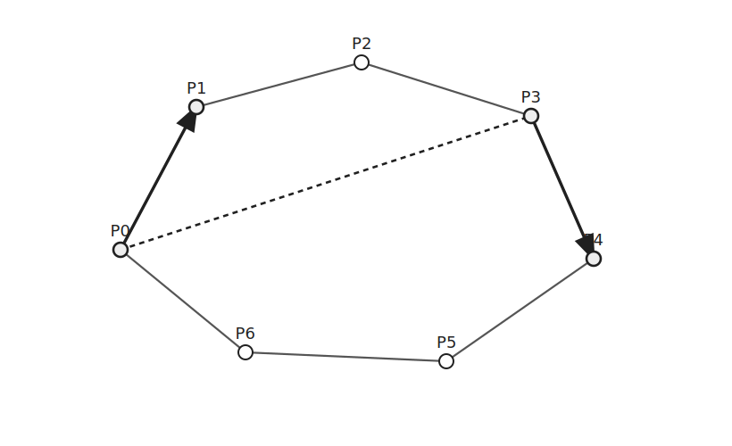
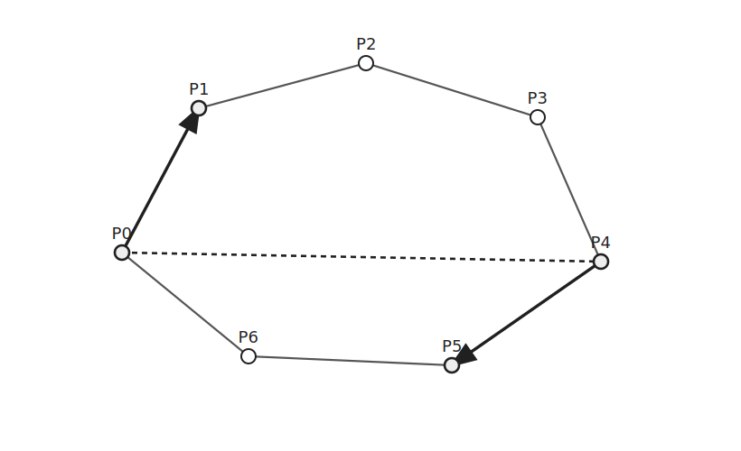
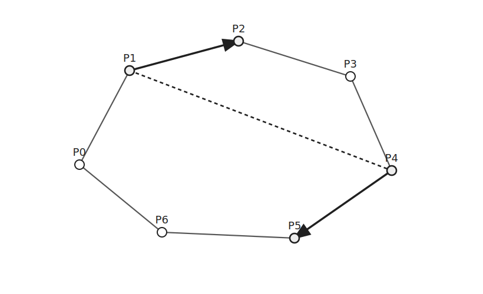
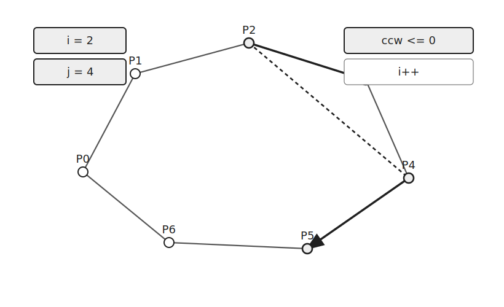
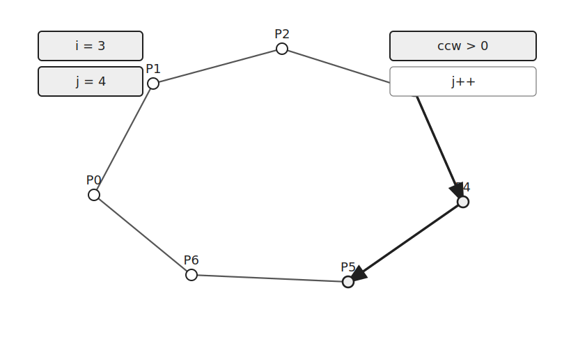

Rotating Calipers는 볼록 다각형에서 서로 가장 먼 두 점을 찾는 알고리즘이다.

먼저 Graham's Scan 등으로 볼록 껍질을 구한 뒤 사용한다.

볼록 껍질 위의 점들을 반시계 방향으로 보면서 두 포인터를 함께 움직인다.

## 구조

다음과 같은 볼록 껍질이 있다고 하자.



`i`는 현재 보는 변의 시작점이고 `j`는 반대쪽 점이다.

각 단계에서 `Pi`와 `Pj` 사이의 거리를 확인해 최댓값을 갱신한다.

```cpp
ret=max(ret, dist(v[i], v[j]));
```

## 이동 기준

현재 변 `Pi → P(i+1)`과 반대쪽 변 `Pj → P(j+1)`을 비교한다.

두 벡터의 외적이 양수이면 `j`를 증가시킨다.



```cpp
if(ccw(hull[i], hull[(i+1)%n], hull[j], hull[(j+1)%n])>0) j++;
```

같은 `i`에 대해 반대쪽 점을 더 회전시켰을 때 더 먼 점이 나올 수 있기 때문이다.

다음 상태에서도 같은 방식으로 거리를 갱신하고 `j`를 움직인다.





외적이 양수가 아니면 현재 `i`에 대한 반대쪽 점은 충분히 확인한 상태이다.

이제 `i`를 증가시켜 다음 변을 본다.



```cpp
else i++;
```

이후에도 같은 방식으로 두 포인터를 움직인다.







각 포인터는 한 방향으로만 움직인다.

따라서 모든 후보를 확인해도 전체 이동 횟수는 선형이다.

## 거리 계산

두 점 사이의 거리는 제곱 거리로 비교해도 된다.

제곱근은 단조 증가하므로 최댓값을 비교할 때는 제곱근을 계산하지 않아도 된다.

```cpp
ll dist(point a, point b) { return (b.x-a.x)*(b.x-a.x)+(b.y-a.y)*(b.y-a.y); }
```

마지막에 실제 거리가 필요하면 `sqrt()`를 적용한다.

## 구현

Rotating Calipers는 다음과 같이 구현할 수 있다.

```cpp
ll dist(point a, point b) { return (b.x-a.x)*(b.x-a.x)+(b.y-a.y)*(b.y-a.y); }
ll ccw(point a, point b, point c, point d) {
    point v1 = {b.x-a.x, b.y-a.y};
    point v2 = {d.x-c.x, d.y-c.y};
    return v1.x*v2.y-v2.x*v1.y;
}

ll rotating_calipers(vector<point> v) {
    int n=v.size();
    ll ret=0, i=0, j=1;
    while(i<n && j<n) {
        ret=max(ret, dist(v[i], v[j]));
        if(ccw(v[i], v[i+1], v[j], v[j+1])>0) j++;
        else i++;
    }
    return ret;
}
```

## 시간복잡도

Rotating Calipers에서는 `i`와 `j`가 각각 한 방향으로만 움직인다.

따라서 시간복잡도는 $O(N)$이다.

전체 점에서 볼록 껍질을 먼저 구한다면 Graham's Scan이 $O(N\log N)$이므로 전체 시간복잡도는 $O(N\log N)$이다.

## 연습 문제

[https://soj.services/problems/68](https://soj.services/problems/68)

<details>
<summary>코드 보기</summary>

```cpp
#include<bits/stdc++.h>
using namespace std;

typedef long long ll;

struct point {
    ll x, y, p=0, q=0;
    bool operator<(const point b) const {
        if(p*b.q!=b.p*q) return p*b.q>b.p*q;
        if(y!=b.y) return y<b.y;
        return x<b.x;
    }
};

ll ccw(point a, point b, point c) {
    point v1 = {b.x-a.x, b.y-a.y};
    point v2 = {c.x-a.x, c.y-a.y};
    return v1.x*v2.y-v2.x*v1.y;
}

ll ccw(point a, point b, point c, point d) {
    point v1 = {b.x-a.x, b.y-a.y};
    point v2 = {d.x-c.x, d.y-c.y};
    return v1.x*v2.y-v2.x*v1.y;
}

vector<point> graham_scan(vector<point> v) {
    sort(v.begin(), v.end());
    for(int i=1;i<v.size();i++) {
        v[i].p=v[i].x-v[0].x;
        v[i].q=v[i].y-v[0].y;
    }
    sort(v.begin(), v.end());
    vector<point> stk;
    for(auto e:v) {
        while(stk.size()>2 && ccw(stk[stk.size()-2], stk.back(), e)<=0) stk.pop_back();
        stk.push_back(e);
    }
    return stk;
}

ll dist(point a, point b) { return (b.x-a.x)*(b.x-a.x)+(b.y-a.y)*(b.y-a.y); }

ll rotating_calipers(vector<point> v) {
    int n=v.size();
    ll ret=0, i=0, j=1;
    while(i<n && j<n) {
        ret=max(ret, dist(v[i], v[j]));
        if(ccw(v[i], v[i+1], v[j], v[j+1])>0) j++;
        else i++;
    }
    return ret;
}

int main() {
    cin.tie(0)->sync_with_stdio(0);
    int n; cin >> n;
    vector<point> v(n);
    for(int i=0;i<n;i++) cin >> v[i].x >> v[i].y;
    cout << rotating_calipers(graham_scan(v));
}
```

</details>
