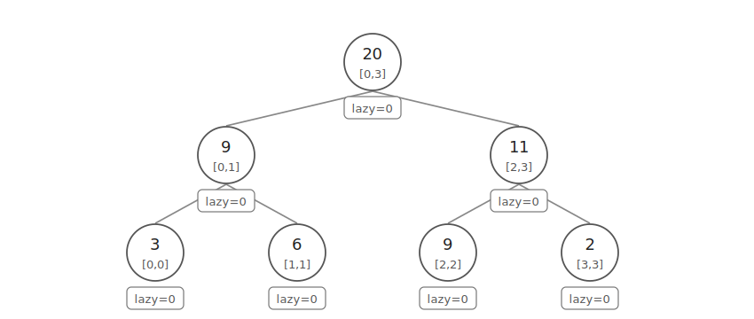
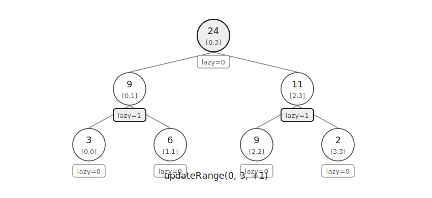
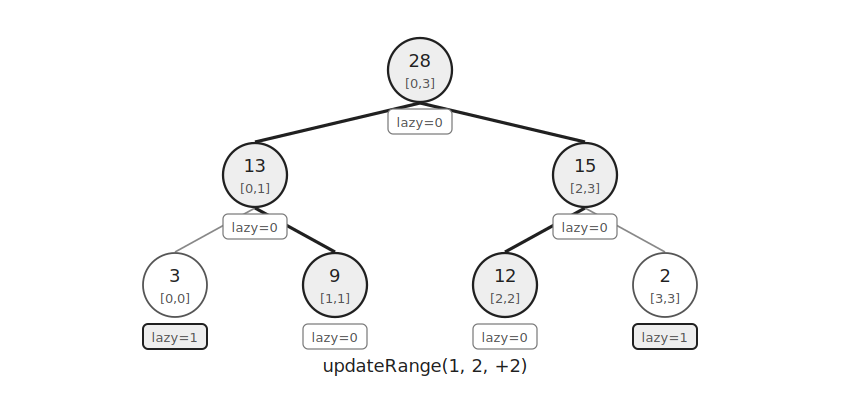
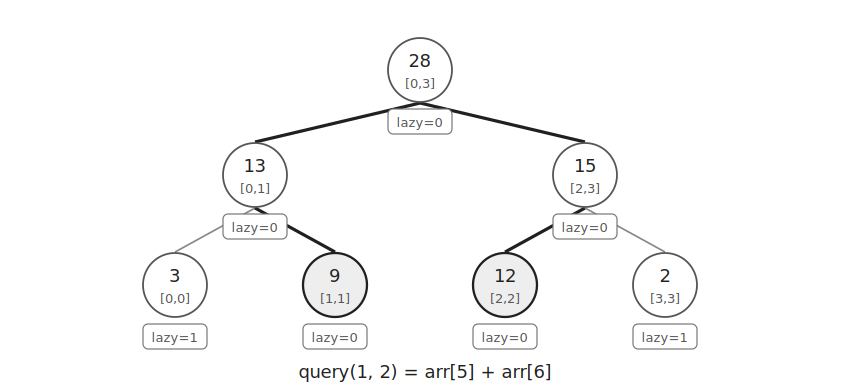

Lazy Propagation은 세그먼트 트리에서 구간 업데이트를 빠르게 처리하는 방법이다.

일반 세그먼트 트리는 한 점의 값 변경과 구간 쿼리를 빠르게 처리한다.

하지만 구간 전체에 값을 더할 때 모든 리프를 직접 바꾸면 구간 길이에 비례한 시간이 걸린다.

Lazy Propagation은 자식 노드의 갱신을 바로 처리하지 않고 나중에 필요한 순간까지 미룬다.

이 글에서는 구간 합과 구간 덧셈을 기준으로 설명한다.

## 구조

다음 배열을 저장하는 세그먼트 트리를 생각하자.

```text
3 6 9 2
```



`arr[nodeNum]`에는 현재 노드가 담당하는 구간의 합을 저장한다.

`lazy[nodeNum]`에는 아직 자식 노드로 내려보내지 않은 덧셈 값을 저장한다.

```cpp
ll arr[MAX*4], lazy[MAX*4];
```

## Lazy 적용

구간 `[0, 3]`에 `+1`을 더한다고 하자.

이 구간은 루트 노드가 담당하는 구간과 완전히 같다.

따라서 자식 노드까지 내려가지 않고 루트의 합만 먼저 바꿀 수 있다.



구간의 길이가 `4`이므로 루트의 합은 `1*4`만큼 증가한다.

자식 노드에는 나중에 `+1`을 적용해야 하므로 `lazy`에 값을 남긴다.

`nodeNum`가 구간 `[nodeL, nodeR]`을 담당한다면 구간 길이는 `nodeR-nodeL+1`이다.

따라서 합에는 `lazy[nodeNum] * (nodeR-nodeL+1)`를 더한다.

리프가 아니라면 현재 노드의 `lazy` 값을 두 자식의 `lazy`에 넘긴다.

```cpp
void updateLazy(int nodeNum, int nodeL, int nodeR) {
    if(lazy[nodeNum]) {
        arr[nodeNum]+=lazy[nodeNum]*(nodeR-nodeL+1);
        if(nodeNum<SZ) {
            lazy[nodeNum*2]+=lazy[nodeNum];
            lazy[nodeNum*2+1]+=lazy[nodeNum];
        }
        lazy[nodeNum]=0;
    }
}
```

업데이트와 쿼리 모두 노드를 방문하면 먼저 `updateLazy()`를 호출한다.

## 부분 구간 업데이트

이번에는 구간 `[1, 2]`에 `+2`를 더한다고 하자.

현재 노드의 구간이 업데이트 구간과 겹치지 않으면 무시한다.

현재 노드의 구간이 업데이트 구간에 완전히 포함되면 현재 노드에 값을 반영하고 자식 갱신을 미룬다.

일부만 겹치면 두 자식으로 내려간다.



자식 갱신이 끝난 뒤에는 두 자식의 합으로 부모 값을 다시 계산한다.

```cpp
arr[nodeNum]=arr[nodeNum*2]+arr[nodeNum*2+1];
```

구간 업데이트 함수는 다음과 같다.

```cpp
void updateRange(int L, int R, ll val, int nodeNum=1, int nodeL=0, int nodeR=SZ-1) {
    updateLazy(nodeNum, nodeL, nodeR);
    if(R<nodeL || nodeR<L) return;
    if(L<=nodeL && nodeR<=R) {
        lazy[nodeNum]+=val;
        updateLazy(nodeNum, nodeL, nodeR);
        return;
    }
    int mid=nodeL+nodeR>>1;
    updateRange(L, R, val, nodeNum*2, nodeL, mid);
    updateRange(L, R, val, nodeNum*2+1, mid+1, nodeR);
    arr[nodeNum]=arr[nodeNum*2]+arr[nodeNum*2+1];
}
```

## 구간 쿼리

구간 합을 구할 때도 방문한 노드의 `lazy`를 먼저 처리한다.



현재 노드의 구간이 쿼리 구간과 겹치지 않으면 `0`을 반환한다.

현재 노드의 구간이 쿼리 구간에 완전히 포함되면 `arr[node]`를 반환한다.

일부만 겹치면 두 자식의 결과를 더한다.

```cpp
ll query(int L, int R, int nodeNum=1, int nodeL=0, int nodeR=SZ-1) {
    updateLazy(nodeNum, nodeL, nodeR);
    if(R<nodeL || nodeR<L) return 0;
    if(L<=nodeL && nodeR<=R) return arr[nodeNum];
    int mid=nodeL+nodeR>>1;
    return query(L, R, nodeNum*2, nodeL, mid)+query(L, R, nodeNum*2+1, mid+1, nodeR);
}
```

## 구현

구간 합과 구간 덧셈을 처리하는 Lazy Segment Tree는 다음과 같이 구현할 수 있다.

```cpp
ll SZ=1, arr[MAX*4], lazy[MAX*4];

void build(int n) {
    while(SZ<n) SZ<<=1;
}

void updateLazy(int nodeNum, int nodeL, int nodeR) {
    if(lazy[nodeNum]) {
        arr[nodeNum]+=lazy[nodeNum]*(nodeR-nodeL+1);
        if(nodeNum<SZ) {
            lazy[nodeNum*2]+=lazy[nodeNum];
            lazy[nodeNum*2+1]+=lazy[nodeNum];
        }
        lazy[nodeNum]=0;
    }
}

void updateRange(int L, int R, ll val, int nodeNum=1, int nodeL=0, int nodeR=SZ-1) {
    updateLazy(nodeNum, nodeL, nodeR);
    if(R<nodeL || nodeR<L) return;
    if(L<=nodeL && nodeR<=R) {
        lazy[nodeNum]+=val;
        updateLazy(nodeNum, nodeL, nodeR);
        return;
    }
    int mid=nodeL+nodeR>>1;
    updateRange(L, R, val, nodeNum*2, nodeL, mid);
    updateRange(L, R, val, nodeNum*2+1, mid+1, nodeR);
    arr[nodeNum]=arr[nodeNum*2]+arr[nodeNum*2+1];
}

ll query(int L, int R, int nodeNum=1, int nodeL=0, int nodeR=SZ-1) {
    updateLazy(nodeNum, nodeL, nodeR);
    if(R<nodeL || nodeR<L) return 0;
    if(L<=nodeL && nodeR<=R) return arr[nodeNum];
    int mid=nodeL+nodeR>>1;
    return query(L, R, nodeNum*2, nodeL, mid)+query(L, R, nodeNum*2+1, mid+1, nodeR);
}
```

Lazy Propagation을 사용하면 구간 업데이트에서도 필요한 노드만 방문한다.

세그먼트 트리의 높이가 $\log N$이므로 구간 업데이트와 구간 쿼리는 각각 $O(\log N)$이다.

초기화는 $O(N)$이고 공간복잡도는 $O(N)$이다.

## 연습 문제

https://soj.services/problems/62

<details>
<summary>코드 보기</summary>

```cpp
#include<bits/stdc++.h>
using namespace std;

typedef long long ll;
const int MAX=200'001*4;

ll SZ=1, a[MAX], lazy[MAX];

void updateLazy(int nodeNum) {
    if(lazy[nodeNum]) {
        a[nodeNum]+=lazy[nodeNum];
        if(nodeNum<SZ) {
            lazy[nodeNum*2]+=lazy[nodeNum];
            lazy[nodeNum*2+1]+=lazy[nodeNum];
        }
        lazy[nodeNum]=0;
    }
}

void updateRange(int L, int R, ll val, int nodeNum=1, int nodeL=0, int nodeR=SZ-1) {
    updateLazy(nodeNum);
    if(R<nodeL || nodeR<L) return;
    if(L<=nodeL && nodeR<=R) {
        lazy[nodeNum]+=val;
        updateLazy(nodeNum);
        return;
    }
    int mid=nodeL+nodeR>>1;
    updateRange(L, R, val, nodeNum*2, nodeL, mid);
    updateRange(L, R, val, nodeNum*2+1, mid+1, nodeR);
    a[nodeNum]=max(a[nodeNum*2], a[nodeNum*2+1]);
}

ll maxRange(int L, int R, int nodeNum=1, int nodeL=0, int nodeR=SZ-1) {
    updateLazy(nodeNum);
    if(R<nodeL || nodeR<L) return LONG_LONG_MIN;
    if(L<=nodeL && nodeR<=R) return a[nodeNum];
    int mid=nodeL+nodeR>>1;
    return max(maxRange(L, R, nodeNum*2, nodeL, mid), maxRange(L, R, nodeNum*2+1, mid+1, nodeR));
}

int main() {
    cin.tie(0)->sync_with_stdio(0);
    int n, q; cin >> n >> q;
    while(SZ<n) SZ<<=1;
    for(int i=0;i<n;i++) cin >> a[i+SZ];
    for(int i=SZ-1;i>0;i--) a[i]=max(a[i*2], a[i*2+1]);
    while(q--) {
        int op, l, r, x; cin >> op >> l >> r;
        if(op==1) {
            cin >> x;
            updateRange(l-1, r-1, x);
        } else {
            cout << maxRange(l-1, r-1) << '\n';
        }
    }
}
```

</details>
