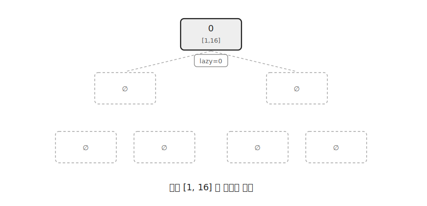
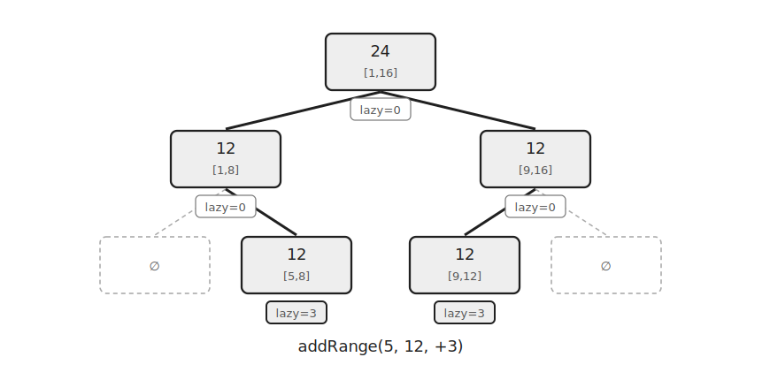
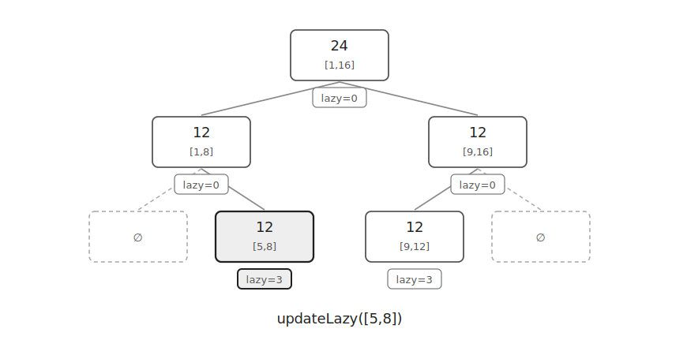
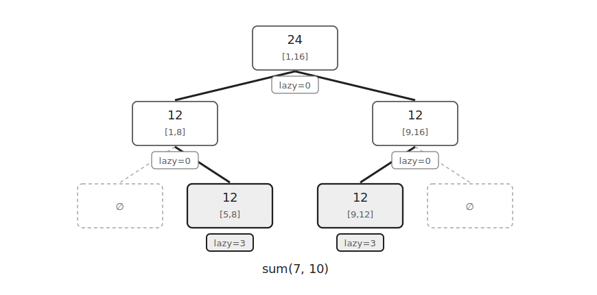

`Sparse Segment Tree`는 `Dynamic Segment Tree`에 `Lazy Propagation`을 적용한 자료구조이다.

좌표 범위가 매우 크지만 실제로 사용하는 구간이 적을 때 사용할 수 있다.

필요한 노드만 만들고 구간 업데이트는 `lazy` 값으로 미룬다.

이 글에서는 구간 덧셈과 구간 최댓값을 기준으로 설명한다.

## 구조

처음에는 루트 노드 하나만 존재한다.



각 노드는 왼쪽 자식 번호, 오른쪽 자식 번호, 구간 최댓값, `lazy` 값을 저장한다.

```cpp
struct Node {
    int l=-1, r=-1;
    ll val=0, lazy=0;
};
```

`l`, `r`이 `-1`이면 아직 만들어지지 않은 자식이다.

노드는 `vector<Node>`에 저장한다.

```cpp
vector<Node> arr=vector<Node>(1);
```

루트 노드는 `0`번이다.

## 노드 생성

자식 노드가 필요할 때만 만든다.

```cpp
int newNode() {
    arr.push_back({});
    return arr.size()-1;
}

int lc(int p) {
    if(arr[p].l==-1) arr[p].l=newNode();
    return arr[p].l;
}

int rc(int p) {
    if(arr[p].r==-1) arr[p].r=newNode();
    return arr[p].r;
}
```

왼쪽 자식이 필요하면 `lc(p)`를 호출하고 오른쪽 자식이 필요하면 `rc(p)`를 호출한다.

이미 자식이 존재하면 기존 번호를 그대로 반환한다.

## 구간 업데이트

구간 `[5, 12]`에 `+3`을 더한다고 하자.

전체 범위가 `[0, 15]`이어도 실제로 방문한 노드만 만들어진다.



현재 노드의 구간이 업데이트 구간에 완전히 포함되면 `apply()`만 수행하고 더 내려가지 않는다.

```cpp
void apply(int p, ll x) {
    arr[p].val+=x;
    arr[p].lazy+=x;
}
```

`val`은 구간 최댓값이므로 구간 전체에 `x`를 더하면 최댓값도 `x`만큼 증가한다.

`lazy`에는 아직 자식에게 넘기지 않은 덧셈 값을 저장한다.

```cpp
if(L<=nodeL && nodeR<=R) return apply(nodeNum, val);
```

구간이 일부만 겹치면 필요한 자식을 만들고 내려간다.

```cpp
addRange(L, R, val, lc(nodeNum), nodeL, mid);
addRange(L, R, val, rc(nodeNum), mid+1, nodeR);
```

업데이트가 끝나면 두 자식의 최댓값으로 현재 노드 값을 다시 계산한다.

```cpp
ll v1 = arr[nodeNum].l!=-1 ? arr[arr[nodeNum].l].val : 0;
ll v2 = arr[nodeNum].r!=-1 ? arr[arr[nodeNum].r].val : 0;
arr[nodeNum].val=max(v1, v2);
```

## Lazy 전파

일부 구간만 다시 내려가야 한다면 현재 노드의 `lazy`를 자식에게 넘겨야 한다.



```cpp
void updateLazy(int nodeNum, int nodeL, int nodeR) {
    if(arr[nodeNum].lazy && nodeL!=nodeR) {
        apply(lc(nodeNum), arr[nodeNum].lazy);
        apply(rc(nodeNum), arr[nodeNum].lazy);
        arr[nodeNum].lazy=0;
    }
}
```

`apply()`는 자식의 `val`과 `lazy`를 동시에 증가시킨다.

따라서 자식 구간 전체에 같은 값이 더해졌다는 정보를 유지할 수 있다.

`Sparse Segment Tree`에서는 `lazy`를 전파할 때도 자식이 없으면 새로 만든다.

## 구간 최댓값

구간 최댓값을 구할 때는 `maxRange()`를 사용한다.



없는 노드는 아직 직접 만들어지지 않은 구간이다.

이때 조상에서 내려온 `lazy` 값 `z`가 그 구간의 값이 된다.

```cpp
if(nodeNum==-1) return z;
```

현재 노드의 구간이 쿼리 구간에 완전히 포함되면 현재 노드의 값에 조상에서 내려온 `z`를 더해 반환한다.

```cpp
if(L<=nodeL && nodeR<=R) return arr[nodeNum].val+z;
```

일부만 겹치면 현재 노드의 `lazy`를 `z`에 더한 뒤 양쪽 자식으로 내려간다.

```cpp
z+=arr[nodeNum].lazy;
return max(maxRange(L, R, arr[nodeNum].l, nodeL, mid, z), maxRange(L, R, arr[nodeNum].r, mid+1, nodeR, z));
```

이 구현은 `maxRange()`에서 실제로 `lazy`를 전파하지 않고 `z`로 누적해서 내려간다.

## 구현

구간 덧셈과 구간 최댓값을 처리하는 `Sparse Segment Tree`는 다음과 같이 구현할 수 있다.

```cpp
struct Node {
    int l=-1, r=-1;
    ll val=0, lazy=0;
};

vector<Node> arr=vector<Node>(1);

int newNode() {
    arr.push_back({});
    return arr.size()-1;
}

int lc(int p) {
    if(arr[p].l==-1) arr[p].l=newNode();
    return arr[p].l;
}

int rc(int p) {
    if(arr[p].r==-1) arr[p].r=newNode();
    return arr[p].r;
}

void apply(int p, ll x) {
    arr[p].val+=x;
    arr[p].lazy+=x;
}

void updateLazy(int nodeNum, int nodeL, int nodeR) {
    if(arr[nodeNum].lazy && nodeL!=nodeR) {
        apply(lc(nodeNum), arr[nodeNum].lazy);
        apply(rc(nodeNum), arr[nodeNum].lazy);
        arr[nodeNum].lazy=0;
    }
}

void addRange(int L, int R, ll val, int nodeNum=0, int nodeL=MIN, int nodeR=MAX) {
    if(R<nodeL || nodeR<L) return;
    if(L<=nodeL && nodeR<=R) return apply(nodeNum, val);
    updateLazy(nodeNum, nodeL, nodeR);
    int mid=nodeL+nodeR>>1;
    addRange(L, R, val, lc(nodeNum), nodeL, mid);
    addRange(L, R, val, rc(nodeNum), mid+1, nodeR);
    ll v1=arr[nodeNum].l!=-1 ? arr[arr[nodeNum].l].val : 0;
    ll v2=arr[nodeNum].r!=-1 ? arr[arr[nodeNum].r].val : 0;
    arr[nodeNum].val=max(v1, v2);
}

ll maxRange(int L, int R, int nodeNum=0, int nodeL=MIN, int nodeR=MAX, ll z=0) {
    if(R<nodeL || nodeR<L) return 0;
    if(nodeNum==-1) return z;
    if(L<=nodeL && nodeR<=R) return arr[nodeNum].val+z;
    int mid=nodeL+nodeR>>1;
    z+=arr[nodeNum].lazy;
    return max(maxRange(L, R, arr[nodeNum].l, nodeL, mid, z), maxRange(L, R, arr[nodeNum].r, mid+1, nodeR, z));
}
```

전체 좌표 범위의 크기를 `N`이라고 하자.

구간 덧셈과 구간 최댓값 쿼리는 트리 높이에 비례하므로 각각 $O(\log N)$이다.

다만 방문한 구간에 대해서만 노드를 만들기 때문에 메모리는 생성된 노드 수에 비례한다.

업데이트가 `Q`번이라면 생성되는 노드 수는 최대 $O(Q\log N)$이다.

## 연습 문제

[https://soj.services/problems/64](https://soj.services/problems/64)

<details>
<summary>코드 보기</summary>

```cpp
#include<bits/stdc++.h>
using namespace std;

typedef long long ll;
const ll MIN=0, MAX=(1<<30)-1;

struct Node {
    int l=-1, r=-1;
    ll val=0, lazy=0;
};

vector<Node> arr = vector<Node>(1);

int newNode() {
    arr.push_back({});
    return arr.size()-1;
}

int lc(int p) {
    if(arr[p].l==-1) arr[p].l=newNode();
    return arr[p].l;
}

int rc(int p) {
    if(arr[p].r==-1) arr[p].r=newNode();
    return arr[p].r;
}

void apply(int p, ll x) {
    arr[p].val+=x;
    arr[p].lazy+=x;
}

void updateLazy(int nodeNum, int nodeL, int nodeR) {
    if(arr[nodeNum].lazy && nodeL!=nodeR) {
        apply(lc(nodeNum), arr[nodeNum].lazy);
        apply(rc(nodeNum), arr[nodeNum].lazy);
        arr[nodeNum].lazy=0;
    }
}

void addRange(int L, int R, ll val, int nodeNum=0, int nodeL=MIN, int nodeR=MAX) {
    if(R<nodeL || nodeR<L) return;
    if(L<=nodeL && nodeR<=R) return apply(nodeNum, val);
    updateLazy(nodeNum, nodeL, nodeR);
    int mid=nodeL+nodeR>>1;
    addRange(L, R, val, lc(nodeNum), nodeL, mid);
    addRange(L, R, val, rc(nodeNum), mid+1, nodeR);
    ll v1 = arr[nodeNum].l!=-1 ? arr[arr[nodeNum].l].val : 0;
    ll v2 = arr[nodeNum].r!=-1 ? arr[arr[nodeNum].r].val : 0;
    arr[nodeNum].val=max(v1, v2);
}

ll maxRange(int L, int R, int nodeNum=0, int nodeL=MIN, int nodeR=MAX, ll z=0) {
    if(R<nodeL || nodeR<L) return 0;
    if(nodeNum==-1) return z;
    if(L<=nodeL && nodeR<=R) return arr[nodeNum].val+z;
    int mid = nodeL+nodeR>>1;
    z+=arr[nodeNum].lazy;
    return max(maxRange(L, R, arr[nodeNum].l, nodeL, mid, z), maxRange(L, R, arr[nodeNum].r, mid+1, nodeR, z));
}

int main() {
    cin.tie(0)->sync_with_stdio(0);
    int q; cin >> q;
    int ans=0;
    while(q--) {
        int op, a, b, x; cin >> op >> a >> b;
        int l=a^ans, r=b^ans;
        if(l>r) swap(l, r);
        if(op==1) {
            cin >> x;
            addRange(l, r, x);
        } else {
            ans = maxRange(l, r);
            cout << ans << '\n';
        }
    }
}
```

</details>