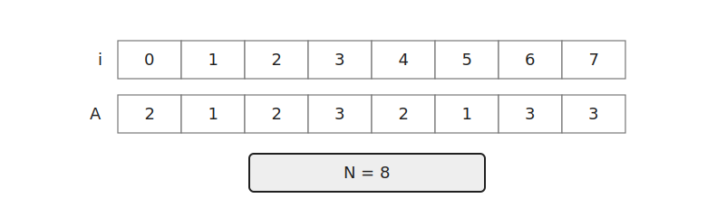
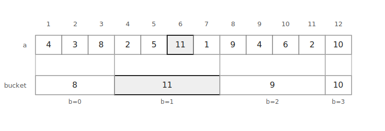
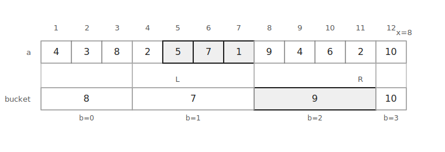
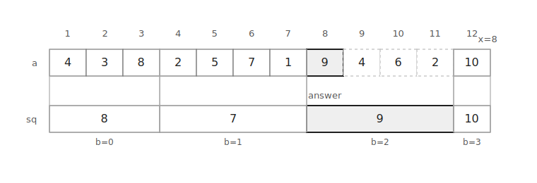
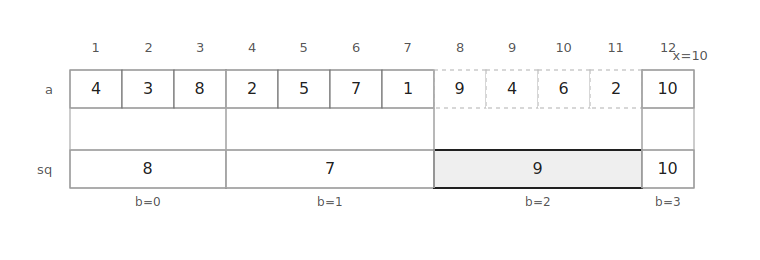

`Square Root Decomposition`은 배열을 일정한 크기의 블록으로 나누어 쿼리를 빠르게 처리하는 기법이다.

구간 전체를 매번 확인하지 않고 완전히 포함되는 블록은 미리 계산한 값을 사용한다.

이 글에서는 점 업데이트와 구간에서 $x$ 이상인 첫 번째 위치를 찾는 쿼리를 기준으로 설명한다.

## 문제 형태

배열 $a$가 있고 두 종류의 쿼리가 주어진다고 하자.

```text
1 i x      a_i를 x로 변경
2 l r x    [l, r]에서 a_i >= x인 가장 작은 i 출력
```

조건을 만족하는 위치가 없다면 $-1$을 출력한다.

배열을 그대로 훑으면 쿼리 하나에 $O(N)$이 걸린다.

`Square Root Decomposition`을 사용하면 각 블록의 최댓값을 이용해 필요 없는 구간을 건너뛸 수 있다.

## 블록 관리

배열을 크기가 $\sqrt N$ 정도인 블록으로 나눈다.

예제 코드에서는 `sz=450`을 사용한다.

각 블록에는 그 블록에 들어 있는 값의 최댓값을 저장한다.

```cpp
int a[222'222], sz=450, bucket[450];
```



`bucket[b]`는 `b`번 블록의 최댓값이다.

따라서 어떤 블록의 `bucket[b]`가 $x$보다 작다면 그 블록 안에는 $x$ 이상인 값이 없다.

이 블록은 통째로 건너뛸 수 있다.

## 점 업데이트

`a_i`를 $x$로 바꾸면 `i`가 속한 블록의 최댓값을 다시 계산한다.



```cpp
void update(int i, int x) {
    a[i]=x;
    i=i/sz*sz;
    bucket[i/sz]=INT_MIN;
    for(int j=i;j<i+sz;j++) bucket[i/sz]=max(bucket[i/sz], a[j]);
}
```

한 블록만 다시 보면 되므로 업데이트 시간복잡도는 $O(\text{sz})$이다.

`sz`를 $\sqrt N$ 정도로 잡으면 $O(\sqrt N)$이다.

## 구간 쿼리

쿼리 $[l,r]$에서 $a_i \ge x$인 가장 작은 인덱스 $i$를 찾는다고 하자.

먼저 왼쪽 끝이 블록 경계에 닿을 때까지 직접 확인한다.



```cpp
while(l%sz && l<=r) {
    if(a[l]>=x) return l;
    l++;
}
```

이후 완전히 포함되는 블록을 확인한다.

블록의 최댓값이 $x$보다 작으면 그 블록은 통째로 건너뛴다.

```cpp
while(l+sz<=r) {
    if(bucket[l/sz]>=x) {
        for(int i=l;i<l+sz;i++) {
            if(a[i]>=x) return i;
        }
    }
    l+=sz;
}
```



`bucket[l/sz] >= x`라면 그 블록 안에 답이 있을 수 있다.

이 경우에만 블록 내부를 직접 훑고 처음으로 $a_i \ge x$를 만족하는 위치를 반환한다.



마지막으로 오른쪽 끝에 남은 낱개 원소를 확인한다.

```cpp
while(l<=r) {
    if(a[l]>=x) return l;
    l++;
}
```

끝까지 찾지 못하면 $-1$을 반환한다.

## 구현

`Square Root Decomposition`은 다음과 같이 구현할 수 있다.

```cpp
int a[222'222], sz=450, bucket[450];

void update(int i, int x) {
    a[i]=x;
    i=i/sz*sz;
    bucket[i/sz]=INT_MIN;
    for(int j=i;j<i+sz;j++) bucket[i/sz]=max(bucket[i/sz], a[j]);
}

int query(int l, int r, int x) {
    while(l%sz && l<=r) {
        if(a[l]>=x) return l;
        l++;
    }
    while(l+sz<=r) {
        if(bucket[l/sz]>=x) {
            for(int i=l;i<l+sz;i++) {
                if(a[i]>=x) return i;
            }
        }
        l+=sz;
    }
    while(l<=r) {
        if(a[l]>=x) return l;
        l++;
    }
    return -1;
}
```

업데이트는 한 블록만 다시 계산하므로 $O(\text{sz})$이고 $\text{sz} \approx \sqrt N$으로 잡으면 $O(\sqrt N)$이다.

쿼리는 양끝 낱개 원소와 가운데 블록을 각각 최대 $O(\sqrt N)$개 확인한다.

답이 있을 수 있는 블록은 내부를 한 번만 훑으므로 쿼리 시간복잡도는 $O(\sqrt N)$이다.

공간복잡도는 $O(N)$이다.

## 연습 문제

[https://soj.services/problems/70](https://soj.services/problems/70)

<details>
<summary>코드 보기</summary>

```cpp
#include<bits/stdc++.h>
using namespace std;

int a[222'222], sz=450, sq[450];

void update(int i, int x) {
    a[i]=x;
    i=i/sz*sz;
    sq[i/sz]=INT_MIN;
    for(int j=i;j<i+sz;j++) {
        sq[i/sz]=max(sq[i/sz], a[j]);
    }
}

int query(int l, int r, int x) {
    while(l%sz && l<=r) {
        if(a[l]>=x) return l;
        l++;
    }
    while(l+sz<=r) {
        if(sq[l/sz]>=x) {
            for(int i=l;i<l+sz;i++) {
                if(a[i]>=x) return i;
            }
        }
        l+=sz;
    }
    while(l<=r) {
        if(a[l]>=x) return l;
        l++;
    }
    return -1;
}

int main() {
    cin.tie(0)->sync_with_stdio(0);
    int n, q; cin >> n >> q;
    fill(sq, sq+sz, INT_MIN);
    for(int i=1;i<=n;i++) {
        cin >> a[i];
        sq[i/sz]=max(sq[i/sz], a[i]);
    }
    while(q--) {
        int op; cin >> op;
        if(op==1) {
            int i, x; cin >> i >> x;
            update(i, x);
        } else {
            int l, r, x; cin >> l >> r >> x;
            cout << query(l, r, x) << '\n';
        }
    }
}
```

</details>