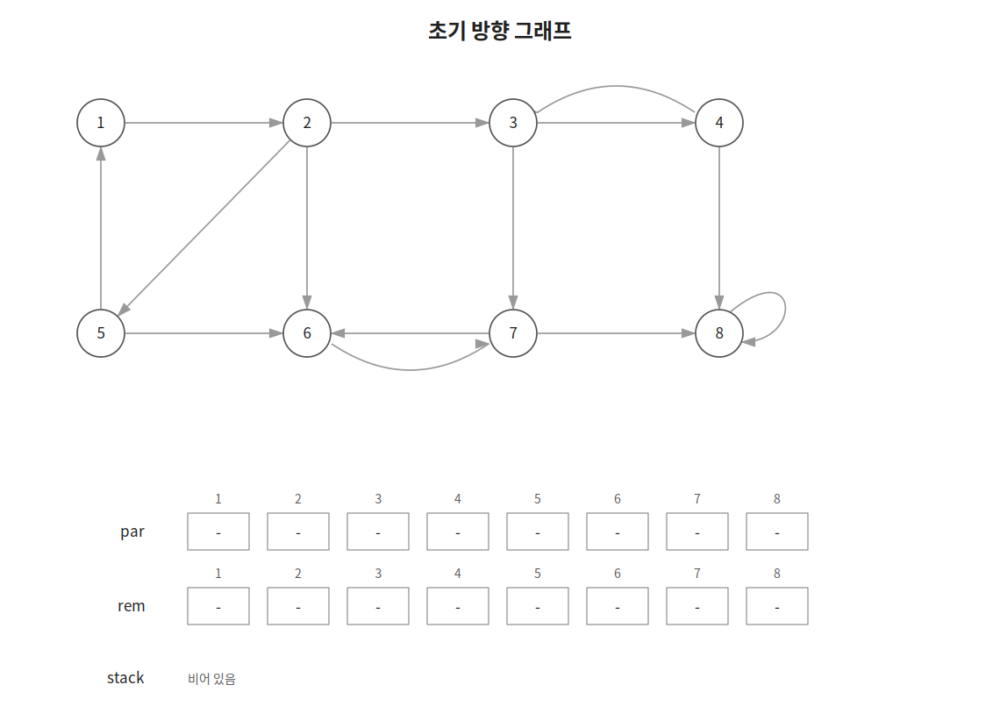
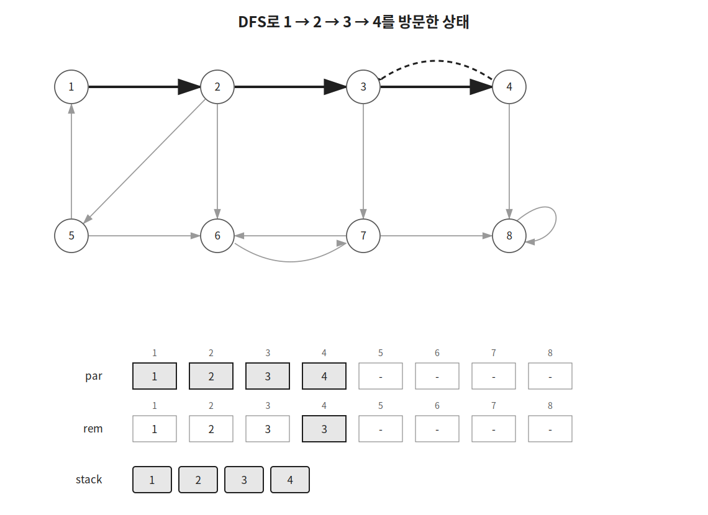
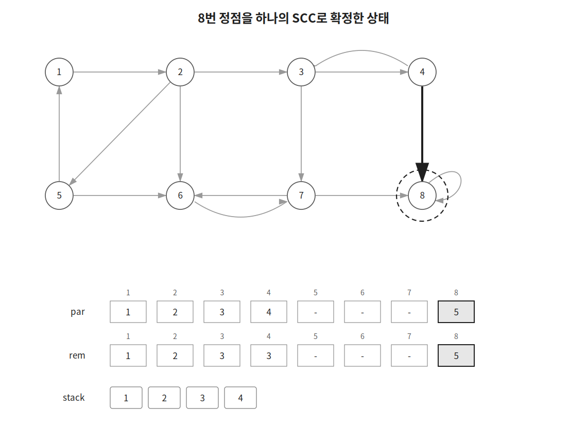
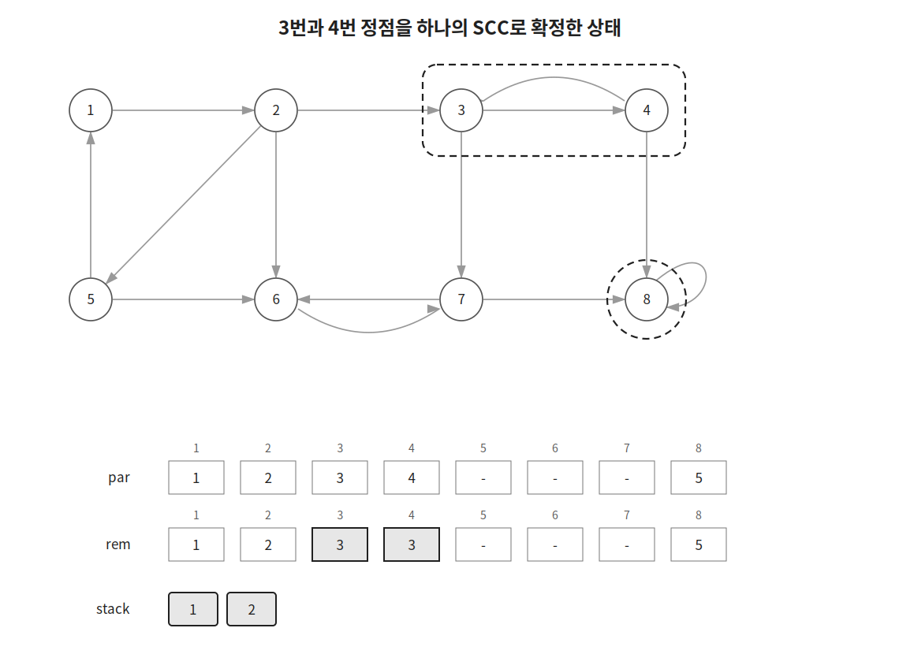
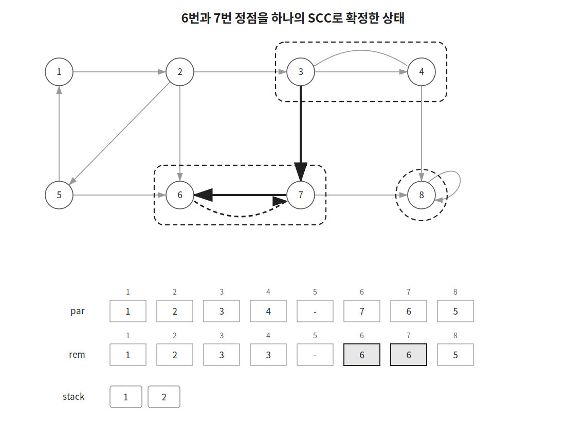
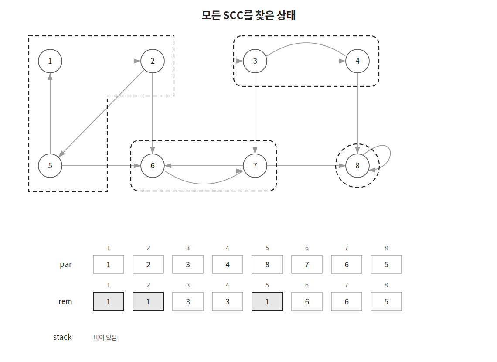

Tarjan 알고리즘은 방향 그래프의 SCC를 한 번의 DFS로 찾는 알고리즘이다.

SCC(Strongly Connected Component)는 같은 집합에 속한 모든 정점이 서로 도달할 수 있는 정점 집합이다.

## 동작 원리

다음과 같은 방향 그래프가 있다고 하자.



DFS로 정점을 처음 방문할 때 방문 순서를 저장하고 스택에 넣는다.

```cpp
int rem=par[cur]=++idx;
stk.push(cur);
```

`par[cur]`에는 처음에는 `cur`번 정점의 방문 순서를 저장한다.

`rem`에는 현재 정점에서 아직 SCC로 확정되지 않은 정점을 통해 도달할 수 있는 가장 작은 방문 순서를 저장한다.

처음에는 두 값이 같다.

```text
rem = par[cur]
```

그림의 `par` 행은 각 정점에 저장된 값을 나타낸다.

`rem` 행은 설명을 위해 각 DFS 호출이 현재 들고 있는 `rem` 값을 함께 나타낸 것이다. 실제 구현에서는 배열이 아니라 지역 변수로 관리한다.

DFS로 처음 방문하는 정점을 만나면 해당 정점을 먼저 탐색한다.

탐색이 끝난 뒤 반환된 값을 이용해 현재 정점의 `rem`을 갱신한다.

```cpp
if(!par[next]) {
    rem=min(rem, dfs(next));
}
```

이미 방문했지만 아직 SCC로 확정되지 않은 정점을 만나면 해당 정점의 `par` 값을 이용한다.

```cpp
else if(!vis[next]) {
    rem=min(rem, par[next]);
}
```

예를 들어 `1 → 2 → 3 → 4` 순서로 방문한 뒤 `4 → 3` 간선을 확인했다고 하자.



`3`번 정점은 아직 SCC로 확정되지 않았다.

따라서 `4`번 정점의 `rem`은 `par[3]`인 `3`으로 줄어든다.

```text
rem = min(4, par[3]) = 3
```

### SCC 확정

모든 인접 정점을 확인한 뒤 `rem`과 `par[cur]`이 같다면 `cur`은 SCC의 시작점이다.

```cpp
if(rem==par[cur]) {
    ...
}
```

이 경우 스택에서 `cur`이 나올 때까지 정점을 꺼내 하나의 SCC로 묶는다.

```cpp
while(true) {
    int top=stk.top(); stk.pop();
    SCCs.back().push_back(top);
    vis[top]=true;
    par[top]=rem;
    if(top==cur) break;
}
```

`vis[top]`은 해당 정점이 이미 하나의 SCC로 확정되었음을 나타낸다.

`par[top]`은 같은 SCC의 시작점이 가진 값으로 통일한다.

`8`번 정점은 자기 자신만으로 하나의 SCC를 만든다.



`3`번 정점으로 돌아오면 `rem`과 `par[3]`이 모두 `3`이다.

따라서 스택에서 `3`번 정점이 나올 때까지 꺼내면 `3`, `4`가 하나의 SCC로 묶인다.



같은 방식으로 `6`, `7`도 하나의 SCC로 묶인다.



탐색이 끝나면 SCC는 다음과 같이 나뉜다.



## 구현

Tarjan 알고리즘은 다음과 같이 구현할 수 있다. $O(V+E)$

```cpp
stack<int> stk;
int idx, vis[MAX], par[MAX];
vector<vector<int>> conn(MAX), SCCs;

int dfs(int cur) {
    int rem=par[cur]=++idx;
    stk.push(cur);
    for(int next:conn[cur]) {
        if(!par[next]) rem=min(rem, dfs(next));
        else if(!vis[next]) rem=min(rem, par[next]);
    }
    if(rem==par[cur]) {
        SCCs.push_back(vector<int>());
        while(true) {
            int top=stk.top(); stk.pop();
            SCCs.back().push_back(top);
            vis[top]=true;
            par[top]=rem;
            if(top==cur) break;
        }
    }
    return rem;
}

void tarjan(int n) {
    for(int cur=1;cur<=n;cur++) {
        if(!vis[cur]) {
            dfs(cur);
        }
    }
}
```

## 시간복잡도

각 정점은 한 번 방문하며 각 간선도 한 번 확인한다.

따라서 시간복잡도는 $O(V+E)$이다.

## 연습 문제

[https://soj.services/problems/48](https://soj.services/problems/48)

<details>
<summary>코드 보기</summary>

```cpp
#include<bits/stdc++.h>
using namespace std;

const int MAX = 10001;

stack<int> stk;
int idx, vis[MAX], par[MAX];
vector<vector<int>> conn(MAX), SCCs;

int dfs(int cur) {
    int rem = par[cur] = ++idx;
    stk.push(cur);
    for(int next:conn[cur]) {
        if(!par[next]) rem=min(rem, dfs(next));
        else if(!vis[next]) rem=min(rem, par[next]);
    }
    if(rem==par[cur]) {
        SCCs.push_back(vector<int>());
        while(true) {
            int top = stk.top(); stk.pop();
            SCCs.back().push_back(top);
            vis[top]=true;
            par[top]=rem;
            if(top==cur) break;
        }
    }
    return rem;
}

int main() {
    cin.tie(0)->sync_with_stdio(0);
    int n, m; cin >> n >> m;
    while(m--) {
        int u, v; cin >> u >> v;
        conn[u].push_back(v);
    }
    for(int i=1;i<=n;i++) if(!vis[i]) dfs(i);

    cout << SCCs.size() << '\n';
    for(auto &scc:SCCs) {
        sort(scc.begin(), scc.end());
        for(auto e:scc) cout << e << ' ';
        cout << "-1\n";
    }
}
```

</details>
