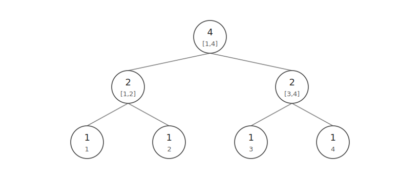
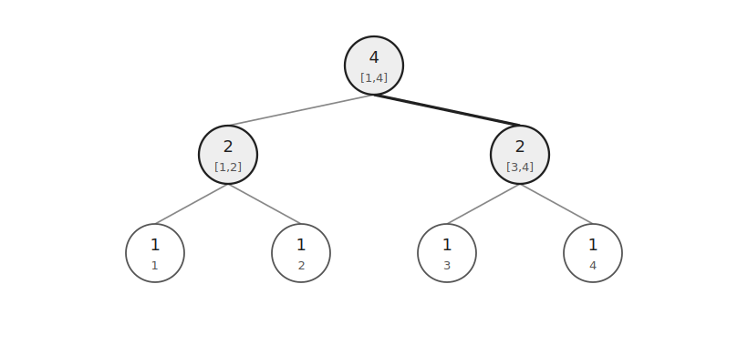
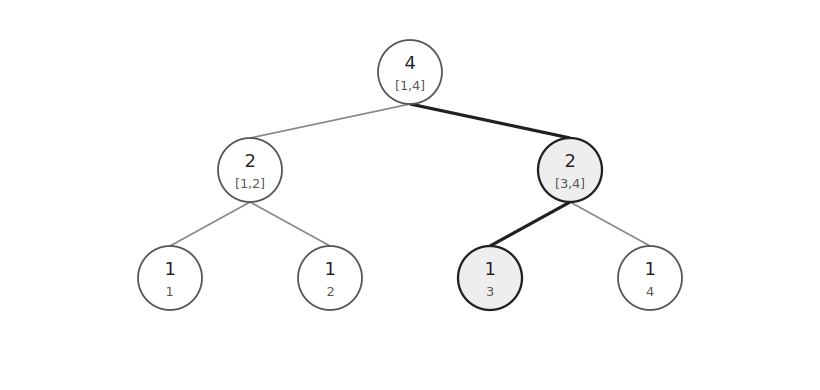
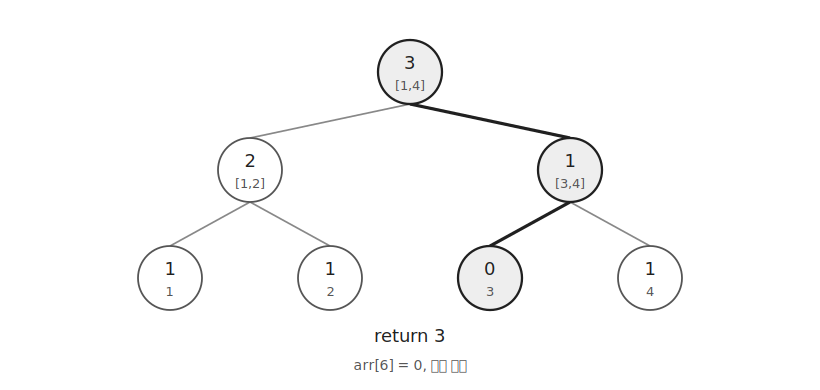
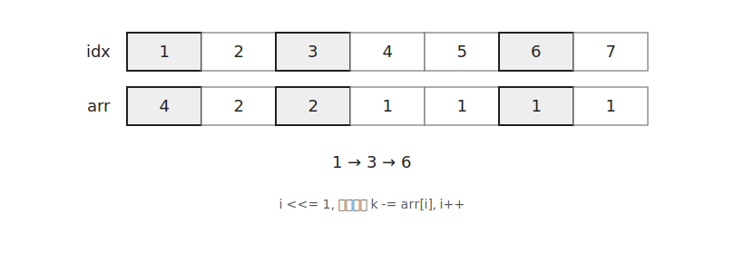

Walking on Segment Tree는 세그먼트 트리의 값을 이용해 루트에서 리프까지 내려가는 테크닉이다.

구간 합을 기준으로 왼쪽으로 갈지 오른쪽으로 갈지 결정하면서 원하는 위치를 찾는다.

대표적으로 남아 있는 원소 중 `k`번째 원소를 찾을 때 사용할 수 있다.

## 구조

`1`부터 `N`까지의 값이 있고 아직 제거되지 않은 값은 `1`, 제거된 값은 `0`으로 둔다고 하자.

각 노드는 자신이 담당하는 구간에 남아 있는 원소의 개수를 저장한다.



처음에는 모든 값이 남아 있으므로 모든 리프가 `1`이다.

부모 노드는 두 자식의 합을 저장한다.

```cpp
arr[i]=arr[i*2]+arr[i*2+1];
```

## k번째 원소 찾기

남아 있는 원소 중 `3`번째 원소를 찾는다고 하자.

루트에서 시작해 왼쪽 자식의 값을 확인한다.



왼쪽 구간에는 원소가 `2`개만 있다.

찾는 값은 `3`번째이므로 왼쪽 구간에는 없다.

따라서 `k`에서 왼쪽 구간의 개수를 빼고 오른쪽 자식으로 이동한다.

```cpp
if(arr[i*2]<k) {
    k-=arr[i*2];
    i=i*2+1;
}
```

이제 오른쪽 구간 안에서 `1`번째 원소를 찾으면 된다.

다시 왼쪽 자식의 값을 확인한다.



왼쪽 구간에 원소가 `1`개 있으므로 찾는 값은 왼쪽에 있다.

이 경우 `k`는 그대로 두고 왼쪽 자식으로 이동한다.

```cpp
else {
    i=i*2;
}
```

리프 노드에 도착하면 해당 위치가 답이다.



위 예시에서는 `3`번째 값이 선택된다.

선택한 값을 다시 사용하지 않아야 한다면 리프를 `0`으로 바꾸고 부모를 갱신한다.

## 비재귀 구현

배열 기반 세그먼트 트리에서는 현재 노드 번호 `i`만 관리하면 된다.



먼저 루트인 `1`번 노드에서 시작한다.

```cpp
int i=1;
```

왼쪽 자식으로 내려가기 위해 `i`를 두 배로 만든다.

```cpp
while(i<SZ) {
    i<<=1;
    if(arr[i]<k) k-=arr[i++];
}
```

왼쪽 구간의 원소 수가 `k`보다 작으면 오른쪽 자식으로 이동한다.

이때 왼쪽 구간의 원소 수만큼 `k`에서 빼야 한다.

`i<SZ`인 동안 반복하면 리프에 도착한다.

## 구현

남아 있는 원소 중 `k`번째 원소를 찾고 제거하는 코드는 다음과 같다.

```cpp
int SZ=1, arr[MAX*4];

void update(int i, int val) {
    i+=SZ;
    arr[i]=val;
    while(i>1) {
        i>>=1;
        arr[i]=arr[i*2]+arr[i*2+1];
    }
}

int query(int k) {
    int i=1;
    while(i<SZ) {
        i<<=1;
        if(arr[i]<k) k-=arr[i++];
    }
    return i-SZ+1;
}
```

## 시간복잡도

세그먼트 트리의 높이는 $O(\log N)$이다.

루트에서 리프까지 한 번 내려가므로 `query()`는 $O(\log N)$에 동작한다.

선택한 값을 제거하는 `update()`도 루트까지 올라가므로 $O(\log N)$이다.

따라서 찾고 제거하는 전체 시간복잡도는 $O(\log N)$이다.

공간복잡도는 $O(N)$이다.

## 연습 문제

[https://soj.services/problems/56](https://soj.services/problems/56)

<details>
<summary>코드 보기</summary>

```cpp
#include<bits/stdc++.h>
using namespace std;

typedef long long ll;
const int MAX=1'000'001;

ll SZ=1, a[MAX*4];

void update(int i, int val) {
    i+=SZ;
    a[i]+=val;
    while(i>1) {
        i>>=1;
        a[i]=a[i*2]+a[i*2+1];
    }
}

int query(ll k) {
    int i=1;
    while(i<SZ) {
        i<<=1;
        if(a[i]<k) k-=a[i++];
    }
    return i-SZ+1;
}

int main() {
    cin.tie(0)->sync_with_stdio(0);
    int n, q; cin >> n >> q;
    while(SZ<n) SZ<<=1;
    for(int i=0;i<n;i++) cin >> a[i+SZ];
    for(int i=SZ-1;i>0;i--) a[i]=a[i*2]+a[i*2+1];
    while(q--) {
        int op; cin >> op;
        if(op==1) {
            int i, x; cin >> i >> x;
            update(i-1, x);
        } else {
            ll k; cin >> k;
            cout << query(k) << '\n';
        }
    }
}
```

</details>
