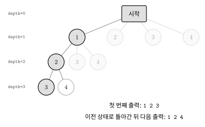
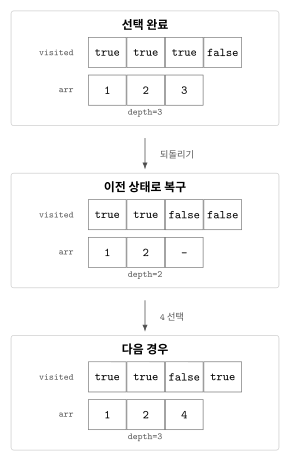

백트래킹은 가능한 선택을 하나씩 시도하고 이전 상태로 돌아가며 모든 경우를 탐색하는 알고리즘이다.

현재 상태에서 답을 만들 수 없다면 더 깊이 탐색하지 않아 불필요한 경우를 줄일 수 있다.

## 순열 만들기

`1`부터 `n`까지의 정수 중 서로 다른 `m`개를 골라 순서대로 나열한다고 하자.

각 위치에서 아직 사용하지 않은 숫자를 하나 선택하면 된다.

예를 들어 `n=4`, `m=3`이라면 먼저 `1`, `2`, `3`을 차례대로 선택한다.



깊이가 `m`에 도달하면 하나의 순열이 완성된다.

```text
1  2  3
```

출력을 마치면 이전 상태로 돌아가 다음 숫자를 선택한다.

```text
1  2  4
```

이 과정을 반복하면 가능한 모든 순열을 구할 수 있다.

## 상태 저장

현재까지 선택한 숫자는 배열 `arr`에 저장한다.

이미 사용한 숫자는 다시 선택하지 않도록 `visited` 배열로 관리한다.

깊이가 `depth`라면 다음 숫자를 `arr[depth]`에 저장한다.

```cpp
visited[x]=true;
arr[depth]=x;

back(depth+1);
```

## 이전 상태로 돌아가기

하나의 경우를 모두 탐색한 뒤에는 이전 상태로 돌아가야 한다.



재귀 호출이 끝난 뒤 `visited[x]`를 다시 `false`로 바꾸면 다른 경우에서 해당 숫자를 사용할 수 있다.

```cpp
visited[x]=false;
```

이처럼 이전 상태로 되돌아가는 과정이 백트래킹의 핵심이다.

## 구현

`1`부터 `n`까지의 정수 중 서로 다른 `m`개를 고르는 순열은 다음과 같이 구할 수 있다.

```cpp
int n, m, arr[8];
bool visited[9];

void back(int depth=0) {
    if(depth==m) {
        for(int i=0;i<m;i++) cout << arr[i] << ' ';
        cout << '\n';
        return;
    }
    for(int i=1;i<=n;i++) {
        if(!visited[i]) {
            visited[i]=true;
            arr[depth]=i;
            back(depth+1);
            visited[i]=false;
        }
    }
}
```

`depth`는 현재까지 선택한 숫자의 개수이다.

`depth`가 `m`이 되면 하나의 순열이 완성되므로 현재 배열을 출력한다.

가능한 순열의 개수는 다음과 같다.

$$
{}_nP_m=\frac{n!}{(n-m)!}
$$

각 순열을 출력하는 데 $O(m)$이 필요하므로 전체 시간복잡도는 $O({}_nP_m \times m)$이다.

## 가지치기

현재 상태에서 답을 만들 수 없다면 더 깊이 탐색할 필요가 없다.

```cpp
if(!canContinue()) return;
```

이처럼 불필요한 경우를 미리 제외하는 것을 가지치기라고 한다.

가지치기 조건은 문제마다 달라진다.

## 연습 문제

[백트래킹](https://soj.services/problems/26)

<details>
<summary>코드 보기</summary>

```cpp
#include<bits/stdc++.h>
using namespace std;

int n, m, arr[8];
bool vis[8];

void back(int depth=0) {
    if(depth==m) {
        for(int i=0;i<m;i++) cout << arr[i] << ' ';
        cout << '\n';
        return;
    }
    for(int i=0;i<n;i++) {
        if(!vis[i]) {
            vis[i]=true;
            arr[depth]=i+1;
            back(depth+1);
            vis[i]=false;
        }
    }
}

int main() {
    cin.tie(0)->sync_with_stdio(0);
    cin >> n >> m;
    back();
}
```

</details>
