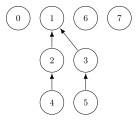
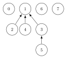

`DSU`는 서로 겹치지 않는 집합들을 관리하는 자료구조이다. `Union-Find`라고도 부른다.

두 원소가 같은 집합에 속하는지 확인하거나 서로 다른 두 집합을 하나로 합칠 때 사용한다.

## 대표 원소

각 집합은 하나의 대표 원소를 갖는다.

같은 집합에 속한 원소들은 대표 원소가 같으며 대표 원소를 이용하면 두 원소가 같은 집합에 속하는지 확인할 수 있다.

처음에는 모든 원소가 서로 다른 집합에 속한다.


각 원소의 부모를 자기 자신으로 설정하면 초기 상태를 만들 수 있다. $O(n)$

```cpp
for(int i=0;i<n;i++) {
    par[i]=i;
}
```

## 대표 원소 찾기

`find()`는 원소가 속한 집합의 대표 원소를 찾는다.

부모를 반복해서 따라가다가 자기 자신을 부모로 갖는 원소를 만나면 해당 원소가 대표 원소이다.

```cpp
int find(int x) {
    if(par[x]==x) return x;
    return find(par[x]);
}
```

두 원소의 대표 원소가 같다면 같은 집합에 속한다.

```cpp
if(find(a)==find(b)) {
    cout << "same";
}
```

## 집합 합치기

`merge()`는 두 원소가 속한 집합을 하나로 합친다.

먼저 두 원소의 대표 원소를 찾은 뒤 더 작은 대표 원소가 부모가 되도록 설정한다.

```cpp
void merge(int a, int b) {
    a=find(a);
    b=find(b);
    if(a>b) par[a]=b;
    else par[b]=a;
}
```

이렇게 하면 각 집합에서 가장 작은 원소가 대표 원소가 된다.

집합을 단순하게 합치기만 하면 트리의 높이가 커질 수 있다.



## 경로 압축

대표 원소를 찾는 과정에서 경로 압축을 할 수 있다.

```cpp
int find(int x) {
    if(par[x]==x) return x;
    return par[x]=find(par[x]);
}
```



경로 압축을 적용하면 이후의 `find()`를 훨씬 빠르게 수행할 수 있다.

## 크기를 이용한 합치기

위처럼 구현해도 충분하지만 더 안정적인 시간복잡도를 보장하려면 크기가 작은 집합을 큰 집합 아래에 연결하면 된다.

```cpp
void merge(int a, int b) {
    a=find(a);
    b=find(b);
    if(a==b) return;
    if(sz[a]<sz[b]) {
        par[a]=b;
        sz[b]+=sz[a];
    } else {
        par[b]=a;
        sz[a]+=sz[b];
    }
}
```

경로 압축과 크기를 이용한 합치기를 함께 사용하면 `find()`와 `merge()`를 거의 $O(1)$에 가깝게 수행할 수 있다. $O(\alpha(n))$

## 연습 문제

[DSU](https://soj.services/problems/21)

<details>
<summary>코드 보기</summary>

```cpp
#include<bits/stdc++.h>
using namespace std;

int par[1'000'001], sz[1'000'001];

int find(int x) {
    if(par[x]==x) return x;
    return par[x]=find(par[x]);
}

void merge(int a, int b) {
    a=find(a);
    b=find(b);
    if(a==b) return;
    if(a<b) {
        par[b]=a;
        sz[a]+=sz[b];
    } else {
        par[a]=b;
        sz[b]+=sz[a];
    }
}

int main() {
    cin.tie(0)->sync_with_stdio(0);
    int n, q; cin >> n >> q;
    for(int i=1;i<=n;i++) {
        par[i]=i;
        sz[i]=1;
    }

    while(q--) {
        string s; int a, b; cin >> s;
        if(s=="merge") {
            cin >> a >> b;
            merge(a, b);
        } else if(s=="same") {
            cin >> a >> b;
            cout << (find(a)==find(b)) << '\n';
        } else {
            cin >> a;
            cout << sz[find(a)] << '\n';
        }
    }
}
```

</details>